<table>
<colgroup>
<col style="width: 100%" />
</colgroup>
<thead>
<tr class="header">
<th><blockquote>

Добро пожаловать в

<strong>MikroBILL</strong>

<strong>Советы</strong>, которые помогут вам упростить работу

<a href="https://mikro-bill.com">https://mikro-bill.com</a>

<a href="https://t.me/MikroBILL">https://t.me/MikroBILL</a>

</blockquote></th>
</tr>
</thead>
<tbody>
</tbody>
</table>

# Системные требования

> Системные требования ядра **MikroBILL**:

<table>
<colgroup>
<col style="width: 9%" />
<col style="width: 40%" />
<col style="width: 9%" />
<col style="width: 40%" />
</colgroup>
<thead>
<tr class="header">
<th colspan="2"><strong>Минимальные</strong></th>
<th colspan="2"><strong>Рекомендуемые</strong></th>
</tr>
</thead>
<tbody>
<tr class="odd">
<td><strong>ОС:</strong></td>
<td>Windows 7 / UNIX</td>
<td><strong>ОС:</strong></td>
<td>Windows 10 x64 / UNIX (Debian 11)</td>
</tr>
<tr class="even">
<td><strong>ПО:</strong></td>
<td>
.Net 6

Для WinACME под Windows необходим .Net Framework 4.7.2
</td>
<td><strong>ПО:</strong></td>
<td>
.Net 6

Для WinACME под Windows необходим .Net Framework 4.7.2
</td>
</tr>
<tr class="odd">
<td><strong>RAM:</strong></td>
<td>1GB</td>
<td><strong>RAM:</strong></td>
<td>8GB</td>
</tr>
<tr class="even">
<td><strong>HDD:</strong></td>
<td>10GB</td>
<td><strong>SSD:</strong></td>
<td>120GB</td>
</tr>
</tbody>
</table>

> Так же для корректной работы требуется дополнительное ПО: Apache
> (2.2 - 2.4), PHP (5.4 – 8.1), MySQL (5.1 – 8). OpenSSL, ACME.
>
> Системные требования приложения для удалённого администрирования
> **MikroREMOTE**:

<table>
<colgroup>
<col style="width: 9%" />
<col style="width: 40%" />
<col style="width: 9%" />
<col style="width: 40%" />
</colgroup>
<thead>
<tr class="header">
<th colspan="2"><strong>Минимальные</strong></th>
<th colspan="2"><strong>Рекомендуемые</strong></th>
</tr>
</thead>
<tbody>
<tr class="odd">
<td><strong>ОС:</strong></td>
<td>Windows 7</td>
<td><strong>ОС:</strong></td>
<td>Windows 10 x64</td>
</tr>
<tr class="even">
<td><strong>ПО:</strong></td>
<td>.Net Framework 4.7.2</td>
<td><strong>ПО:</strong></td>
<td>.Net Framework 4.7.2</td>
</tr>
<tr class="odd">
<td><strong>RAM:</strong></td>
<td>1GB</td>
<td><strong>RAM:</strong></td>
<td>8GB</td>
</tr>
<tr class="even">
<td><strong>HDD:</strong></td>
<td>10GB</td>
<td><strong>SSD:</strong></td>
<td>10GB</td>
</tr>
</tbody>
</table>

> Для запуска **MikroBILL 2.0.10** и более новых версий вам понадобится
> следующее дополнительное ПО:  
> **1.** Net Core
> 3.1: [Скачать](https://download.visualstudio.microsoft.com/download/pr/b92958c6-ae36-4efa-aafe-569fced953a5/1654639ef3b20eb576174c1cc200f33a/windowsdesktop-runtime-3.1.32-win-x64.exe).  
> **2.** Visual C++ Redistributable
> 2019: [Скачать](https://download.visualstudio.microsoft.com/download/pr/b929b7fe-5c89-4553-9abe-6324631dcc3a/296F96CD102250636BCD23AB6E6CF70935337B1BBB3507FE8521D8D9CFAA932F/VC_redist.x64.exe).  
> **3.** Security Update KB3063858 (для старых ОС вроде Win
> 7): [Скачать](https://download.microsoft.com/download/0/8/E/08E0386B-F6AF-4651-8D1B-C0A95D2731F0/Windows6.1-KB3063858-x64.msu).  
> **4.** Net Framework
> 4.7.2: [Скачать](http://mikro-bill.com/files/netfx472.exe).

# Установка

> Процесс установки под **Windows** максимально прост и сводится к
> скачиванию дистрибутива <http://mikro-bill.com/downloads/> и запуску
> MikroBILL.exe, программа сама установит себя, а также установит и
> настроит Apache и MySQL.

> Процесс установки под **Unix** несколько сложнее, вам понадобится
> терминал. Для функционирования биллинга нужна база данных, если MySQL
> не установлена, установите её вначале. Так же понадобится WEB сервер
> Apache 2.4. Об этом ниже в разделе «[**Ручная
> установка**](#Ручная_Установка)».
>
> **Для скачивания стабильной версии введите:**
>
> wget --no-check-certificate -O /tmp/MikroBILL-Install.sh
> <https://mikro-bill.com/files/MikroBILL-Install.sh>
>
> **Для скачивания BETA версии:**
>
> wget --no-check-certificate -O /tmp/MikroBILL-Install.sh
> <https://mikro-bill.com/files/MikroBILL-Install-beta.sh>
>
> chmod +x /tmp/MikroBILL-Install.sh
>
> /tmp/MikroBILL-Install.sh
>
> Данные команды скачают скрипт и запустят его. Будет установлена
> платформа NET и MikroBILL. После установки .Net Core может
> потребоваться перезагрузка.  
> В таком случае перезапустите ОС и запустите скрипт установки MikroBILL
> ещё раз. Также вы можете выполнить все команды самостоятельно.
>
> **Ручная установка**

1.  **Установка MariaDB (MySQL):**  
    > apt install mariadb-server  
    > systemctl restart mariadb  
    >   
    > **Создание пользователя БД:**  
    > mysql  
    > GRANT ALL ON \*.\* TO 'Login'@'localhost' IDENTIFIED BY 'Password'
    > WITH GRANT OPTION;  
    > FLUSH PRIVILEGES;

> Где Login нужно заменить на логин создаваемого пользователя БД, а
> Password на пароль. Если нужно разрешить соединение со всех адресов,
> замените 'localhost' на '%'.
>
> Для улучшения безопасности лучше отозвать у пользователя разрешение
> создавать файлы через SQL запросы:  
> REVOKE FILE on \*.\* from 'Login'@'localhost';

1.  **Установка Apache:**  
    > apt install apache2  
    > apt install php  
    > apt install php-cli php-mbstring php-xml php-common php-curl  
    > apt install php-mysql  
    > systemctl restart apache2

2.  **Установка .NET Core:**  
    > apt install -y snapd  
    > wget -O
    > /tmp/dotnet-install.sh <https://dot.net/v1/dotnet-install.sh>  
    > chmod +x /tmp/dotnet-install.sh  
    > /tmp/dotnet-install.sh -c 6.0 --runtime aspnetcore  
    >   
    > На некоторых системах может понадобиться установить дополнительные
    > пакеты:  
    > export PATH="$PATH:/snap/bin"  
    > snap install core  
    > snap install core18  
    >   
    > Статья на сайте MicroSoft на случай, если что-то пойдёт не
    > так: <https://learn.microsoft.com/ru-ru/dotnet/core/install/linux>  
    >   
    > После установки .Net Core может потребоваться перезагрузка.  
    > В таком случае перезапустите ОС и запустите скрипт установки
    > MikroBILL ещё раз.

3.  **Ручная установка MikroBILL.**

> Скачайте и распакуйте архив с MikroBILL.
>
> mkdir -p /tmp/MikroBILL
>
> Для скачивания стабильной версии введите:
>
> wget -O /tmp/MikroBILL/MikroBILL\_Unix.zip
> https://mikro-bill.com/downloads/stable
>
> Для скачивания BETA версии:
>
> wget -O /tmp/MikroBILL/MikroBILL\_Unix.zip
> https://mikro-bill.com/downloads/beta
>
> apt install unzip
>
> unzip -o /tmp/MikroBILL/MikroBILL\_Unix.zip -d /tmp/MikroBILL
>
> **Запустите программу установки:**  
> dotnet /tmp/MikroBILL/MikroBILL.dll
>
> Если по какой-то причине терминал не видит dotnet, то впишите его
> полный путь. В зависимости от дистрибутива UNIX и способа установки
> .NET это могу быть:
>
> /root/.dotnet/dotnet
>
> /snap/bin/dotnet
>
> /usr/bin/dotnet

#  Активация

**Активация через программу удалённого администрирования MikroREMOTE:**

Подключитесь к серверу MikroBILL, используя логин и пароль, которые вы
указали при установке. Перейдите в окно настроек (кнопка с изображением
шестерёнки на панели управления), перейдите на вкладку
«Администрирование» и нажмите кнопку «Активировать». В открывшемся окне
выберите «Купить или расширить активацию».

Откроется окно с выбором оборудования, к которому можно осуществить
привязку активации. Привязать активацию можно к физическому HDD/SSD или
к USB флэшке, вставленной в ПК, или проброшенной внутрь виртуальной
машины средствами гипервизора. Так же USB флэшка может быть вставлена в
любой роутер MikroTik, добавленный в MikroBILL. Так же активацию можно
привязать непосредственно к самому роутеру MikroTik.

Выберите устройство из списка и далее кнопку «Скопировать в буфер».
Идентификатор активации будет скопировать. Отправьте его разработчикам
для получения активации. Порядок действий показан на рисунках ниже.

<table>
<colgroup>
<col style="width: 45%" />
<col style="width: 0%" />
<col style="width: 54%" />
</colgroup>
<thead>
<tr class="header">
<th></th>
<th colspan="2"></th>
</tr>
</thead>
<tbody>
<tr class="odd">
<td>Рис. 1</td>
<td colspan="2">Рис. 2</td>
</tr>
<tr class="even">
<td colspan="2"></td>
<td>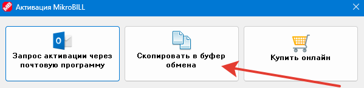</td>
</tr>
<tr class="odd">
<td colspan="2">Рис. 3</td>
<td>Рис. 4</td>
</tr>
</tbody>
</table>

**Активация через WEB портал администратора:**

Откройте браузер и перейдите по адресу: http://IP-адрес\_сервера/kassa

Авторизуйтесь, используя логин и пароль, которые вы указали при
установке. Нажмите кнопку «Администрирование» в правом верхнем углу. В
открывшейся странице администрирования нажмите кнопку «Меню», перейдите
на вкладку «Настройки» и выберите пункт «Системные». На открывшейся
странице выберите «Информация о версии и активации». Нажмите «Начать
активацию» и затем «Купить или расширить активацию».

Откроется окно с выбором оборудования, к которому можно осуществить
привязку активации. Привязать активацию можно к физическому HDD/SSD или
к USB флэшке, вставленной в ПК, или проброшенной внутрь виртуальной
машины средствами гипервизора. Так же USB флэшка может быть вставлена в
любой роутер MikroTik, добавленный в MikroBILL. Так же активацию можно
привязать непосредственно к самому роутеру MikroTik.

Выберите устройство из списка и скопируйте идентификатор. Затем
отправьте его разработчикам для получения активации. Порядок действий
показан на рисунках ниже.

<table>
<colgroup>
<col style="width: 46%" />
<col style="width: 53%" />
</colgroup>
<thead>
<tr class="header">
<th></th>
<th></th>
</tr>
</thead>
<tbody>
<tr class="odd">
<td>Рис. 1</td>
<td>Рис. 2</td>
</tr>
<tr class="even">
<td></td>
<td></td>
</tr>
<tr class="odd">
<td>Рис. 3</td>
<td>Рис. 4</td>
</tr>
<tr class="even">
<td></td>
<td></td>
</tr>
<tr class="odd">
<td>Рис. 5</td>
<td>Рис. 6</td>
</tr>
</tbody>
</table>

# Администрирование

> Настраивать MikroBILL, а также управлять абонентами, вы можете как
> через WEB интерфейс, расположенный по адресу
> http://адрес\_сервера/kassa так и через специальную программу –
> MikroREMOTE, актуальную версию которой вы всегда можете скачать с WEB:
> http://адрес\_сервера/kassa/files/MikroREMOTE.zip или из установочного
> архива MikroBILL.
>
>  style="width:5.02083in;height:3.5625in" />
>
> По умолчанию MikroREMOTE соединяется с сервером MikroBILL по протоколу
> TCP на порту 7402 (можно изменить в настройках). При необходимости
> добавьте порт в исключения фаервола на ПК и роутере, а также сделайте
> проброс порта на роутере, если есть необходимость подключаться извне.

# Органы управления

>  style="width:6.26806in;height:2.84653in" />
>
> *Внешний вид программы MikroREMOTE*
>
> Слева на панели доступны фильтры поиска.
>  style="width:4.29167in;height:0.27083in" />
>
> Они позволяют отобразить абонентов только с выбранных
> [тарифов](#тарифы), [групп](#группы), или с определённой подключённой
> [услугой](#услуги). Фильтры можно настраивать.
>
>  style="width:2.03204in;height:1.49831in" />
>
> Там можно менять порядок пунктов, включать и отключать их.
>
> 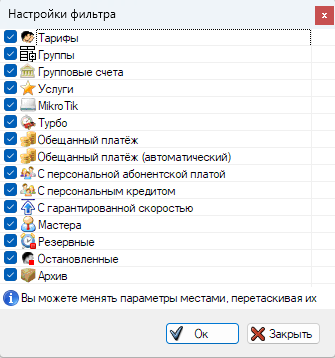 style="width:3.19145in;height:3.41056in" />
>
> Так же доступная разная логика для обработки выбранных фильтров.
>
>  style="width:1.63542in;height:1.02083in" />
>
> Логика «**И**» (будут отображаться абоненты, отвечающие сразу всем
> условиям), «**ИЛИ**» (будут отображаться абоненты отвечающие любому из
> условий), а также «**НЕ РАВНО**» (будут отображаться абоненты, не
> отвечающие условиям отбора).
>
> Так же можно искать абонентов по совпадению текстовых
> данных. style="width:2.03125in;height:0.27083in" />
>
> Если нажать копку настроек, откроется выбор, параметров, по которым
> будет осуществляться поиск.
>
>  style="width:2.15625in;height:5.28125in" />
>
> Здесь доступна опция мультипоиска, позволяющая в строку поиска вносить
> несколько запросов, разделённых символом “**;**”. Например:
>
>  style="width:4.59375in;height:1.53125in" />
>
> Справа на верхней панели расположены кнопки:
>
>  style="width:0.97917in;height:0.29167in" />
>
> По порядку:
>
> 1\. Настройки MikroREMOTE и Администрирование;
>
> 2\. Управление [тарифами](#тарифы), [группами](#группы),
> [услугами](#услуги), [скриптами и триггерами](#Скрипты_и_триггеры);
>
> 3\. Параметры списка абонентов (скрытие элементов, подсвечивание
> цветом).
>
> Кнопки, которые расположены посередине панели, относятся к управлению
> абонентами, их функционал мы рассмотрим в разделе «[**Управление
> абонентами**](#управление-абонентами)».
>
> Внизу формы находятся счётчики абонентов:
>
>  style="width:6.26806in;height:0.20694in" />
>
> Здесь отображается количество абонентов, прошедших фильтрацию. Справа
> список подключённых роутеров. Если нажать на него появится список, в
> котором можно производить дополнительные действия с роутерами.
>
>  style="width:1.90625in;height:2in" />

# Настройки MikroREMOTE

>  style="width:5.51045in;height:2.81732in" />
>
> На вкладке настроек MikroREMONT можно вписать адрес подключения к
> MySQL и отдельные параметры база для статистики NetFlow (если
> используется). Ниже можно включить запись логов. Файл хранится по
> пути: «%allusersprofile%\MikroREMOTE\Log.txt».
>
> Нажав на кнопку «**Интерфейс MikroREMOTE**» вы попадёте в настройки
> внешнего вида MikroREMOTE.
>
>  style="width:4.40651in;height:5.46363in" />
>
> Рассмотрим некаторе опции подробно.

-   «**Суммарная скорость в заголовке**» - в заголовке программы будет
    отображаться текущая сумма скоростей всех абонентов.

-   «**Всплывающее окно о поступивших текетах**» - в углу будет
    появляться алерт, когда абонент создаёт новый тикет.

>  style="width:1.94503in;height:1.60179in" />

-   «**Маскировать пароли**» - скроет пароли в списке абонентов.

-   «**Всплывающие подсказки**» - практически на каждую кнопку и чекбокс
    у нас заготовлена всплывающая подсказка, просто наведите курсор мыши
    на интересующую опцию.

-   «**Автоблокировка**» - Если вы не трогали мышь и клавиатуру
    выбранный промежуток времени, MikroREMOTE автоматически
    заблокируется, вам будет необходимо ввести пароль своего кассира для
    продолжения работы.

-   «**Показывать хаб событий**» - опция доступна только кассирам,
    отмеченным как администраторы, включает всплывающее окно с ошибками,
    возникающими в ядре биллинга, например, при подключении ТВ подписок.

>  style="width:3.12491in;height:1.79707in" />

-   «**Сворачивать в трей при закрытии**» - при нажатие на кнопку
    закрытия в главном окне MikroREMOTE, вместо закрытия приложения, оно
    будет сворачиваться в трей.

-   «**Сортировка в выпадающих списках**» - в выпадающих списках
    [тарифы](#тарифы), [группы](#группы), [услуги](#услуги) и т.д. будут
    расположены по алфавиту, в противном случае они будут в той
    последовательности, в которой они выставлены в настройках.

-   «**Короткий адрес**» - Вместо полного адреса вы можете включить
    отображение последних нескольких октетов, например, только улицу,
    дом и квартиру. Это поможет экономить место. Вы можете включить
    короткие адреса как из окна настроек, так и кликнув средней клавишей
    мыши (колёсиком) по заголовку столбца «**Адрес**».

-   «**Столбец трафик показывает значения**» и «**Столбец бонусный
    трафик показывает значения**» - выбирает какие данные о трафике
    будут присутствовать в столбце. Можно включить одновременно трафик
    за День, Месяц и Весь трафик. Вы можете изменить отображение трафика
    как из окна настроек, так и кликнув средней клавишей мыши
    (колёсиком) по заголовку столбцов «**Трафик**» или «**Бонусный
    трафик**».

> На вкладке «**Выбор столбцов**» вы можете отметить столбцы с данными,
> которые хотите видеть в главном окне MikroREMOTE. Вы можете изменить
> набор столбцов как из окна настроек, так и кликнув правой клавишей
> мыши по заголовку любого столбца.
>
> На вкладке «**Панель инструментов**» вы можете выбрать, какие кнопки
> для управления абонентами желаете видеть на верхней панели.
>
>  style="width:5.34853in;height:4.20852in" />
>
> Перенесённые в левую сторону пункты отобразятся на панели в главном
> окне MikroREMOTE.
>
>  style="width:6.56355in;height:0.40094in" />
>
> На вкладке « class="anchor">**Поля в профиле абонента**» вы можете
> переименовать стандартные поля в профиле абонента для соответствия
> региональным требованиям.
>
>  style="width:4.24277in;height:2.13636in" />

# Администрирование

>  style="width:6.49057in;height:3.71773in" />
>
> *Внешний вид вкладки «Администрирование»*
>
> Давайте пройдёмся по всем окнам настроек и заглянем в каждый уголок.
>
> **MySQL и WEB**
>
>  style="width:5.15625in;height:5.33333in" />
>
> В этом окне задаются параметры подключения к базе данных MySQL со
> стороны сервиса MikroBILL, так же путь к папке, где храниться файлы
> WEB. Это нужно для автоматического применения настроек. В поле адреса
> вы можете внести несколько IP или доменов, разделяя их символом «;». В
> этом случае попытки подключения будут осуществляться в порядке
> следования адресов. Если один адрес становится недоступным,
> подключение возобновиться через следующий.
>
> Путь к WEB можно выбрать как:

1.  «**Прямой или сетевая папка**» - для тех случаев, если апач
    установлен на этом же ПК. Также тут можно указать сетевую папку.

> Для корректной работы сетевой папки под Windows вам необходимо, чтобы
> служба MikroBILL запускалась от имени локального администратора. Для
> этого зайдите в «**Панель управления»** &gt; «**Администрирование»**
> **&gt;** «**Службы»**. Найдите службу MikroBILL. В свойствах службы
> перейдите на вкладку «**Вход в систему**» и впишите учётную запись
> администратора.
>
>  style="width:3.85624in;height:1.97172in" />
>
> После изменения параметров, перезапустите службу MikroBILL.

1.  «**FTP**» - Вы сможете указать доступ к файлам WEB по протоколу FTP,
    например, если Apache расположен на внешнем хостинге.

2.  «**SFTP**» - Вы сможете указать доступ к файлам WEB по протоколу
    SSH, например, если Apache расположен на внешнем сервере.

> «**Автообновление файлов WEB**» - включает автоматическую запись
> файлов в папку апача при обновлении MikroBILL.
>
> «**Проверка целостности файлов» -** активирует проверку по контрольной
> сумме критических файлов (контрольные суммы при каждом билде вшиваются
> в исполняемый файл) – функция позволяет эффективно противостоять
> киберугрозам, в случае взлома останавливает сервер Apache (если
> включена опция «**Останавливать Apache**»), отправляет администраторам
> сообщение на Email и в MikroREMOTE.
>
> «**Интеллектуальный анализ файлов**» - Проверяет содержимое файлов по
> бинарным заголовком на соответствие типа файла его содержимому, при
> срабатывании защиты подозрительный файл удаляется. Опция может
> конфликтовать с пользовательскими расширениями WEB.
>
> «**Переопределить значения переменных PHP**» - В открывшемся окне вы
> сможете переопределить значения переменных PHP, например, чтобы со
> стороны WEB сервера соединение с базой шло по другому IP. Впишите ваш
> PHP код здесь в текстовое поле. Имена переменных вы можете посмотреть
> в фале config.php в корне WEB сервера.
>
> Обратите Внимание, что при ошибке в синтаксисе WEB перестанет
> работать.
>
> В окне «**Параметры записи NetFlow**» вы можете включить запись
> сетевой статистики NetFlow в отдельную базу.
>
>  style="width:3.71121in;height:3.34299in" />
>
> Так же тут находятся дополнительные настройки. Например, можно
> включить распознавание хостов. Обратите внимание, что хост
> определяется по IP, который посетил абонент, и результат может быть не
> точным, если на одном адресе расположено несколько доменов!
>
> Ниже расположены настройки времени хранения статистики в месяцах и
> время анализа, в течении которого все обращения абонента на один
> IP:Port будут объединены в одну запись. Для ускорения работы можно
> установить время анализа = 0, тогда объединение записей производиться
> не будет.
>
> **Роутеры и
> настройки**
>
>  style="width:6.26806in;height:3.2125in" />
>
> Здесь находятся список с роутерами, добавленными в MikroBILL. Ниже
> расположена кнопка настроек, где можно выбрать дополнительные
> параметры, такие как интервал обновления данных с роутера (скорость и
> онлайн), если данные читаются не через NetFlow, а также размер
> килобайта.
>
>  style="width:4.25817in;height:2.7469in" />
>
> Вытесняющая авторизация запрещает абоненту одновременно авторизоваться
> более чем на одном роутере, если абоненты привязаны одновременно к
> нескольким роутерам.
>
> При нажатии на кнопку  style="width:0.3125in;height:0.26042in" /> откроется окно с выбором
> типов роутеров. Из коробки в MirkoBILL добавлена поддержка только
> роутеров MikroTik, но вы можете вписать собственные Telnet или SSH
> команды для управления оборудованием.
>
>  style="width:5.10417in;height:6.125in" />
>
> Здесь вы можете вписать Telnet или SSH команды для следующих событий:

-   Создан новый абонент

-   Отредактирован абонент

-   Остановлен абонент

-   Запущен абонент

-   Удалён абонент

-   Ограничения скорости изменились

-   Принудительный разрыв сессии

> В тексте команд можно использовать теги автозамены, список которых
> представлен ниже:

<table>
<colgroup>
<col style="width: 22%" />
<col style="width: 77%" />
</colgroup>
<thead>
<tr class="header">
<th><strong>Тэг</strong></th>
<th><strong>На что будет заменён</strong></th>
</tr>
</thead>
<tbody>
<tr class="odd">
<td>#IP#</td>
<td>Подставляет первый IP абонента</td>
</tr>
<tr class="even">
<td>#IP?#</td>
<td>Подставляет IP абонента, вместо “?” порядковый номер IP</td>
</tr>
<tr class="odd">
<td>#MAC#</td>
<td>Подставляет первый MAC клиента</td>
</tr>
<tr class="even">
<td>#MAC?#</td>
<td>Подставляет MAC клиента, вместо “?” порядковый номер MAC</td>
</tr>
<tr class="odd">
<td>#LOGIN#</td>
<td>Подставляет первый логин абонента</td>
</tr>
<tr class="even">
<td>#LOGIN?#</td>
<td>Подставляет логин абонента, вместо “?” порядковый номер логина</td>
</tr>
<tr class="odd">
<td>#PASS#</td>
<td>Подставляет первый пароль абонента</td>
</tr>
<tr class="even">
<td>#PASS?#</td>
<td>Подставляет пароль абонента, вместо “?” порядковый номер пароля</td>
</tr>
<tr class="odd">
<td>#LIMIT_IN#</td>
<td>Подставляет ограничение входящей скорости в кбит/с</td>
</tr>
<tr class="even">
<td>#LIMIT_OUT#</td>
<td>Подставляет ограничение исходящей скорости в кбит/с</td>
</tr>
<tr class="odd">
<td>#LIMIT_IN_B#</td>
<td>Подставляет ограничение входящей скорости в бит/с</td>
</tr>
<tr class="even">
<td>#LIMIT_OUT_B#</td>
<td>Подставляет ограничение исходящей скорости в бит/с</td>
</tr>
<tr class="odd">
<td>#LIMIT_IN_MB#</td>
<td>Подставляет ограничение входящей скорости в Мбит/с</td>
</tr>
<tr class="even">
<td>#LIMIT_OUT_MB#</td>
<td>Подставляет ограничение исходящей скорости в Мбит/с</td>
</tr>
<tr class="odd">
<td>#CONTRACT#</td>
<td>Подставляет номер договора</td>
</tr>
<tr class="even">
<td>#COMMENT#</td>
<td>Подставляет комментарий абонента</td>
</tr>
<tr class="odd">
<td>#COMMENT2#</td>
<td>Подставляет комментарий №2 абонента</td>
</tr>
<tr class="even">
<td>#COMMENT3#</td>
<td>Подставляет комментарий №3 абонента</td>
</tr>
<tr class="odd">
<td>#COMMENT4#</td>
<td>Подставляет комментарий №4 абонента</td>
</tr>
<tr class="even">
<td>#TICKET#</td>
<td>Подставляет текст тикета</td>
</tr>
<tr class="odd">
<td>#FIELD_ИмяПоля#</td>
<td>Подставляет данные из дополнительного поля</td>
</tr>
<tr class="even">
<td>#DISCONNECT#</td>
<td>Переподключиться (для Telnet и SSH подключений)</td>
</tr>
<tr class="odd">
<td>#SLEEP#</td>
<td>Ожидание 1 секунда (для Telnet и SSH подключений)</td>
</tr>
<tr class="even">
<td>#RND#</td>
<td>Произвольный набор цифр</td>
</tr>
<tr class="odd">
<td>#DAY#</td>
<td>День месяца</td>
</tr>
<tr class="even">
<td>#MONTH#</td>
<td>Месяц</td>
</tr>
<tr class="odd">
<td>#YEAR#</td>
<td>Год</td>
</tr>
<tr class="even">
<td>#HOUR#</td>
<td>Час</td>
</tr>
<tr class="odd">
<td>#MINUTE#</td>
<td>Минута</td>
</tr>
<tr class="even">
<td>#SECOND#</td>
<td>Секунда</td>
</tr>
<tr class="odd">
<td>#IP_GATEWAY#</td>
<td>Шлюз абонента</td>
</tr>
<tr class="even">
<td>#TARIFF#</td>
<td>Название тарифа</td>
</tr>
<tr class="odd">
<td>#TARIFF_SKAT#</td>
<td>Название тарифа для Скат DPI</td>
</tr>
</tbody>
</table>

> Вы можете начать строку с **{ACC=** и закончить её **=ACC}** чтобы
> команда
>
> была отправлена на роутер столько же раз, сколько IP у абонента.
>
> Теги \#IP# и \#MAC# при каждой итераиции будут заменены на IP и MAC.
>
> Например:
>
> {ACC=/ip firewall filter disable \[find src-address="#IP#"\]=ACC}
>
> Также доступны  смарт-теги автозамены, получающие значения от API:  
>       **\#API\_{путь\_API}\_ENDAPI#** - Подставит любое значение,
> которое вы можете получить через API для абонента.  
>       Описание путей API
> доступно [здесь](https://mikro-bill.com/index.php?page=api_docs&node=API.Client).
> Примеры написания тэгов ниже.
>
> Примеры тегов, получающих значение через API:  
>       **\#API\_{BillingInfo.DefaultInterface}\_ENDAPI#** - Подставит
> локальный интерфейс абонента.  
>       **\#API\_{StatusInfo.CurrentSpeedLimitIn}\_ENDAPI#** - Подставит
> текущие ограничения скорости для входящего канала.
>
> Так же существуют смарт-теги автозамены с условием. Позволяют в
> зависимости от условия подставлять разные значения:  
>      
> \#IF\_(Путь,Оператор\_сравнения,Сравниваемое\_значение)?(Результат\_ДА):(Результат\_НЕТ)\_ENDIF#  
>       Примеры написания тэгов:
>
> Примеры тегов с условием (описание условий аналогично
> оператору Find из API):  
>    
>   **\#IF\_(StatusInfo.BlockReason,=,-1)?(StandartPool):(BlockeedPool)\_ENDIF#** -
> Тег проверит значение пути StatusInfo.BlockReason, т.е. причину
> остановки абонента, и если оно равно -1, т.е. абонент не остановлен,
> тег подставит "StandartPool", иначе "BlockeedPool".  
>       В тегах результата могут быть другие теги, например:  
>    
>   **\#IF\_(StatusInfo.BlockReason,=,-1)?(#API\_{StatusInfo.CurrentSpeedLimitIn}\_ENDAPI#):(1)\_ENDIF#** -
> Если абоненту разрешён доступ, подставит его текущие ограничения
> входящей скорости, иначе подставит 0.
>
> Ниже находится кнопка «**События инициализации роутера**», где можно
> выбрать команды, которые будут отправляться на оборудование при первом
> подключении к роутеру, а также при выборе опции "Перечитать".
>
>  style="width:5.43826in;height:3.63592in" />
>
> Давайте теперь посмотрим на  class="anchor">окно добавления роутера типа **MikroTik**.

Для роутеров MikroTik доступно подключение по API. Перед подключением
проверьте, что API в настройках MikroTik включено. В WinBox проследуйте:
«**IP**» &gt; «**Services**» и включите сервис API, если он отключен. В
поле адреса вы можете внести несколько IP или доменов, разделяя их
символом «;». В этом случае попытки подключения будут осуществляться в
порядке следования адресов. Если один адрес становится недоступным,
подключение возобновиться через следующий.

Также вы можете выбрать [Группы](#группы) и [Тарифы](#тарифы), абоненты
из которых будут находиться на этом роутере, для этого перейдите на
вкладку «**Тарифы и группы**».

Опция «**Перенаправлять с HotSpot на MikroBILL**» прописывает в
стандартную страницу HotSpot микротика команду перенаправления на WEB
сервер MikroBILL. С неё моно организовать регистрацию новых абонентов
посредством SMS или Email сообщений, а также при помощи ваучеров.

Ниже на форме можно выбрать параметры ограничений скорости:

1.  «**Simple Queue**» – Для каждого абонента будет создана персональная
    запись в разделе Simple Queue.

2.  «**Simple Queue + PCQ**» - Для каждого абонента будет создана
    персональная запись в разделе Simple Queue, в котором будет указан
    Queue Type, соответствующий [тарифу](#тарифы) абонента.

3.  «**Queue Tree**» – Будет построено дерево Queue Tree, с ветками для
    каждого [тарифа](#тарифы).

И источники трафика:

1.  «**Simple Queue**» – Данные о наработанном трафике и текущей
    скорости абонента будет браться из его записи Simple Queue. Данные
    будут читаться с выбранным интервалом активности. У этого способа
    есть недостаток – ваши правила Simple Queue не могут быть выше
    правил, созданных MikroBILL, иначе трафик не будет начисляться.

2.  «**NetFlow**» – данные о наработанном трафике будут отправляться
    роутерами по протоколу NetFlow на указанный UDP порт. Возможно
    понадобится на фареволе разрешить входящий UDP трафик по этому
    порту. Текущая скорость абонента будет вычисляться раз в 30 секунд
    как количество наработанного трафика за это время, поделённое на
    время. Поскольку NetFlow отправляет данные о трафике либо в момент
    разрыва сетевой сессии, либо по прошествии временного интервала
    (минимум – 1м.), показания скорости и трафика могут отставать от
    реальных.

> При нажатии на кнопку « class="anchor">**Объекты, которыми управляет MikroBILL**»
> откроется выбор данных, вносимых биллингом на роутеры.
>
>  style="width:4.15047in;height:2.6633in" />
>
> Здесь можно включить создание фильтров фаервола, правил NAT и Mangle.
> Также вы можете видеть пункты вида «**Разрешить … правила, созданные
> не MikroBILL**», включение этих пунктов позволяет устанавливать ваши
> правила, выше правил, созданных MikroBILL. В противном случае ваши
> правила будут автоматически перемещены вниз списка. Создание
> собственных правил может быть полезно, например, если у вас на роутере
> предусмотрены абоненты, не добавленные в MikroBILL. Но будьте
> осторожны, роутер обрабатывает правила сверху вниз, и, попав под
> условие любого правила, сетевой пакет дальше не обрабатывается и не
> сможет дойти до правил MikroBILL. Включайте эти опции, если вы ясно
> понимаете что и для каких целей делаете.
>
> На вкладке **PPP** параметры для абонентов, авторизующихся через
> туннели PPP.
>
>  style="width:4.07399in;height:2.39646in" />
>
> Здесь можно включить создание PPP сервера на роутере и запись учётных
> записей абонентов в PPP Secrets.
>
> Пояснения по дополнительным параметрам:

1.  «**Учётные записи всегда включены**» - По умолчанию, когда абонент
    переходит в состояние «Заблокирован», его учётная запись в PPP
    Secrets отключается. Включите опцию, и учётные записи абонентов
    останутся включёнными всегда. Это не повлияет на доступность
    интернет у заблокированных абонентов, доступ к всемирной сети будет
    ограничен для них на уровне фаервола. Опция может быть полезна для
    отображения страницы-заглушки «Нет денег», или для доступа к
    бесплатным ресурсам (WhiteHosts – настройка доступна из раздела
    «Списки сетей»).

2.  «**Удалять записи архивных абонентов**» - После перевода абонента в
    архив, удалять его запись из PPP Secrets.

3.  «**У PPP абонентов не прописывать IP шлюза**» - По умолчанию
    MikroBILL прописывает параметр «Local address» для записей PPP
    Secrets, вы можете включить опцию и параметр «Local address» всегда
    останется пустым, это может пригодится, если адреса абонентам
    задаются через PPP Profiles. Выбрать PPP профили для включённых и
    отключённых абонентов можно в свойствах [тарифов](#тарифы) и
    [групп](#группы).

> На вкладке «**Simple Queue**» находятся параметры простых очередей.
>
>  style="width:4.07178in;height:1.91221in" />
>
> Здесь стоит отметить параметр «**Создавать Simple Queue, когда абонент
> онлайн**» - записи Simple Queue будут автоматически создаваться, когда
> абонент выходит в онлайн, и будут автоматически удаляться, когда
> абонент отключается. Опция доступна для абонентов с PPP авторизацией
> всегда, а для абонентов с IP авторизацией только, если трафик читается
> через NetFlow.
>
> На вкладке «**Адресные
> листы**» можно выбрать, для каких объектов будут создаваться списки.
>
> 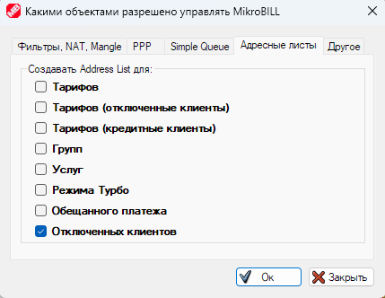 style="width:4.08202in;height:3.15904in" />
>
> Названия адресных листов, используемых MikroBILL, и пояснения по ним:

1.  «**MikroBILL\_Users**» – В список попадают IP абонентов, которым
    разрешён доступ.

2.  «**MikroBILL\_Off\_Users**» – В список попадают IP абонентов,
    которым запрещён доступ.

3.  «**MikroBill\_All\_Drop**» – В список попадают диапазоны по маске
    /24, в которых есть абоненты. По этому листу NAT выдаёт интернет, а
    фаервол блокирует весь трафик, кроме разрешённого листом
    «**MikroBILL\_Users**».

4.  «**MikroBILL\_Tarif\_Имя\_Тарифа**» – В список попадают IP
    абонентов, находящихся на указанном [тарифе](#тарифы), которым
    разрешн доступ. По этому списку строится дерево очередей Queue Tree.

5.  «**MikroBILL\_Tarif\_OFF\_Имя\_Тарифа**» – В список попадают IP
    абонентов, находящихся на указанном [тарифе](#тарифы), которым
    запрещён доступ. По этому списку строится дерево очередей Queue
    Tree, применяются ограничения скорости для заблокированных
    абонентов.

6.  **«MikroBILL\_Tarif\_Credit\_Имя\_Тарифа**» – В список попадают IP
    абонентов, находящихся на указанном [тарифе](#тарифы), которые в
    настоящий момент находятся в кредите. По этому списку строится
    дерево очередей Queue Tree, применяются ограничения для кредитных
    абонентов (если такие настроены).

7.  **«MikroBILL\_Tarif\_PromisedPay\_Имя\_Тарифа**» – В список попадают
    IP абонентов, находящихся на указанном [тарифе](#тарифы), которые в
    настоящий момент одолжили денег (обещанный платёж). По этому списку
    строится дерево очередей Queue Tree, применяются ограничения для
    абонентов, активировавших обещанный платёж.

8.  **«MikroBILL\_Tarif\_Turbo\_Имя\_Тарифа**» – В список попадают IP
    абонентов, находящихся на указанном [тарифе](#тарифы), которые в
    настоящий момент активировали ускорение. По этому списку строится
    дерево очередей Queue Tree, применяются увеличенные ограничения.

9.  **«MikroBill\_LinkedServices\_Имя\_Услуги**» – В список попадают IP
    абонентов, подключивших указанную [услугу](#услуги). MikroBILL никак
    не использует адресный лист, он предусмотрен для особых настроек
    администратором, для предоставления абонентам дополнительных
    сервисов.

**PS:** Для того, чтобы для услуги создавался адресный лист,
соответствующую опцию нужно включить и в свойствах услуги.

1.  **«MikroBILL\_Group\_Имя\_Группы**» – В список попадают IP
    абонентов, находящихся в указанной группе. По этому списку строится
    дерево очередей Queue Tree для ограничения общей скорости на
    [группу](#группы) (если задано в настройках [группы](#группы)).

2.  **«MikroBILL\_WhiteIP\_Users**» – В список попадают IP абонентов, у
    кого адрес отмечен как белый. Это исключает абонентов из общего
    правила NAT.

3.  **«MikroBILL\_LanBallance\_Имя\_Интерфейса**» – В список попадают IP
    абонентов, которые должны выходить в интернет через указанный
    интерфейс. Лист создаётся, если в свойствах подключения к роутеру
    включена балансировка нагрузки на WAN интерфейсах. Статически
    привязать абонента к WAN интерфейсу можно как в свойствах
    [Тарифа](#тарифы) и [Группы](#группы), так и в профиле самого
    абонента.

> Кнопка « class="anchor">**WAN** интерфейсы и балансировка нагрузки»
>
>  style="width:4.98985in;height:4.19206in" />

В этом окне вы можете отметить внешние интерфейсы и задать их параметры.
А так выглядят параметры WAN интерфейса:

Здесь можно выбрать доступную скорость канала в заданное время суток и
параметры шлюза, для маршрутизации трафика.

В окне настроек балансировки нагрузки можно выбрать IP адреса, пингом на
которые будет определяться, что интерфейс доступен и отметить
[тарифы](#тарифы) и [группы](#группы), абонентов из которых будет
автоматически перенаправлять на самый незагруженный интерфейс. Так же
тут можно включить автоматическую отправку сообщений мастеру, при
переходе интерфейса в состояние «недоступен». Про создание мастеров вы
можете прочитать в разделе «[Тикеты](#тикеты)».

**PS:** Загруженность интерфейсов определяется исходя из назначенной им
ширины и из суммарных ограничений скорости абонентов, привязанных к
интерфейсу.

На вкладке «**Тарифы и группы**» вы можете выбрать
[тарифы](#тарифы), абоненты с которых будут размещены на этом роутере, а
также назначить один из тарифов блокирующим. На блокирующий тариф
абоненты будут перемещаться автоматически при недостатке средств на
оплату их текущего тарифа (в момент списания абонентской платы). На
блокирующем тарифе у них не будет доступа в интернет, кроме белого
списка, но вы сможет задать для них особые условия тарификации. При
необходимости, после пополнения баланса, абонент может автоматически
быть возвращён на прежний тариф.

Для работы функции автоматического перевода на блокирующий тариф, он
должен быть выбран в свойствах роутера, на котором находится абонент
(рисунок ниже), а также в свойствах тарифа абонента на вкладке
«**Дополнительно**» необходимо отметить пункт «**Переносить на
блокирующий тариф при нехватке средств**».

**IP пулы и
создание клиентов**

На первой вкладке «**IP пулы**» можно создать любое количество пулов IP
адресов. Пулы вы можете привязывать к [Тарифам](#тарифы) и
[Группам](#группы), соответствующие настройки есть в их свойствах.
Чекбокс «Генерировать IP, если на тарифе или в [группе](#группы) выбран
пул» включает автоматический выбор IP для абонентов при создании.

Интерфейс создания пула весьма минималистичен. Чекбокс «Этот пул внешних
IP» выключает общее NAT правило для абонентов, адрес которым выдан из
этого пула.

На вкладке
«**Создание абонентов**» можно выключить создание логина-пароля для
новых абонентов и алгоритм, по которому они будут создаваться.

На вкладке «**Автоподключение услуг**» задаётся перечень
[услуг](#услуги), которые будут автоматически подключены новому
абоненту.

На вкладке «**Обязательные поля**» выбирается минимальный список данных,
не заполнив которые, нельзя создать нового абонента.

Кнопка «**Финансы**» порождает меню с тремя пунктами:

Рассмотрим все пункты по очереди:

1.  «**Бонусы при пополнении онлайн**» - Позволяют автоматически
    начислять абоненту деньги на счёт в зависимости от суммы пополнения.

>  style="width:4.37899in;height:1.972in" />
>
>  style="width:2.68755in;height:1.60868in" />

1.  «**Скидки при своевременной оплате**» - Позволяет абоненту платить
    меньше, если он не блокировался по балансу в течении заданного
    времени.

>  style="width:4.92697in;height:1.97269in" />
>
>  style="width:2.66029in;height:2.08745in" />

1.  «**Валюта и абонентская плата**» - Позволяет
    изменить название валюты некоторые другие важные параметры.

> Остановимся на некоторых параметрах более подробно.
>
> **Вкладка «Основное».**
>
>  style="width:3.25in;height:2.48958in" />

-   **Название валюты** – Здесь вы можете вписать собственное название,
    или выбрать название валюты из списка.

-   **Ставка налога** – Значение НДС, будет печататься на квитанциях об
    оплате.

-   **Время списания** – Время суток, когда будет списана абонентская
    плата. Так же время можно выбрать персонально для каждого
    [тарифа](#тарифы) в его свойствах.

-   **Остановка при –** При каком балансе абоненту будет заблокирована
    из-за нехватки финансов.

> **Вкладка «Рекомендации».**
>
>  style="width:4.8125in;height:2.83333in" />

-   **Рекомендовать на –** С учётом какого количества дней вперёд
    необходимо просчитывать рекомендуемую сумму пополнения для
    абонентов.

-   **Доп.** **% рекомендаций –** Дополнительный процент, добавляемый к
    рекомендуемой сумме оплаты.

-   **Рекомендуемая сумма оплаты с учётом кредитного лимита –** Если
    опция включена, будет рекомендоваться минимально допустимая сумма,
    чтобы абонент смог работать, в противном случае рекомендоваться
    будет сумма, чтобы после списания абонентской платы у абонента на
    счету остался 0.

-   **Округлять рекомендации в большую сторону –** Сумма рекомендации
    будет округлена до целого числа в большую сторону в зависимости от
    дополнительных условий:

1.  До целого - например, вместо 649.15 будет рекомендовать 650.00;

2.  Кратно 10 - например, вместо 131.15 будет рекомендовать 140.00;

3.  Кратно 50 - например, вместо 131.15 будет рекомендовать 150.00;

4.  Кратно 100 - например, вместо 131.15 будет рекомендовать 200.00;

5.  Кратно 1000 - например, вместо 2374.15 будет рекомендовать 3000.00.

-   **Рекомендовать не меньше месячной платы по тарифу –** Минимальная
    сумма рекомендуемой оплаты – сумма по тарифу за месяц.

> **Вкладка «Другое».**
>
>  style="width:4.70833in;height:5.02083in" />

-   **Проверять соответствие баланса абонента последней записи в
    финансовой статистике –** При запуске MikroBILL будет обращаться к
    логу финансовых операций в БД MySQL, баланс абонента будет
    устанавливаться таким же, как в самой свежей финансовой операции.

-   **Проверять соответствие даты абонентской платы последней записи в
    финансовой статистике –** При запуске MikroBILL будет обращаться к
    логу финансовых операций в БД MySQL, дата последней абонентской
    платы абонента будет устанавливаться такой же, как в самой свежей
    финансовой операции, соответствующей списанию оплаты по тарифу.

-   **Скидки и персональная оплата. Для тарифов "разделить поровну на
    месяц" указывается за –** Здесь можно выбрать, для посуточных
    тарифов скидка и персональная оплата будет рассчитываться исходя из
    суммы оплаты за сутки, или исходя из суммы оплаты за месяц.

-   **Не блокировать доступ в выходные –** Если деньги на счету абонента
    закончились в субботу или воскресение, до доступ в интернет будет
    приостановлен только в понедельник.

-   **В комментарии к абонентской плате указывать месяц –** При списании
    оплаты по тарифу и за услуги, в комментарии указывать за какой
    временной период произошла оплата.

-   **Интервал выгрузки списанного за трафик –** С какой периодичностью
    в БД в финансовую историю будут выгружаться данные о списанных
    деньгах за трафик (применимо только в случае, если назначена цена
    мегабайта).

> Кнопка «**Параметры WEB-заглушек и сервера**»
>
>  style="width:3.95315in;height:4.2091in" />
>
> WEB-заглушки работают только если сайт открывается через HTTP, только
> в этом случае возможно перенаправить трафик на отдельный порт WEB
> сервера. В случае с HTTPS будет разрыв соединения.
>
> Так же на этой форме можно добавить список бесплатных ресурсов,
> которые будут открываться у абонентов при отрицательное балансе (также
> в связи с законодательством, в частности РФ 319-ФЗ имеется возможность
> автоматически выгружать список социальных сайтов и предоставлять
> абонентам к ним доступ по нажатию кнопки; более подробно об этом
> читайте в разделе [услуг](#услуги)).
>
> Вверху формы расположена копка «**Аварийный режим**», которая
> предназначена для временного ограничения скорости всем абонентам, а
> также вывешивания баннера с информацией в WEB-кабинет при нештатных
> ситуациях на сетях провайдера.
>
>  style="width:4.75809in;height:5.59319in" />
>
> Кнопка «**WEB-персонализация**» - позволяет кастомизировать
> абонентский WEB-кабинет.
>
> 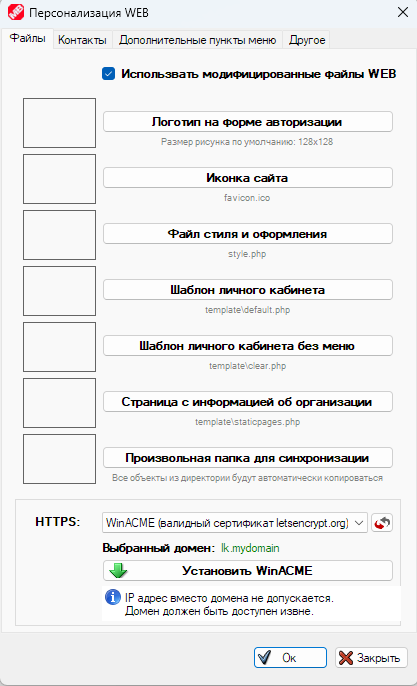 style="width:4.00152in;height:6.58284in" />
>
> Первая вкладка «**Файлы**» позволяет загрузить собственный файлы
> стилей, логотип и т.д. Так же можно добавить любую папку, данные из
> которой автоматически будут переписываться в корень сайта.
>
> Перечислим основные файлы WEB и расскажем, какую функцию они
> выполняют:

-   «**template/default.php**» - Шаблон страницы абонентского
    WEB-кабинета.

-   «**template/clear.php**» - Шаблон страницы абонентского
    WEB-кабинета, который отображается после любого действия, например,
    после оплаты.

-   «**template/agent.php**» - Шаблон страницы скачивания [агента
    авторизации](#Кнопка_Агент_Авторизации).

-   «**template/carduser.php**» и «**template/carduser2.php**» - Шаблоны
    страницы регистрации абонента [картой-ваучером](#карты-оплаты). Оба
    этих шаблона используются одновременно. «**carduser2.php»**
    подставляется в «**carduser.php»** в переменную **%CONTENTS%**.

-   «**template/forgot.php**» и «**template/forgot2.php**» - Шаблоны
    страницы [восстановления пароля](#Разрешения_Для_Абонентов) через
    SMS. «**forgot2.php»** используется, если разрешено восстановление
    пароля без указания логина абонента, только с вводом номера
    телефона, «**forgot.php» -** если нужно знать ещё и логин.

-   «**template/forgot\_email.php**» и
    «**template/forgot2\_email.php**» - Шаблоны страницы [восстановления
    пароля](#Разрешения_Для_Абонентов) через Email.

-   «**forgot2\_email.php»** используется, если разрешено восстановление
    пароля без указания логина абонента, только с вводом email.

-   «**forgot\_email.php» -** если нужно знать ещё и логин.

-   «**template/iptvportal\_\*.php**» - Шаблоны страницы подключения
    подписок IPTVPORTAL.

-   «**template/lifestream\_\*.php**» - Шаблоны страницы подключения
    подписок «Смотрёшка».

-   «**template/megogo\_\*.php**» - Шаблоны страницы подключения
    подписок «Megogo».

-   «**template/omega\_\*.php**» - Шаблоны страницы подключения подписок
    «OmegaTV».

-   «**template/prostotv\_\*.php**» - Шаблоны страницы подключения
    подписок «ProstoTV».

-   «**template/sweet\_\*.php**» - Шаблоны страницы подключения подписок
    «SweetTV».

-   «**template/trinity\_\*.php**» - Шаблоны страницы подключения
    подписок «TrinityTV».

-   «**template/tv24h\_\*.php**» - Шаблоны страницы подключения подписок
    «24h.tv».

-   «**template/wink\_\*.php**» - Шаблоны страницы подключения подписок
    «Wink».

-   «**template/emailregistr.php**» - Шаблоны страницы [регистрации
    абонента через Email](#Разрешения_Для_Абонентов).

-   «**template/smsregistr.php**» - Шаблон страницы [регистрации
    абонента через SMS.](#Разрешения_Для_Абонентов)

-   «**template/qiwibox.php**» - шаблон страницы с информацией об оплате
    через QIWI терминалы.

-   «**template/staticpages\*.php**» - шаблон страницы вопросов и
    ответов, которая находится в кабинете абонента в разделе
    «**Помощь**» &gt; «**Часто задаваемые вопросы**».

-   «**template/webauth.php**» и «**template/webauth2.php**» - Шаблоны
    страницы [WEB авторизации](#WEB_Авторизация) абонента. Оба этих
    шаблона используются одновременно. «**webauth.php»** подставляется в
    «**webauth2.php»** в переменную **%CONTENTS%**. Шаблон
    «**webauth3.php**» показывает состояние WEB-авторизации.

-   «**template/login\_temp.php**» - шаблон страницы входа в абонентский
    WEB-кабинет.

> Внутри шаблонов вы можете заметить конструкции вида
> **%STRINGS\_число%**, MikroBILL автоматически подставит на их место
> строковую константу, которые загружаются из файла «lng/язык.txt».
> Подстчёт строк идёт от нуля. Если вы хотите в шаблоне отобразить 10
> строку из файла локализации, то необходимо писать **%STRINGS\_10%**.
>
> Так же внутри шаблонов можно встретить конструкцию **%REM** – это
> комментарий, который не будет отображаться при отрисовке страницы.
>
> Внизу формы есть выбор типа HTTPS сертификата: самоподписный через
> OpenSSL, ACME сертификат от letsencrypt.org, либо доступна собственных
> файлов сертификата.
>
> Вкладка «**Контакты**» позволяет добавит контактную информацию в
> WEB-кабинет абонента.
>
>  style="width:3.97874in;height:2.90496in" />
>
> На вкладке «**Дополнительные пункты меню**» можно добавить
> дополнительные позиции в абонентский WEB-кабинет, которые ведут либо
> на дополнительную страницу сайта, либо на печать шаблона документа, с
> подстановкой данных (например, для печати договора абонента
> непосредственно из WEB).
>
>  style="width:4.06837in;height:2.25838in" />
>
>  style="width:4.0934in;height:2.21412in" />
>
> На вкладке «**Другое**» вы можете выбрать имя своего сайта, выбрать
> страницу, на которую абонент попадёт после авторизации, настроить язык
> кабинета по умолчанию и включить чат с абонентами через chatra.io.
>
>  style="width:3.68868in;height:4.88679in" />
>
> Кнопка «**Логи, бэкапы и обновления**» ведёт нас на страницу
> одноимённых настроек.
>
>  style="width:3.08963in;height:2.64145in" />
>
> Здесь можно включить запись логов, выбрать максимальный размер файла и
> минимальное пространство на системном диске, при котором запись
> остановится, а также включить запись всех команд, отправляемых на
> оборудование.
>
> Чекбокс «**Отправлять анонимную статистику**» включает отправку на
> наши сервера информации о сбоях в работе программы.
>
> Вкладка «**Бэкапы**» позволяет восстановиться из автоматического
> бэкапа (они создаются каждые 3 часа).
>
>  style="width:3.9878in;height:1.78601in" />
>
> Либо настроить параметры бэкапов.
>
>  style="width:3.85748in;height:5.06116in" />
>
> Если не выбирать «**Бэкап таблиц БД**», то будут сохраняться только
> абонента без логов и финансовой статистики.
>
> Если не выбирать «**Бэкап больших таблиц**», в него не попадут файл,
> загружены в тикеты и сканы документов, прикреплённые к абонентам и
> шаблоны для печати.
>
> На вкладке «**Обновления**» вы можете выбрать параметры обновления
> MikroBILL.
>
>  style="width:3.36075in;height:1.82878in" />
>
> Кнопка «**Плагины**»
>
>  style="width:4.83373in;height:1.59532in" />
>
> Здесь вы можете включать собственные модификации абонентского
> WEB-кабинета, либо добавлять свои способы приёма оплаты (способ оплаты
> и его иконка будут отображаться в MikroREMOTE). Ниже представлено
> пояснение по формату данных.
>
> Для добавления плагина в папке %allusersprofile%\MikroBILL\Plugins\\
> на сервере создайте папку с именем своего плагина, внутри которой
> создайте файл Plugin.cfg в кодировке UTF-8 со следующим содержимым:
>
> Type=PayPlugin
>
> Name=Имя плагина
>
> ID=100
>
> Icon=icon.png
>
> Comment=Комментарий
>
> Copy\_To=Папка внутри web, куда нужно копирвать файлы плагина,
> находящиеся в папке
> %allusersprofile%\MikroBILL\Plugins\Папка\_плагина\bin\\
>
> **ID** - уникальный номер вашего плагина, который не пересекается с
> другими плагинами (больше 100, но меньше 200).
>
> **Icon** - путь к миниатюре, значку вашего плагина, который будет
> отображаться в окне финансовой статистики.
>
> Управлять плагинами вы можете из окна настроек, вкладка
> "**Администрирование**" &gt; кнопка "**Плагины**".
>
> Для добавления платежа в БД вашим скриптом используйте SQL запрос:
>
> INSERT INTO \`addcash2\` VALUES ('GUID\_Абонента',
> Сумма\_пополнения\_деньги, Сумма\_пополнения\_дни,
> 'Идентификатор\_плагина', 0, 'Любой\_уникальный\_идентификатор',
> 'Комментарий', 'Время\_операции');
>
> **GUID\_Абонента** можно получить из таблицы stat, поле shortguid.
>
> **Идентификатор** равен строке "ID=уникальный\_номер\_вашего\_плагина"
> (без кавычек), т.е. для данного примера: "ID=100" (без кавычек).
>
> Чтобы MikroBILL оперативно принял пополнение необходимо выполнить
> следующий SQL запрос:
>
> INSERT INTO \`refresh\_db\` VALUES (1);
>
> Для добавления плагина в папке %allusersprofile%\MikroBILL\Plugins\\
> на сервере создайте папку с именем своего плагина, внутри которой
> создайте файл Plugin.cfg в кодировке UTF-8 со следующим содержимым:
>
> Type=WebPlugin
>
> Name=Имя плагина
>
> ID=0
>
> Icon=icon.png
>
> Comment=Комментарий
>
> Php\_command=Команда PHP, которая должна выполняться при загрузке
> плагина, например: require('mymodule.php');
>
> **ID** - уникальный номер вашего плагина, который не пересекается с
> другими плагинами (целое число до 16 разрядов).
>
> **Icon** - путь к миниатюре, значку вашего плагина, который будет
> отображаться в окне настроек MikroBILL.
>
> Управлять плагинами вы можете из окна настроек, вкладка
> "**Администрирование**" &gt; кнопка "**Плагины**".
>
> Примерный вид фала mymodule.php:
>
> &lt;div style="position:absolute"&gt;
>
> Ваш код тут!
>
> &lt;/div&gt;
>
> Вы так же можете создавать WEB плагины, для этого в папке
> %allusersprofile%\MikroBILL\Plugins\\ на сервере создайте папку с
> именем своего плагина, внутри которой создайте файл Plugin.cfg в
> кодировке UTF-8 со следующим содержимым:
>
> Type=WebPlugin
>
> Name=Имя плагина
>
> ID=0
>
> Icon=icon.png
>
> Comment=Комментарий
>
> Php\_command=Команда PHP, которая должна выполняться при загрузке
> плагина, например: require('mymodule.php');
>
> ID - уникальный номер вашего плагина, который не пересекается с
> другими плагинами (целое число до 16 разрядов).
>
> Icon - путь к миниатюре, значку вашего плагина, который будет
> отображаться в окне настроек MikroBILL.
>
> На всякий случай напомним, что включать и отключать уже созданные
> плагины вы можете в окне настроек, вкладка "**Администрирование**"
> &gt; кнопка "**Плагины**".
>
> А ещё, на нашем сайте доступен магазин плагинов, созданных нашими
> пользователями. Вы тоже можете разместить своё творение здесь:
> <http://mikro-bill.com/plugins/> для этого напишите на
> <fomichok@mail.ru> или в телеграм <https://t.me/Fomichok>.
>
>  style="width:6.26806in;height:3.71667in" />

Кнопка
«**Кассиры и Мастера**»

>  style="width:5.99709in;height:1.79307in" />
>
> Здесь представлены кассиры и мастера. Мастера могут назначаться
> ответственными за выполнение каких-то работ, а кассиры отвечают за
> работу с абонентами и за администрирование (в зависимости от выданных
> им привилегий). Под учётными данными кассиров так же осуществляется
> подключение через MikroREMOTE и по протоколам API через приложение и
> PHP. Настройки профиля кассира выглядят следующим образом:
>
>  style="width:6.26806in;height:5.54514in" />
>
> Здесь можно внести Логин и Пароль, добавить персональные данные
> кассира, а также выбрать [тарифы](#тарифы) и [группы](#группы), с
> которых кассир будет видеть абонентов. Так же можно включить фильтр
> входа кассира по IP адресам.
>
> На вкладке «**Разрешения**» можно выбрать допустимы для кассира
> действия.
>
> 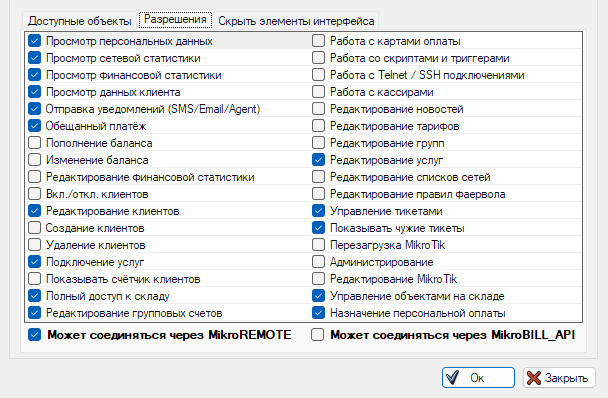 style="width:5.40017in;height:3.20659in" />
>
> На вкладке «**Доступ по времени**» можно ограничить кассиру время
> работы по дням недели и по часам.
>
>  style="width:6.26806in;height:2.83194in" />
>
> На вкладке «**Скрыть элементы интерфейса**» можно отключить кассиру
> любую кнопку в интерфейсе, или пункт меню. Можно скрыть любой столбец
> с данными, или часть адресов, например, район города.
>
>  style="width:6.33465in;height:3.70079in" />
>
> В верхней правой части доступен выбор группы для кассира, а также
> кнопка, открывающая окно редактирования групп кассиров (доступна
> только администраторам).
>
>  style="width:4.92708in;height:2.97917in" />
>
> Группы позволяют назначать кассирам, входящим в эту группу одинаковые
> привилегии, а также давать доступ к одинаковым тарифам и группам,
> настройки групп имеют вкладки «**Доступные объекты**»,
> «**Разрешения**», «**Доступ по времени**» и «**Скрыть элементы
> интерфейса**». Все эти вкладки полностью идентичны как визуально, так
> и по функционалу аналогичным из свойств кассиров.
>
> Группы имеют больший приоритет по сравнению с настройками, внесёнными
> в профиль кассира, за исключением поля «**Доверенные IP**», если это
> поле заполнено в профиле кассиров, то значение берётся из него.
>
> Кнопка «**Вход**» окна настроек открывает параметры авторизации
> абонентов.
>
>  style="width:4.20435in;height:3.90183in" />
>
> Здесь можно включить, чтобы абонента пускало в WEB-кабинет только с
> IP, который прописан у него в профиле, либо включить авто вход, если
> IP, с которого зашёл абонент, совпадает с IP в его профиле.
>
> **Обратите внимание:** IP абонента может корректно определиться только
> в случае, если между клиентом и WEB-сервером нет NAT, т.к. последний
> маскирует реальный IP.
>
> Ещё на этой форме можно включить  class="anchor">WEB-авторизацию, тогда IP, с которого зашёл
> абонент, будет автоматически добавляться в его профиль.
>
>  style="width:3.49449in;height:2.11961in" />
>
> По умолчанию для WEB-авторизации предусмотрена отдельная страница
> входа: http://адрес\_сервера/enter.php, но если отметить чекбокс
> «**Авторизация в WEB-кабинете = WEB-авторизации**», то WEB-авторизация
> для абонента будет срабатывать, в момент ввода абонентом логина и
> пароля на главной странице абонентского кабинета.
>
> Для WEB-авторизации так же справедливо требование об отсутствии NAT
> между клиентом и WEB-сервером.
>
> Пункт «**Авторизация в ЛК = HotSpot авторизации в MikroTik**» включает
> отправку команды на HotSpot микротика в момент, когда абонент вводит
> свои логин и пароль на главной странице абонентского кабинета. Таким
> образом абоненту не нужно посещать страницу HotSpot микротика, чтобы
> авторизоваться, достаточно просто быть авторизованным в WEB-кабинете
> MikroBILL. Чтобы абонент вместо HotSpot странице роутера попадал на
> кабинет MikroBILL, поставьте чекбокс «**Перенаправлять с HotSpot на
> MikroBILL**» в свойствах подключения к роутеру. **Обратите внимание:**
> необходимо включить PAP авторизацию в профиле хотспота на роутере,
> чтобы авторизация была успешной.
>
> Так же на странице настроек входа можно включать маску логина, чтобы
> абонент соблюдал формат при вводе данных. Например, если у вас
> абоненты в качестве логина используют номера телефонов, то маска будет
> выглядеть следующим образом: **+7 (\_\_\_) \_\_\_-\_\_\_\_**, ниже
> можно вписать допустимые символы, например: **\[0-9\]** или
> **\[A-Z,a-z,0-9\]**.
>
> Кнопка «**Клиенты**» порождает меню с тремя пунктами:
>
>  style="width:1.52484in;height:0.64806in" />

Рассмотрим все пункты по очереди:

1.  **«****Разрешения»** – Определяют, что может делать
    абоненты.

> 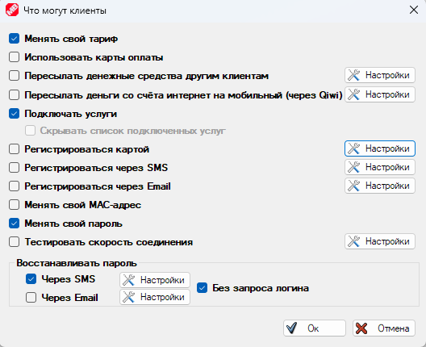 style="width:5.01809in;height:4.0867in" />
>
> Тут можно разрешить абонентам менять свой [тариф](#тарифы),
> использовать карты оплаты и менять свой пароль через настройки в
> WEB-кабинете, разрешить абонентам подключать [услуги](#услуги), менять
> MAC адрес и пароль подключения. Так же можно включить восстановление
> пароля через SMS или Email. Другие пункты не столь очевидны, поэтому
> остановимся на них более подробно.

-   **«Пересылать денежные средства другим абонентам»** - у абонентов в
    WEB-кабинете появится возможность отправить часть средств со своего
    счёта Интернет на счёт другого абонента по номеру договора. Выглядит
    это так:

>  style="width:4.74759in;height:3.53082in" />
>
> А вот настройки параметров перевода на стороне администратора:
>
>  style="width:3.00544in;height:1.37142in" />

-   «**Пересылать деньги со счёта интернет на мобильный (через
    Qiwi)**» - разрешает абонентам переводить деньги со счёта Интернет
    на мобильный телефон. Деньги будут переводиться с вашего Qiwi
    кошелька на указанный абонентом номер. Так выглядит окно настроек:

> Для использования этой опции вам понадобится кошелёк в платёжной
> системе Qiwi и действующий токен, который можно получить, перейдя по
> ссылке: <https://qiwi.com/api>

-   «**Регистрироваться картой**» - в разделе карт
    оплаты вы можете создавать ваучеры, пополняющие счёт абонента
    деньгами, либо днями работы. Так же можно создать ваучер,
    регистрирующий нового абонента. Процедуру создания ваучеров мы
    рассмотрим в следующем разделе, а пока посмотрим на окно настроек
    регистрации нового абонента ваучером.

>  style="width:2.86404in;height:3.63733in" />
>
> Здесь можно выбрать начальный [тариф](#тарифы), [группу](#группы) и
> тип авторизации абонента. Опция «**Доступно только по прямой ссылке**»
> скрывает ссылку на регистрацию ваучером с главной страницы,
> регистрация будет доступна, если абонент сам введёт URL. Страница
> регистрации находится по адресу: <http://адрес_сервера/newclient.php>
>
> «**Все поля обязательны к заполнению**» - запрещает регистрацию, если
> не заполнены паспортные данные и телефон.
>
> «**Необходимо принять публичную оферту**» - Абоненту необходимо
> принять публичную оферту для регистрации.
>
> Абонентов зарегистрированных оператором, так же есть возможность
> обязать принять оферту, соответствующий чекбокс находится по кнопке
> «**Клиенты**» **&gt;** «**Дополнительно**» &gt; «**Запретить доступ
> клиентам, не принявшим публичную оферту**». Абонент не получит доступ
> в Интернет, пока не примет оферту, об этом будет напоминать плашка в
> WEB-кабинете. Текст оферты необходимо разместить в папке WEB
> документов Апача в файле files\ofetra.htm. Кассир может принять оферту
> за абонента, для этого есть пункт в контекстном меню абонента:
> «**Дополнительно**» &gt; «**Дополнительно**» &gt; «**Оферта**».
>
> Вот так страница регистрации через SMS выглядит на стороне абонента:
>
> 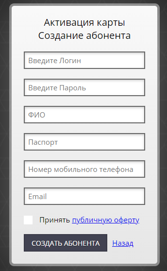 style="width:3.28951in;height:5.3359in" />
>
> «**Регистрироваться через SMS**» - Разрешает абонентам
> регистрироваться через номер мобильного телефона. После завершения
> регистрации, абоненту будет выслано SMS сообщение с реквизитами входа.
> Как вы можете заметить, в шаблоне SMS сообщений используются теги
> автозамены, обрамлённый символом решётки «**\#**», полный список
> доступных тегов в таблице ниже.

<table>
<colgroup>
<col style="width: 28%" />
<col style="width: 71%" />
</colgroup>
<thead>
<tr class="header">
<th><strong>Тэг</strong></th>
<th><strong>На что будет заменён</strong></th>
</tr>
</thead>
<tbody>
<tr class="odd">
<td>#NAME#</td>
<td>Будет заменено на ФИО абонента</td>
</tr>
<tr class="even">
<td>#CLIENT#</td>
<td>Будет заменено на имя абонента</td>
</tr>
<tr class="odd">
<td>#USRLOGIN#</td>
<td>Будет заменено на логин клиента</td>
</tr>
<tr class="even">
<td>#USRPASS#</td>
<td>Будет заменено на пароль клиента</td>
</tr>
<tr class="odd">
<td>#IP#</td>
<td>Будет заменено на IP-адрес</td>
</tr>
<tr class="even">
<td>#MAC#</td>
<td>Будет заменено на MAC-адрес</td>
</tr>
<tr class="odd">
<td>#TEL#</td>
<td>Будет заменено на телефон абонента</td>
</tr>
<tr class="even">
<td>#PASSPORT#</td>
<td>Будет заменено на паспортные данные</td>
</tr>
<tr class="odd">
<td>#BORN_DATE#</td>
<td>Будет заменено на дату рождения</td>
</tr>
<tr class="even">
<td>#BORN_IN#</td>
<td>Будет заменено на место рождения</td>
</tr>
<tr class="odd">
<td>#SERVICES#</td>
<td>Будет заменено на список подключенных услуг</td>
</tr>
<tr class="even">
<td>#EMAIL#</td>
<td>Будет заменено на email абонента</td>
</tr>
<tr class="odd">
<td>#DAYS#</td>
<td>Будет заменено на количество дней</td>
</tr>
<tr class="even">
<td>#CONTRACT#</td>
<td>Будет заменено на номер договора</td>
</tr>
<tr class="odd">
<td>#STOPDATE#</td>
<td>Будет заменено на дату остановки</td>
</tr>
<tr class="even">
<td>#STARTDATE#</td>
<td>Будет заменено на дату активации абонента</td>
</tr>
<tr class="odd">
<td>#CASH#</td>
<td>Будет заменено на значение баланса</td>
</tr>
<tr class="even">
<td>#CASH+#</td>
<td>Будет заменено на сумму пополнения</td>
</tr>
<tr class="odd">
<td>#CASH-#</td>
<td>Будет заменено на размер обещанного платежа и его стоимость</td>
</tr>
<tr class="even">
<td>#CASHNAME#</td>
<td>Будет заменено на название валюты</td>
</tr>
<tr class="odd">
<td>#NEXTCASH#</td>
<td>Баланс после следующего списания абонентской платы</td>
</tr>
<tr class="even">
<td>#BLOCKCASH#</td>
<td>Баланс, при котором абонент будет заблокирован</td>
</tr>
<tr class="odd">
<td>#PAYSIZE#</td>
<td>Будет заменено на размер списания абонентской платы</td>
</tr>
<tr class="even">
<td>#PAYSIZE2#</td>
<td>Будет заменено на размер списания абонентской платы за месяц</td>
</tr>
<tr class="odd">
<td>#PAY_DAY#</td>
<td>Будет заменено на день абонентской платы</td>
</tr>
<tr class="even">
<td>#RECOMMENDED_PAY#</td>
<td>Будет заменено на рекомендуемую сумму платежа</td>
</tr>
<tr class="odd">
<td>#PAYSIZECLEAR#</td>
<td>Необходимая сумма текущего пополнения</td>
</tr>
<tr class="even">
<td>#TARIF#</td>
<td>Будет заменено на название тарифа абонента</td>
</tr>
<tr class="odd">
<td>#ADDRESS#</td>
<td>Будет заменено на адрес подключения</td>
</tr>
<tr class="even">
<td>#ADDRESS2#</td>
<td>Будет заменено на адрес регистрации</td>
</tr>
<tr class="odd">
<td>#ZIP_CODE#</td>
<td>Будет заменено на почтовый индекс</td>
</tr>
<tr class="even">
<td>#DIALIN#</td>
<td>Будет заменено на тип PPP подключения</td>
</tr>
<tr class="odd">
<td>#INFORM1#</td>
<td>Будет заменено на информацию №1 из профиля абонента</td>
</tr>
<tr class="even">
<td>#INFORM2#</td>
<td>Будет заменено на информацию №2 из профиля абонента</td>
</tr>
<tr class="odd">
<td>#COMMENT1#</td>
<td>Будет заменено на комментарий №1 из профиля абонента</td>
</tr>
<tr class="even">
<td>#COMMENT2#</td>
<td>Будет заменено на комментарий №2 из профиля абонента</td>
</tr>
<tr class="odd">
<td>#COMMENT3#</td>
<td>Будет заменено на комментарий №3 из профиля абонента</td>
</tr>
<tr class="even">
<td>#COMMENT4#</td>
<td>Будет заменено на комментарий №4 из профиля абонента</td>
</tr>
<tr class="odd">
<td>#COMPANY_NAME#</td>
<td>Будет заменено на название организации</td>
</tr>
<tr class="even">
<td>#DIRECTOR#</td>
<td>Будет заменено на ФИО директора</td>
</tr>
<tr class="odd">
<td>#BANK#</td>
<td>Будет заменено на название банка</td>
</tr>
<tr class="even">
<td>#BANK_ACCOUNT#</td>
<td>Будет заменено на номер лицевого счёта</td>
</tr>
<tr class="odd">
<td>#BANK_ROOT_ACCOUNT#</td>
<td>Будет заменено на кор.счёт банка</td>
</tr>
<tr class="even">
<td>#INN#</td>
<td>Будет заменено на ИНН</td>
</tr>
<tr class="odd">
<td>#KPP#</td>
<td>Будет заменено на КПП</td>
</tr>
<tr class="even">
<td>#BIK#</td>
<td>Будет заменено на БИК</td>
</tr>
<tr class="odd">
<td>#OGRN#</td>
<td>Будет заменено на ОГРН</td>
</tr>
<tr class="even">
<td>#MAILING_ADDRESS#</td>
<td>Будет заменено на почтовый адрес</td>
</tr>
<tr class="odd">
<td>#BILLING_ADDRESS#</td>
<td>Будет заменено на адрес для счетов</td>
</tr>
<tr class="even">
<td>#LEGAL_ADDRESS#</td>
<td>Будет заменено на юридический адрес</td>
</tr>
<tr class="odd">
<td>#CONTACT_PERSON#</td>
<td>Будет заменено на контактное лицо</td>
</tr>
<tr class="even">
<td>#CREATION_DATE#</td>
<td>Будет заменено на дату создания абонента</td>
</tr>
<tr class="odd">
<td>#CODE#</td>
<td>Будет заменено на код проверки при изменении телефона</td>
</tr>
<tr class="even">
<td>#SMOTRESHKA_LOGIN#</td>
<td>Будет заменено на логин в системе Смотрёшка</td>
</tr>
<tr class="odd">
<td>#SMOTRESHKA_PASS#</td>
<td>Будет заменено на пароль в системе Смотрёшка</td>
</tr>
<tr class="even">
<td>#MEGOGO_LOGIN#</td>
<td>Будет заменено на логин в системе Megogo</td>
</tr>
<tr class="odd">
<td>#MEGOGO_PASS#</td>
<td>Будет заменено на пароль в системе Megogo</td>
</tr>
<tr class="even">
<td>#IPTVPORTAL_LOGIN#</td>
<td>Будет заменено на логин в системе IPTVPORTAL</td>
</tr>
<tr class="odd">
<td>#IPTVPORTAL_PASS#</td>
<td>Будет заменено на пароль в системе IPTVPORTAL</td>
</tr>
<tr class="even">
<td>#LIMIT_IN#</td>
<td>Будет заменено на ограничение входящей скорости</td>
</tr>
<tr class="odd">
<td>#LIMIT_OUT#</td>
<td>Будет заменено на ограничение исходящей скорости</td>
</tr>
<tr class="even">
<td>#RND#</td>
<td>Будет заменено на произвольный набор цифр</td>
</tr>
<tr class="odd">
<td>#DAY#</td>
<td>Будет заменено на номер дня в месяце</td>
</tr>
<tr class="even">
<td>#MONTH#</td>
<td>Будет заменено на номер месяца</td>
</tr>
<tr class="odd">
<td>#YEAR#</td>
<td>Будет заменено на год</td>
</tr>
<tr class="even">
<td>#HOUR#</td>
<td>Будет заменено на час</td>
</tr>
<tr class="odd">
<td>#MINUTE#</td>
<td>Будет заменено на минуты</td>
</tr>
<tr class="even">
<td>#SECOND#</td>
<td>Будет заменено на секунды</td>
</tr>
</tbody>
</table>

>  style="width:3.06363in;height:4.968in" />
>
> Действия чекбоксов «**Доступно только по прямой ссылке**», «**Все поля
> обязательны к заполнению**» и «**Необходимо принять публичную
> оферту**» аналогичны логике из регистрации абонента ваучером.

-   «**Регистрироваться через Email**» - Все настройки идентичны
    регистрации по SMS, за тем лишь исключением, что сообщение будет
    отправлено на электронную почту.

-   «**Тестировать скорость соединения**» - Абоненты смогут проверять
    скорость доступа в Интернет. Вы можете включить локальный тест
    скорости в настройках, или воспользоваться внешними серверами.

> Окно добавления сервера скорости выглядит так:
>
>  style="width:4.93268in;height:1.73471in" />
>
> Так же вы можете сделать свой сервер теста скорости общедоступным,
> чтобы абоненты других провайдеров могли на нём тестировать скорость,
> для этого напишите нам на <fomichok@mail.ru> и приложите URL к вашему
> тесту, как на скрине выше.

1.  «**Логгирование**» - в
    этом разделе всё просто: выбираются данные, которые нужно хранить в
    базе и как долго они могут там находиться.

>  style="width:3.93692in;height:3.47431in" />

1.  «**Дополнительно**» - открывает окно с дополнительными параметрами.

>  style="width:4.26504in;height:3.431in" />
>
> Разберём действия некоторых чекбоксов.

-   «**Разрешить автоматический обещанный платёж**» - При нехватке
    средств на оплату [услуг](#услуги), абоненту автоматически будет
    активироваться обещанный платёж. Срок действия платежа, его сумму, и
    максимальное количество активаций можно настроить в окне услуг.
    Чтобы абоненту начислялся автоматический обещанный платёж он должен
    явно разрешить его себе в личном кабинете, либо это может сделать за
    него администратор в контекстном меню «**Дополнительно**» &gt;
    «**Дополнительно**» &gt; «**Автоматический обещанный платёж**».

-   «**Разрешить абонентам откладывать свой старт**» - У заблокированных
    по балансу абонентов появится возможность, начать пользоваться
    [услугами](#услуги) не сразу после пополнения, а с началом
    следующего расчётного периода (зависит от настроек
    [тарифа](#тарифы)).

-   «**Абонент может видеть список своих заявок**» - В абонентском
    WEB-кабинете будет доступен список тикетов, которые открывал
    абонент. **PS:** [Мастера](#Мастера), ответственные за тикеты, могут
    скрыть любой тикет от абонента, для этого в окне создания и
    редактирования тикета есть чекбокс «**Абонент может видеть тикет**».

-   «**Запретить пополнения абонентам с незаполненным профилем**» -
    Абоненты не смогут пополнить свой баланс, пока не заполнят
    паспортные данные и сотовый телефон.

-   «**Запретить доступ абонентам, не принявшим публичную оферту**» -
    Абонент не получит доступ в Интернет, пока не примет оферту, об этом
    будет напоминать плашка в WEB-кабинете. Текст оферты необходимо
    разместить в папке WEB документов Апача в файле files\ofetra.htm.
    Кассир может принять оферту за абонента, для этого есть пункт в
    контекстном меню абонента: «**Дополнительно**» &gt;
    «**Дополнительно**» &gt; «**Оферта**».

-   «**Язык сервиса MikroBILL**» - Выбирает язык, на котором будут
    писаться записи в логах, например, записи о списании абонентской
    платы в финансовой статистике.

> Кнопка
> «**Yandex.Карта**»
>
> Здесь вы можете внести данные API ключа Яндекс Карт. Сервис нужен
> чтобы отмечать дома абонентов на карте или места расположения
> роутероров, рисовать зоны покрытия и т.д.
>
>  style="width:3.8363in;height:1.65506in" />
>
> Зарегистрировать API ключ вы можете на странице
> <https://developer.tech.yandex.ru/services/> - **это бесплатно!** Ниже
> можно выбрать центр карты.
>
> Кнопка «**Логи действий**»
>
> На этой форме отображается вся статистика – по абонентам, кассирам и
> мастерам. Пример на снимке ниже:
>
>  style="width:6.26806in;height:1.43958in" />
>
> В столбце «**Инициатор**» - автор действия: кассир, мастер, либо это
> автоматическое действие, совершённое биллингом. В столбце
> «**Объект**» - сущность, над которой производятся манипуляции – это
> абонент, либо какое-то окно настроек. Столбец «**Объект 2**»
> заполняется не всегда, в случаях, если действие производилось с двумя
> объектами, например, подключение [услуги](#услуги) абоненту.
>
> Из контекстного меню любой записи можно перейти в окно редактирования
> каждого объекта, представленного в этой строке:
>
>  style="width:2.14075in;height:0.93415in" />
>
> Кнопка «**Онлайн платежи**»
>
> Здесь можно включить приём онлайн платежей. На момент написания этого
> документа доступны следующие платёжные системы: LiqPay, iPay.ua,
> paycom.uz, Юmoney (Yandex.Деньги), Юkassa (Yandex.Касса), Тинькофф
> Банк, Сбербанк, ROBOKASSA, Onpay, ОСМП, Модульбанк, Payeer, NonStop,
> Compay, Payplug, Krasplat, pbkiosk.ru, gosbank.su, Privat24,
> payhub.com.ua (ПУМБ), PayBerry, 2click.money, fc-sistema.com,
> citypay.su, easypay.ua, easypay.am, MobiDram, TelCell, VivaWallet,
> Центральная Касса, kaspi.kz, click.uz, HayPost, КАССервис, Prodamus,
> GlobalMoney, LugaPay, парсинг SMS и email сообщений, парсинг
> персональных QIWI кошельков.
>
> Поскольку все платёжные системы настраиваются однотипно, настроим для
> примера только одну – Ю.Кассу.
>
>  style="width:5.06217in;height:5.16703in" />
>
> Здесь можно добавить несколько учётных записей кассы, чтобы привязать
> каждую к определённой [группе](#группы) абонентов (для этого в
> свойствах [группы](#группы) есть вкладка «**Оплата**»). Таким образом
> вы можете принимать оплату в разных района как разные юридические
> лица.
>
> Ниже в настройках можно выбрать [тарифы](#тарифы) и [группы](#группы),
> которым будет доступен этот способ оплаты. Пункты «**Комиссия при
> пополнении**» и «**Комиссия платёжной системы**» увеличивают
> рекомендуемую сумму оплаты. Первый спишет процент в пользу провайдера,
> второй подразумевает, что на счёт провайдера поступит сумма уже за
> вычетом указанного процента, т.к. его сняла платёжная система.
>
> В пункте «**Название способа оплаты**» - можно выбрать заголовок,
> который увидит абонент в своём WEB-кабинете.
>
> «**Принимать запросы только с разрешённых IP адресов**» включает
> фильтр адресов, с которых может приходить уведомление об успешной
> оплате.
>
> Уведомление отправляет платёжная система, поэтому не забудьте включить
> уведомления на их сайте и вписать Callback URL, который равен
> http://домен\_или\_внешний\_ip/payin/название\_платёжной\_системы/payin.php.
> Ваш WEB-сервер должен иметь доступ извне (возможно, потребуется
> сделать проброс 80 и 443 TCP порта на роутере). Проверьте, перейдя
> браузером на URL. Если вы увидите сообщение: "Hello my World!",
> значит, ваш сайт доступен извне и платежи будут автоматически
> приходить на счета абонентов. В окне настроек каждой платёжной системы
> в MiroREMOTE будут подсказки по URL для уведомлений.
>
> Кнопка «**Телевидение**».
>
> В настоящее время доступны следующие поставщики контента: Смотрёшка,
> 24h.TV, Trinity.TV, Sweet.TV, Omega.TV, Megogo, Prosto.TV, IPTVPORTAL,
> TVIP Media и Wink.
>
> Поскольку все ТВ системы настраиваются однотипно, настроим для примера
> только одну – 24h.tv
>
>  style="width:3.92779in;height:3.08849in" />
>
> В настройках вы можете внести данные авторизации, а так же включить
> запись в лог всех HTTP запросов и ответов. Логи вы можете посмотреть
> из MikroREMOTE, «**Настройки**» &gt; «**Администрирование**» &gt;
> «**Логи, бэкапы и обновления**». Так же логи можно посмотреть
> самостоятельно, под Windows они расположены по пути
> %allusersprofile%\MikroBILL\Log.txt, на UNIX - /var/MikroBILL/Log.txt
>
> Кнопка «**Загрузить подписки**» прочитает список доступных ТВ-пакетов
> и добавит их как обычные [услуги](#услуги), которые абонент сможет
> подключить из своего WEB-кабинета, а вы сможете настроить их в разделе
> услуг.
>
> Вид страницы активации подписок из абонентского WEB-кабинета
> представлен ниже. Также тут можно посмотреть список каналов в каждой
> подписке, либо перейти на страницу скачивания приложения для Android и
> iOS для управления подписками. Поскольку ТВ сервис посылает данные об
> активированных подписках на ваш URL, проверьте, что ваш WEB-сервер
> имеет доступ извне (возможно, потребуется сделать проброс 80 и 443 TCP
> порта на роутере). Проверьте, перейдя браузером на URL. Если вы
> увидите сообщение: "Hello my World!", значит, ваш сайт доступен извне.
> В окне настроек каждого провайдера ТВ будут подсказки по URL для
> уведомлений.
>
>  style="width:6.26806in;height:3.81875in" />
>
> Кнопка
> «**Агент авторизации**»
>
> Ваши абоненты могут использовать приложение MikroAGENT (под Windows)
> для авторизации. В приложении абонент может видеть свой баланс,
> открыть тикет или активировать карту оплаты. Так же приложение поможет
> абоненту создать и подключить VPN соединение. По умолчанию MikroAGENT
> выглядит вот так:
>
>  style="width:1.95833in;height:0.92708in" />
>
> Но вы можете изменить его внешний вид по своему усмотрению, загружая
> собственные изображения.

> Когда у абонента подключен MikroAGENT, его иконка становится такой:
>  style="width:0.21878in;height:0.2292in" />

-   Чекбокс «**Запретить агенту авторизации менять IP в профиле
    абонента**» - По умолчанию, когда абонент соединяется с сервером
    MikroBILL при помощи MikroAGENT, ему в профиле прописывается тот же
    IP, с которого пришло соединение.

-   Если расчёт с абонентами идёт не с использованием денег, а времени
    (в профиле абонентов установлен параметр «**Дата 2**» -
    фиксированное время остановки), можно отображать в MikroAGENT вместо
    денег, оставшееся время, за это отвечает чекбокс «**Вместо баланса
    отображать количество оставшихся дней**».

-   «**Разрешить авторизацию без логина и пароля**» - Включает IP
    авторизацию. Если адрес абонента в профиле и IP, с которого пришло
    соединение, совпадают, абонент будет считаться авторизованным.

-   «**Разрешить создание PPP соединение на стороне абонента**» -
    MikroAGENT самостоятельно создаст PPTP соединение, поместит ярлык на
    рабочий стол, а при нажатии кнопки подключения
     будет самостоятельно его
    поднимать, и разрывать при отключении.

-   «**Разрешать поднимать PPP туннель заблокированным абонентам**» -
    Остановленные по балансу абоненты смогут поднять PPTP соединение.

-   Кнопка «**Изменить дизайн агента авторизации**» позволяет выбрать
    собственный фон, а также иконки кнопок и самого приложения. Ещё
    здесь имеется возможность вписать IP сервера MikroBILL, чтобы
    абонентам не нужно было этого делать самостоятельно.

> Так же у абонента есть возможность получать IP сервера автоматически,
> для этого есть кнопка в настройках MikroAGENT.
>
>  style="width:2.96875in;height:2.04167in" />
>
> MikroBILL анонсирует себя через UDP пакеты, и если с их прохождением
> до абонента нет проблем, адрес сервера будет определён автоматически.
>
> Через MikroAGENT абонент, помимо своего баланса абонент может:
>
>  style="width:1.9375in;height:1.57292in" />
>
> Перейти на страницу WEB-кабинета, активировать карту оплаты, начать
> использование временного ускорения и обещанного платежа. Ещё имеется
> возможность создать тикет в службе поддержки.
>
> Пункт меню «**Мои сообщения**» открывает окно, со всеми оповещениями,
> полученными через MikroAGENT. Администраторы могут отправить любую
> информацию из MikroREMOTE, для этого создан специальный редактор.
>
>  style="width:5.01042in;height:4.42708in" />
>
> Найти его можно в контекстном меню абонента -&gt; «**Дополнительно**»
> -&gt; «**Сообщение в агента**»
>
> Вы так же можете запретить абонентом пользоваться Интернет, когда
> MikroAGENT не подключен, для этого есть соответствующие чекбоксы в
> свойствах [тарифов](#тарифы) и [групп](#группы).
>
> Кнопка « class="anchor">**Блокировка рекламы**»
>
> Содержит настройки фильтрации рекламы. Помимо этих настроек необходимо
> чтобы абонент в своём WEB-кабинете активировал [услугу](#услуги)
> блокировки рекламы. Форма настроек выглядит так:
>
>  style="width:3.55654in;height:4.14289in" />
>
> Вы можете отсекать рекламу как фильтрами фаервола, но это может
> затронуть работу некоторых сайтов, т.к. на одном IP может содержаться
> несколько сайтов. Либо рекламу можно блокировать средствами DNS
> сервера, тогда IP всех рекламных доменов будет заменяться на
> 127.0.0.1, но в этом случае у абонентов в качестве DNS должен быть
> прописан ваш роутер, в противном случае блокировка рекламы работать не
> будет.
>
> При помощи кнопок «**MikroTik для фаервола**» и «**MikroTik для DNS**»
> можно выбрать роутеры, на которые будут загружаться адресные листы с
> рекламными доменами и статические DNS записи.
>
> Данные о рекламных доменах выгружаются отсюда:
> <https://pgl.yoyo.org/adservers/serverlist.php>, информация на ресурсе
> постоянно обновляется.
>
> Все рекламные домены будут загружены в список сетей «**ADs\_List**», о
> работе со списками сетей читайте в разделе «**Списки сетей /
> Фаервол**».
>
> Кнопки «**Запрещённые сайты**» и «**Социальные сайты**» включают
> автоматизированные выгрузки с серверов Роскомнадзора для социальных
> сайтов, которые должны быть доступны даже при отрицательном балансе, и
> запрещённых сайтов. Выгрузки предусмотрены как в ручном режиме, так и
> в полностью автоматическом.
>
>  style="width:3.13372in;height:4.35519in" />
>
> В ручном режиме вы сами должны загружать список с сайта Роскомнадзора
> и класть его в папку %allusersprofile%\MikroBILL\BadHosts\\ для систем
> на Windows и в /var/MikroBILL/BadHosts для систем на Unix.
>
> В автоматическом режиме вам понадобится ЭЦП. Приобрести её можно
> в доверенном удостоверяющем центре. Ключ необходимо экспортировать в
> формате PKCS#12 из криптоконтейнера в Windows с помощью
> утилиты P12FromGostCSP. Файл PKCS#12 должен содержать сертификат и
> закрытый ключ. Проверить это можно командой:
>
> openssl.exe pkcs12 -in C:/key.pfx -nodes
>
> Далее преобразовать его в PEM. В OpenSSL это делается так (через
> командную строку — может запросить пароль которым защищён
> Ключ PKCS#12):
>
> openssl.exe pkcs12 -in C:/key.pfx -out C:/key.pem -nodes –clcerts
>
> Теперь в настройках MikroBILL нужно указать путь к pem файлу и биллинг
> может подписывать запросы на выгрузку. Вы можете самостоятельно
> подписать запрос и положить xml файл запроса и подпись в папку
> %allusersprofile%\MikroBILL\BadHosts\Static\\ для систем на Windows и
> в /var/MikroBILL/BadHosts/Static для систем на Unix, тогда вам не
> понадобится хранить pem файл на сервере. Более подробно эта процедура
> описана в [этом
> материале](https://web.archive.org/web/20150817114244/http:/chelaxe.ru/blacklist/).
>
> Для выгрузки социальных сайтов все настройки идентичны, за исключением
> того, что в путях на сервере меняется папка с BadHosts на GoodHosts.
>
> Кнопка «**Синхронизация с другим ПО**»
>
> Тут можно включить взаимодействие с Трафик Инспектором, Скат DPI,
> UserSide и FreeRADIUS.

-   **«Трафик инспектор»**

>  style="width:3.02726in;height:4.75017in" />
>
> Предусмотрены 2 варианта работы:
>
> 1\. **MikroBILL - ведущий.**
>
> Балансом и пользователями управляет MikroBILL, все изменения
> автоматически попадают в Трафик Инспектор. В этом случае всегда
> пополняйте баланс пользователей только через MikroBILL. MikroBILL в
> этом случае занимается также снятием абонентской платы.
>
> 2\. **Трафик Инспектор - ведущий.**
>
> Балансом и пользователями управляет Трафик Инспектор, все изменения
> автоматически попадают в MikroBILL. Пользователи авторизуются на
> сервере с Трафик Инспектором и если авторизовались, им разрешается
> доступ на сервере MikroTik. Ограничения скорости пользователей
> задаются через MikroBILL. А пополнять баланс пользователей необходимо
> через Трафик Инспектор, MikroBILL в этом случае просто отображает
> состояние. PS: Выберите [группы](#группы), которые необходимо
> синхронизировать. Если одноимённая [группа](#группы) не создана в
> MikroBILL, то её необходимо создать.
>
> PS: Синхронизация данных происходит примерно 1 раз в минут.
>
> Обратите внимание, что Трафик Инспектор не учитывает регистр при
> управлении пользователями! Например, "Test" и "test" - это для Трафик
> Инспектора один и тот же пользователь, но для MikroTik - разные,
> поэтому никогда не создавайте 2-х разных пользователей, различающихся
> только заглавными и прописными буквами.
>
> Если существует группа в Трафик Инспекторе с таким же именем, как
> [тариф](#тарифы) в MikroBILL, то при создании пользователь будет
> помещён в этот тариф, иначе пользователь будет создан вне какого-либо
> тарифа.
>
> **Обратите внимание!** У вас должна быть установлена консоль
> администратора Трафик Инспектора на серверной машине.
>
> Из-за отсутствия компонента удалённого взаимодействия под UNIX для
> Трафик Инспектора, работа с ним возможна только в случае, когда
> MikroBILL установлен под Windows.

-   «**Скат
    DPI**»

>  style="width:4.93626in;height:2.2532in" />
>
> Вам необходим SSH доступ на машину с установленным Скат DPI. Файлы
> конфигурации тарифов необходимо создать самостоятельно и положить на
> СКАТе в папке /home/vasexperts/
>
> Выбрать имя файла с конфигурацией тарифа можно в свойствах
> [тарифа](#тарифы) на вкладке "**Дополнительно**".

-   «**UserSide**»

> Работа допускается в 2 режимах: MikroBILL передаёт данные в UserSide,
> либо UserSide опрашивает MikroBILL. Во втором случае в UserSide
> передаётся больше данных.
>
> В режиме, когда данные передаёт MikroBILL, вам нужно указать ключ API
> (задайте его в файле usm\_billing.conf.php и создайте биллинг), а так
> же URL, по которому будут отправляться запросы.
>
>  style="width:5.95007in;height:2.32599in" />
>
> В этом режиме будут передаваться только по абонентам только следующие
> данные: логин, дата создания, телефон, email, данные о балансе
> [тариф](#тарифы), IP и время последней активности.
>
> В режиме, когда UserSide опрашивает MikroBILL, настройки выглядят
> по-иному.
>
>  style="width:5.63293in;height:3.52311in" />
>
> В этом режиме передаётся гораздо больше данных, добавятся ещё данные о
> трафике, комментарии, принадлежность [группе](#группы), список
> подключённых [услуг](#услуги), история абонента, библиотека адресов,
> можно включить выгрузку данных из дополнительных полей MikroBILL.
>
> На форме настроек вам нужно вписать API ключ, который так же создаётся
> на сервере UserSide в файле usm\_billing.conf.php, а также указываете
> кассира MikroBILL, от имени которого API будет запрашиват абонентов.
>
> Указать URL биллинга и ключ в usm\_billing.conf.php можно следующим
> образом:
>
> $billingUrl=http://ваш\_домен\_или\_внешний\_ip/actionin/userside/action.php?key=ключ\_api
>
> Для импорта в UserSide дополнительных полей из MikroBILL добавьте:
>
> $additionalCustomerDataMerge\[1\] = 11;
>
> $additionalCustomerDataMerge\[2\] = 12;
>
> Где 1 и 2 - это ID доп.полей в биллинге (получить можно из БД из
> таблицы fields), а 11 и 12 - это ID в userside доп.полей в UserSide.
>
> Больше информации тут: https://wiki.userside.eu/Usm\_billing
>
> Также для изменения данных со стороны UserSide отредактируйте
> /userside3/main/config/config.php, допишите:
>
> $billingSynergy\[99\] = \[
>
> 'url' =&gt;
> 'http://ваш\_домен\_или\_внешний\_ip/actionin/userside/action.php?key=ключ\_api',
>
> 'is\_allow\_change' =&gt; 1
>
> \];
>
> И при редактировании абонента из UserSide данные будут обновляться в
> MikroBILL.

-   «**FreeRADIUS**»

> Вначале вам необходимо установить FreeRADIUS, а затем в настройках
> MikroBILL указать данные подключения к базе MySQL, которую использует
> FreeRADIUS.
>
> 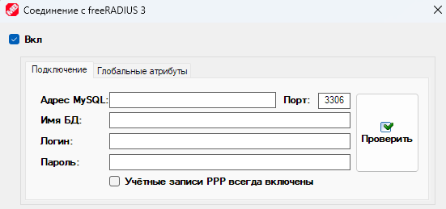 style="width:5.35514in;height:2.51721in" />
>
> На вкладке «**Глобальные атрибуты**» вы можете задать атрибуты,
> которые будут применяться ко всем абонентам. Так же индивидуальные
> атрибуты можно задавать для каждой [группы](#группы) и
> [тарифа](#тарифы). Про атрибуты, применяемые для роутеров MikroTik
> можно почитать [в этой
> статье](https://wiki.mikrotik.com/wiki/Manual:RADIUS_Client).
>
> В значениях атрибута вы можете использовать теги автозамены, ниже
> представлен список доступных тэгов.

<table>
<colgroup>
<col style="width: 26%" />
<col style="width: 73%" />
</colgroup>
<thead>
<tr class="header">
<th><strong>Тэг</strong></th>
<th><strong>На что будет заменён</strong></th>
</tr>
</thead>
<tbody>
<tr class="odd">
<td>#NAME#</td>
<td>Будет заменено на ФИО абонента</td>
</tr>
<tr class="even">
<td>#CLIENT#</td>
<td>Будет заменено на имя абонента</td>
</tr>
<tr class="odd">
<td>#USRLOGIN#</td>
<td>Будет заменено на логин клиента</td>
</tr>
<tr class="even">
<td>#USRPASS#</td>
<td>Будет заменено на пароль клиента</td>
</tr>
<tr class="odd">
<td>#IP#</td>
<td>Будет заменено на IP-адрес</td>
</tr>
<tr class="even">
<td>#MAC#</td>
<td>Будет заменено на MAC-адрес</td>
</tr>
<tr class="odd">
<td>#DAYS#</td>
<td>Будет заменено на количество дней</td>
</tr>
<tr class="even">
<td>#CONTRACT#</td>
<td>Будет заменено на номер договора</td>
</tr>
<tr class="odd">
<td>#STOPDATE#</td>
<td>Будет заменено на дату остановки</td>
</tr>
<tr class="even">
<td>#CASH#</td>
<td>Будет заменено на значение баланса</td>
</tr>
<tr class="odd">
<td>#CASH+#</td>
<td>Будет заменено на сумму пополнения</td>
</tr>
<tr class="even">
<td>#CASH-#</td>
<td>Будет заменено на размер обещанного платежа и его стоимость</td>
</tr>
<tr class="odd">
<td>#CASHNAME#</td>
<td>Будет заменено на название валюты</td>
</tr>
<tr class="even">
<td>#NEXTCASH#</td>
<td>Баланс после следующего списания абонентской платы</td>
</tr>
<tr class="odd">
<td>#BLOCKCASH#</td>
<td>Баланс, при котором абонент будет заблокирован</td>
</tr>
<tr class="even">
<td>#PAYSIZE#</td>
<td>Будет заменено на размер списания абонентской платы</td>
</tr>
<tr class="odd">
<td>#PAYSIZE2#</td>
<td>Будет заменено на размер списания абонентской платы за месяц</td>
</tr>
<tr class="even">
<td>#PAY_DAY#</td>
<td>Будет заменено на день абонентской платы</td>
</tr>
<tr class="odd">
<td>#RECOMMENDED_PAY#</td>
<td>Будет заменено на рекомендуемую сумму платежа</td>
</tr>
<tr class="even">
<td>#PAYSIZECLEAR#</td>
<td>Необходимая сумма текущего пополнения</td>
</tr>
<tr class="odd">
<td>#INFORM1#</td>
<td>Будет заменено на информацию №1 из профиля абонента</td>
</tr>
<tr class="even">
<td>#INFORM2#</td>
<td>Будет заменено на информацию №2 из профиля абонента</td>
</tr>
<tr class="odd">
<td>#COMMENT1#</td>
<td>Будет заменено на комментарий №1 из профиля абонента</td>
</tr>
<tr class="even">
<td>#COMMENT2#</td>
<td>Будет заменено на комментарий №2 из профиля абонента</td>
</tr>
<tr class="odd">
<td>#COMMENT3#</td>
<td>Будет заменено на комментарий №3 из профиля абонента</td>
</tr>
<tr class="even">
<td>#COMMENT4#</td>
<td>Будет заменено на комментарий №4 из профиля абонента</td>
</tr>
<tr class="odd">
<td>#CODE#</td>
<td>Будет заменено на код проверки при изменении телефона</td>
</tr>
<tr class="even">
<td>#SMOTRESHKA_LOGIN#</td>
<td>Будет заменено на логин в системе Смотрёшка</td>
</tr>
<tr class="odd">
<td>#SMOTRESHKA_PASS#</td>
<td>Будет заменено на пароль в системе Смотрёшка</td>
</tr>
<tr class="even">
<td>#MEGOGO_LOGIN#</td>
<td>Будет заменено на логин в системе Megogo</td>
</tr>
<tr class="odd">
<td>#MEGOGO_PASS#</td>
<td>Будет заменено на пароль в системе Megogo</td>
</tr>
<tr class="even">
<td>#IPTVPORTAL_LOGIN#</td>
<td>Будет заменено на логин в системе IPTVPORTAL</td>
</tr>
<tr class="odd">
<td>#IPTVPORTAL_PASS#</td>
<td>Будет заменено на пароль в системе IPTVPORTAL</td>
</tr>
<tr class="even">
<td>#LIMIT_IN#</td>
<td>Будет заменено на ограничение входящей скорости</td>
</tr>
<tr class="odd">
<td>#LIMIT_OUT#</td>
<td>Будет заменено на ограничение исходящей скорости</td>
</tr>
<tr class="even">
<td>#RND#</td>
<td>Будет заменено на произвольный набор цифр</td>
</tr>
<tr class="odd">
<td>#DAY#</td>
<td>Будет заменено на номер дня в месяце</td>
</tr>
<tr class="even">
<td>#MONTH#</td>
<td>Будет заменено на номер месяца</td>
</tr>
<tr class="odd">
<td>#YEAR#</td>
<td>Будет заменено на год</td>
</tr>
<tr class="even">
<td>#HOUR#</td>
<td>Будет заменено на час</td>
</tr>
<tr class="odd">
<td>#MINUTE#</td>
<td>Будет заменено на минуты</td>
</tr>
<tr class="even">
<td>#SECOND#</td>
<td>Будет заменено на секунды</td>
</tr>
<tr class="odd">
<td>#IP_GATEWAY#</td>
<td>Будет заменено на шлюз абонента</td>
</tr>
<tr class="even">
<td>#TARIFF#</td>
<td>Будет заменено на название тарифа</td>
</tr>
<tr class="odd">
<td>#TARIFF_SKAT#</td>
<td>Будет заменено на название тарифа для Скат DPI</td>
</tr>
</tbody>
</table>

> Также доступны  смарт-теги автозамены, получающие значения от API:  
>       **\#API\_{путь\_API}\_ENDAPI#** - Подставит любое значение,
> которое вы можете получить через API для абонента.  
>       Описание путей API
> доступно [здесь](https://mikro-bill.com/index.php?page=api_docs&node=API.Client).
> Примеры написания тэгов ниже.
>
> Примеры тегов, получающих значение через API:  
>       **\#API\_{BillingInfo.DefaultInterface}\_ENDAPI#** - Подставит
> локальный интерфейс абонента.  
>       **\#API\_{StatusInfo.CurrentSpeedLimitIn}\_ENDAPI#** - Подставит
> текущие ограничения скорости для входящего канала.
>
> Так же существуют смарт-теги автозамены с условием. Позволяют в
> зависимости от условия подставлять разные значения:  
>      
> \#IF\_(Путь,Оператор\_сравнения,Сравниваемое\_значение)?(Результат\_ДА):(Результат\_НЕТ)\_ENDIF#  
>       Примеры написания тэгов:
>
> Примеры тегов с условием (описание условий аналогично
> оператору Find из API):  
>    
>   **\#IF\_(StatusInfo.BlockReason,=,-1)?(StandartPool):(BlockeedPool)\_ENDIF#** -
> Тег проверит значение пути StatusInfo.BlockReason, т.е. причину
> остановки абонента, и если оно равно -1, т.е. абонент не остановлен,
> тег подставит "StandartPool", иначе "BlockeedPool".  
>       В тегах результата могут быть другие теги, например:  
>    
>   **\#IF\_(StatusInfo.BlockReason,=,-1)?(#API\_{StatusInfo.CurrentSpeedLimitIn}\_ENDAPI#):(1)\_ENDIF#** -
> Если абоненту разрешён доступ, подставит его текущие ограничения
> входящей скорости, иначе подставит 0.
>
> Для тегов с условием есть служебный тег **\#NULL#**, если в результате
> проверки условия RADIUS атрибуту будет присвоено значение \#NULL#, то
> этот атрибут вообще не будет выгружен на радиус. Например:
>
> **\#IF\_(StatusInfo.BlockReason,=,-1)?(#NULL#):(Blocked)\_ENDIF#** 
>
> В данном примере тег проверит значение пути StatusInfo.BlockReason,
> т.е. причину остановки абонента, и если оно не равно -1, т.е. абонент
> остановлен, тег подставит в значение RADIUS атрибута "Blocked", иначе
> RADIUS атрибут вообще не будет выгружен

# Тарифы

> Тарифы позволяют настраивать списание абонентской платы. Ниже
> представлено окно настройки тарифа. Пройдёмся по вкладкам настроек и
> поясним значения параметров.
>
> Вкладка «**Основное**».

-   «**Название (техническое)**» - эту строку видят только
    администраторы

-   «**Название для абонентов**» - эту строку увидит абонент в личном
    кабинете. Допускается выбор отдельного названия для каждой
    локализации. Для этого предназначена кнопка
    . После нажатия откроется
    меню:

>  style="width:2.82292in;height:1.96875in" />
>
> После выбора языка, можно вписать описание.
>
> Предупреждение для пользователей, использующих раскладку, отличную от
> кириллицы и латиницы – MikroTik не умеет корректно работать с
> символами ваших языков. Не используйте в названиях тарифов и именах
> абонентов символы вне латиницы и кириллицы.
>
> PS: Речь о техническом названии тарифа, а не том названии, который
> видит абонент. Имя абонента – это техническое имя абонента для
> администратора, а не ФИО.

-   

>  style="width:5.26042in;height:2.0625in" />

-   Вы можете установить название тарифа для каждого языка отдельно. Для
    этого предназначена кнопка
    . После нажатия откроется
    меню:

>  style="width:2.82292in;height:1.96875in" />
>
> После выбора языка, можно вписать название.

-   «**Примечание**» - Дополнительная информация для служебного
    пользования, видят только сотрудники, допущенные к редактированию
    тарифов.

-   «**Цена трафика**» - Назначает стоимость мегабайта входящего и
    исходящего трафика.

> Вы можете динамически менять стоимость трафика в зависимости от
> времени суток, нажав на кнопку «**Изменять стоимость в зависимости от
> времени суток**».

> Здесь вы можете изменить «**Коэффициэнт**» начисляемого трафика. 1 =
> 100%, таким образом вы можете начислять абонентам на тарифе больше или
> меньше трафика, чем они потребили на самом деле.

-   «**Овердрафт (Кредит)**» - Кредит. Определяет на сколько абонент
    может уйти в минус относительно баланса остановки. Баланс остановки
    можно выбрать в пункте «**Остановка при**» в разделе «[**Валюта и
    абонентская плата**](#Валюта_и_абонентская_плата)».

-   «**Скорость в кредит**» - Абонент считается находящимся в кредите,
    когда его баланс ниже «**Остановки при**», но всё ещё выше
    «**Остановки при**» + «**Кредит**». Так же абонентами в кредите
    считаются абоненты, активировавшие обещанный платёж. Значение
    скорости задаётся либо в мегабитах, либо в процентах от тарифной.

-   «**Скорость при блоке**» - Позволяет изменить ограничения скорости
    для остановленных абонентов, если не предполагается им полностью
    блокировать доступ. Значение скоростных ограничений задаются либо в
    мегабитах, либо в процентах от тарифной. Если скорость при блоке не
    равна нулю, MikroBILL не будет блокировать трафик абонентов через
    фаервол, но если абоненты подключаются через PPP, вам нужно
    разрешить включенные PPP Secrets для остановленных абонентов, для
    этого в свойствах роутера прейдите в окно «[**Объекты, которыми
    управляет MikroBILL**](#Объекты_которыми_управляет_MikroBILL)» и
    включите опцию «**Учётные записи всегда включены**».

-   «**Стартовый баланс**» - Сумма, с которой на счёте будет создан
    новый абонент. Сумма может учитывать первую абонентскую плату и не
    учитывать, подробнее об этом на вкладке «**Абонентская плата**».

-   «**Предоплаченный трафик**» - Объём мегабайт, за которые не будет
    взыматься плата. Количество предоплаченного трафика у абонента
    сбрасывается в момент списания абонентской платы.

-   «**Предоплаченное время**» - При [создании
    абонента](#Создание_Абонентов) будет добавлено время в параметр Дата
    2 (это фиксированная дата остановки).

-   «**Трафик =
    Входящий + Исходящий**» - Весь трафик абонента будет суммироваться
    как входящий.

-   «**Информация**» - позволяют показать любую информацию в WEB
    > кабинете абонента. Вы можете использовать в этих полях HTML теги.
    > Плашка с информацией будет вверху главной страницы абонентского
    > кабинета.

-   «**Выбрать MikroTik**» - Позволяет выбрать роутер, на котором будут
    расположены абоненты с этого тарифа. Так же вы можете выбирать
    расположение абонентов в свойствах [группы](#Группы). Группы имеют
    больший приоритет по сравнению с тарифами. Если роутеры выбраны в
    Тарифе и в Группе, абонент будет помещён на те роутеры, которые
    отмечены в группе.

>  style="width:2.46875in;height:2.17708in" />

-   «**Выбрать кассиров**» - Позволяет выбрать кассиров, которые смогут
    работать с абонентами этого тарифа. Так же вы можете выбирать
    кассиров в свойствах [группы](#Группы). Группы имеют больший
    приоритет по сравнению с тарифами. Если кассиры выбраны в Тарифе и в
    Группе, доступ будет разрешён кассирам, обозначенным в Группе.

>  style="width:2.61495in;height:1.30226in" />
>
> Вкладка «**Ограничения**».

-   «**Использовать ограничения скорости**» - Если опция включена,
    абоненту будет ограничиваться скорость. Для MikroTik поддерживается
    ограничение скорости через Simple Queue и Queue Tree, выбор между
    этими режимами осуществляется в [свойствах подключения к
    роутеру](#Окно_добавления_роутера).

> PS: Если абоненту назначена персональная скорость, для ограничения
> всегда используется Simple Queue.

-   «**Ограничения по расписанию**» - Включает изменение ограничений на
    тарифе в зависимости от времени суток.

Так же можно выбрать в какие дни недели и какое время у абонентов будет
доступ.

-   «**Ограничение скорости в зависимости от размер скачанного за сутки
    или месяц**» - За эту опцию отвечают кнопки, расположенные правее
    текстовых полей с ограничениями:

>  style="width:5in;height:2.13542in" />
>
> Рассмотрим, как выглядит окно ограничения суточного трафика.
>
>  style="width:2.57292in;height:2.61458in" />
>
> «**Порог трафика**» - Значение трафика, при достижении которых,
> срабатывают ограничения (учитывается только входящий трафик, если
> нужно учитывать и исходящий, используйте опцию «[**Трафик = Входщяй +
> Исходящий**](#Трафик_Вх_плюс_Исх)»).
>
> Столбец «**Шаг**» - Шаг снижения входящей скорости, Кбит/сек
>
> Описание:
>
> Новые\_Ограничения = Текущие\_Ограничения - Шаг \* Трафик / Порог
>
> Пример:
>
> Вх = 1024
>
> Шаг = 256
>
> Трафик = 5000
>
> Порог = 2500
>
> Новые ограничения = 1024 - 256 \* 5000 / 2500 = 512
>
> Чем больше у абонента наработано трафика, тем сильнее будут
> уменьшаться ограничения скорости и приоритет трафика, пока не
> достигнут минимального значения – столбец «**Мин.**», и дальше
> ограничения опускаться не будут.
>
> Можно полностью остановить абонента, если в результате расчётов его
> ограничения должны будут опуститься ниже минимального значения, для
> этого установите чекбокс «**При ограничении &lt; 0 - блокировать**».
>
> Форма настроек месячных ограничений трафика абсолютно идентична форме
> суточных ограничений, поэтому мы не будем её детально рассматривать.
>
> Кнопка «**Фейковые ограничения скорости**» - Имеет изображение
>  style="width:0.26042in;height:0.3125in" /> и позволяет скрыть от
> абонентов факт урезания скорости.
>
>  style="width:4.38542in;height:1.94792in" />
>
> Здесь можно вписать лимиты скорости, которые всегда будет видеть
> абонент в своём WEB кабинете, а также скрыть существование придела по
> трафику.

-   «**Приоритет**» - Задаёт приоритет трафика. 1 – Максимальный, 8 –
    Минимальный.

-   «**Бурст**» - Кратковременное превышение ограничений лимитов
    скорости, чтобы сделать интернет сёрфинг более комфортным. В первом
    поле необходимо вписать процент допустимого превышения скорости
    относительно тарифной, во втором максимальную продолжительность
    превышения скорости подряд.

> Вкладка
> «**Абонентская плата**».

-   «**Абонентская плата**» - стоимость тарифа, которая списывается со
    счёта абонента с заданной периодичностью.

-   «**Аренда порта**» - Дополнительная плата за тариф. Списывается со
    счёта абонента одновременно с абонентской платой, отличие в том, что
    абонентская плата списывается пока на счёте есть деньги, и после
    блокировки абонента списания прекращаются (за исключением случаев
    отмеченного пункта «**Снимать абонентскую плату, если абонент
    остановлен**»), аренда порта списывается всегда.

-   «**Интервал**» - Алгоритм списания оплаты.

>  style="width:2.63542in;height:0.70833in" />
>
> 1\. «**Ежедневно»** - Оплата будет списываться каждый день.
>
> 2\. «**Разделить поровну на месяц**» - Стоимость тарифа будет
> разделена на количество дней в текущем месяце и списана равными
> долями.
>
> 3\. «**Списывать N-ого числа месяца**» - Оплата будет сниматься раз в
> месяц, заданного числа.
>
>  style="width:1.85417in;height:0.3125in" />
>
> 4\. «**Помесячно от даты создания**» - Оплата будет сниматься раз в
> месяц того же числа, в которое был создан абонент.
>
> PS: При необходимости вы можете изменить дату создания абонента, для
> этого выделите абонента, откройте контекстное меню и проследуйте
> «**Дополнительно**» -&gt; «**Сбросить**» -&gt; «**Изменить дату
> создания абонента**».
>
> 5\. «**Помесячно от даты абонентской платы**» - Оплата будет сниматься
> раз в месяц того же числа, в которое было предыдущее списание. При
> выборе этого и предыдущего пунктов появляется дополнительный
> выпадающий список, выбирающий длину периода.
>
>  style="width:1.76042in;height:0.59375in" />
>
> «**От даты до даты**» - Оплата будет сниматься раз в месяц того же
> числа, в которое было предыдущее списание.
>
> «**Произвольно**» - Вы сможете выбрать продолжительность расчётного
> периода в днях.
>
>  style="width:4.22917in;height:1.09375in" />
>
> Таким образом, например, можно создать тарифы, оплата в которых
> списывается раз в неделю, раз в полгода, или даже раз в час.

-   «**Когда снимать**» - Выбор условия списания оплаты. Опция активна,
    если «**Время снятия**» = «**Постоплата**».

>  style="width:5.81331in;height:0.60425in" />

-   «**Время снятия**» - Выбирает алгоритм абонентской платы.

> 1\. «**Предоплата»** – Оплата будет сниматься за предстоящий день или
> месяц. Перед началом расчётного периода будет попытка списать оплату.
> В случае нехватки средств, абонент будет остановлен даже с
> положительным балансом, а средства списаны не будут. После пополнения
> баланса, абонент будет разблокирован, средства списаны.
>
> 2 . «**Постоплата»** - Абонентская плату будет сниматься за
> отработанный день или месяц. Списания будут до тех пор, пока баланс
> абонента не станет отрицательным, после этого абонент будет
> остановлен, оплата дальше списываться не будет.

-   «**Снимать оплату, если трафик больше**» - Отключает оплату тарифа,
    если абонент наработал трафика меньше, чем выбрано. В этом случае
    будет списаны деньги только за аренду порта.

-   «**Абонент не оплачивает, если при выходе из блока осталось N
    дней**» - отключает оплату тарифа на предоплате, если абонент
    выходит из блока в момент, когда до следующей оплаты по тарифу
    осталось меньше выбранного числа дней. Допускается дробное значение.
    Например, если выбрана ежедневная оплата в 00:00, и мы хотим, чтобы
    при пополнении после 23:00 за текущий день не списывалась оплата,
    нужно установить 0,041.

-   «**Не снимать оплату, если абонент переходит с тарифа с большей
    оплатой**» - Отменяет первое списание оплаты по новому тарифу, если
    абонент перешёл с более дорого тарифа и в этот расчётный период
    оплата с абонента уже списывалась. Опция активна только на
    предоплатных тарифах.

-   «**Частичная оплата**» - включает частичную оплату на помесячных
    тарифах. Дополнительные опции:

> 1\. «**В первый месяц**» - Включает частичную оплату только в месяц
> перехода на тариф.
>
> 2\. «**Всегда**» - Каждый месяц абонент заплатит пропорционально
> количеству дней, которые ему был разрешён доступ.
>
> 3\. «**Если работал меньше N дней**» - Частичная оплата будет
> активирована, если абонент за месяц мог пользоваться услугами меньше
> выбранного числа дней.

-   «**Частичная абонентская плата после финансовой блокировки**» - Если
    абонент был заблокирован в начале расчётного периода, на этот месяц
    ему будет включена частичная оплата.

-   «**После финансовой блокировки необходимо оплатить месяц**» - Если
    абонент был остановлен из-за опустошения баланса, ему будет
    необходимо положить на счёт сумму достаточную для месяца работы,
    чтобы быть включенным. Это относится как к тарифам с помесячной
    оплатой, так и к посуточной.

-   «**Баланс при создании абонента**» - Выбирает алгоритм стартового
    баланса, который задаётся [на первой вкладке](#тарифы) тарифа. Опция
    доступна только на предоплатных тарифах и можете принимать следующие
    значения:

> 1\. «**Баланс нового абонента**» - Если выбрана эта опция и
> абонентская плата отлична от нуля, то абонент будет заблокирован сразу
> после создания, т.к. на счету не окажется денег для оплаты.

> 2\. «**Баланс нового абонента после списания абонентской платы**» -
> Вначале на счёт абонента будет автоматически зачислена сумма, равная
> необходимой оплате и сразу списана в зачёт следующего месяца, а
> абонент сможет продолжить работу.

> Вкладка «**Турбо, кредит, блокировка**».
>
>  style="width:6.125in;height:4.03125in" />
>
> В этом разделе можно разрешить для абонентов тарифа использование
> таких услуг как «**Временный доступ**», «**Добровольная блокировка**»,
> «**Ускорение**» и «**Обещанный платёж**». Абонент сможет их подключить
> из WEB-кабинета, а администратор из контекстного меню абонента,
> перейдя в раздел «**Дополнительно**». Подробный разбор и настройку
> смотрите в разделе «[**Услуги**](#услуги)».
>
> Вкладка «**Турбо, кредит, блокировка**».

-   «**Стоимость перехода на тариф**» - При переходе на тариф помимо
    абонентской платы с абонента будет списана стоимость перехода.

-   «**Можно уйти с тарифа через N дней**» - запрещает абоненту
    самостоятельно изменять тарифный план, если он пробыл на тарифе
    меньше выбранного числа дней.

-   «**При включении тарифа сбрасывать трафик**» - Сбрасывать суточный и
    месячный трафик при переходе на этот тариф.

-   «**Смена тарифа только с абонентской платой**» - Абонент сможет
    выбрать переход на другой тариф в любое время, но изменение
    произойдёт только, когда текущий тарифный план закончит своё
    действие (подойдёт время абонентской платы).

-   «**Перерасчёт при уходе с тарифа**» - Если в момент ухода с тарифа
    месяц ещё не закончился, сумма за неизрасходованные дни будет
    возвращена на счёт абонента. Опция действует только на предопланых
    тарифах.

-   «**Перерасчёт в конце месяца**» - Если абонент в течении месяца
    некоторое количество дней был остановлен по любым причинам
    (например, включил [добровольную блокировку](#услуги)).

-   «**Описание тарифного плана**» - Текст, который увидит абонент, как
    описание тарифа при выборе его в WEB-кабинете. В поле допускается
    вносить обычный текст и HTML-код.

> Вы можете установить описание тарифа для каждого языка отдельно. Для
> этого предназначена кнопка  style="width:0.52083in;height:0.28125in" />. После нажатия откроется
> меню:
>
>  style="width:2.82292in;height:1.96875in" />
>
> После выбора языка, можно вписать название.

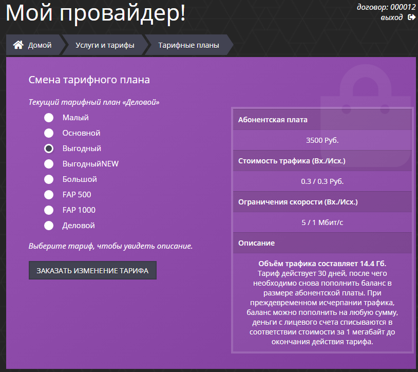

-   «**С этого тарифа можно перейти на**» - Задаёт перечень тарифов,
    доступных абоненту для перехода.

> Вкладка «**Автоматизация**».
>
> Содержит в себе три дополнительных подвкладки:
>
> 1\. «**Автодобавление»** – здесь вы можете выбрать диапазоны адресов,
> из которых будут выбираться новые записи (которые в DHCP лизинге
> отмечены как DYNAMIC) и с IP и MAC из них будут автоматически
> создаваться новые абоненты.
>
>  style="width:6.14583in;height:3.76042in" />
>
> 2\. «**Скрипы и Telnet / SSH»** – Управляет запуском скриптов и
> отправкой Telnet и SSH команд на оборудование, при перемещении
> абонента на тариф и при уходе с него. Логин абонента будет
> автоматически помещён в переменную ClientExt, а название тарифа в
> TarifName. Эти переменные дополнительно в теле скрипта объявлять не
> нужно.

> Про создание скриптов вы можете прочитать в разделе «[**Скрипты и
> триггеры**](#Скрипты_и_триггеры)», а про создание дополнительных
> подключений по Telnet и SSH в разделе «**[Telnet и SSH
> подключения](#Telnet_и_SSH_подключения)».**
>
> В командах вы можете использовать теги автозамены, ниже представлен
> список доступных тэгов.

<table>
<colgroup>
<col style="width: 22%" />
<col style="width: 77%" />
</colgroup>
<thead>
<tr class="header">
<th><strong>Тэг</strong></th>
<th><strong>На что будет заменён</strong></th>
</tr>
</thead>
<tbody>
<tr class="odd">
<td>#IP#</td>
<td>Подставляет первый IP абонента</td>
</tr>
<tr class="even">
<td>#IP?#</td>
<td>Подставляет IP абонента, вместо “?” порядковый номер IP</td>
</tr>
<tr class="odd">
<td>#MAC#</td>
<td>Подставляет первый MAC клиента</td>
</tr>
<tr class="even">
<td>#MAC?#</td>
<td>Подставляет MAC клиента, вместо “?” порядковый номер MAC</td>
</tr>
<tr class="odd">
<td>#LOGIN#</td>
<td>Подставляет первый логин абонента</td>
</tr>
<tr class="even">
<td>#LOGIN?#</td>
<td>Подставляет логин абонента, вместо “?” порядковый номер логина</td>
</tr>
<tr class="odd">
<td>#PASS#</td>
<td>Подставляет первый пароль абонента</td>
</tr>
<tr class="even">
<td>#PASS?#</td>
<td>Подставляет пароль абонента, вместо “?” порядковый номер пароля</td>
</tr>
<tr class="odd">
<td>#LIMIT_IN#</td>
<td>Подставляет ограничение входящей скорости в кбит/с</td>
</tr>
<tr class="even">
<td>#LIMIT_OUT#</td>
<td>Подставляет ограничение исходящей скорости в кбит/с</td>
</tr>
<tr class="odd">
<td>#LIMIT_IN_B#</td>
<td>Подставляет ограничение входящей скорости в бит/с</td>
</tr>
<tr class="even">
<td>#LIMIT_OUT_B#</td>
<td>Подставляет ограничение исходящей скорости в бит/с</td>
</tr>
<tr class="odd">
<td>#LIMIT_IN_MB#</td>
<td>Подставляет ограничение входящей скорости в Мбит/с</td>
</tr>
<tr class="even">
<td>#LIMIT_OUT_MB#</td>
<td>Подставляет ограничение исходящей скорости в Мбит/с</td>
</tr>
<tr class="odd">
<td>#CONTRACT#</td>
<td>Подставляет номер договора</td>
</tr>
<tr class="even">
<td>#COMMENT#</td>
<td>Подставляет комментарий абонента</td>
</tr>
<tr class="odd">
<td>#COMMENT2#</td>
<td>Подставляет комментарий №2 абонента</td>
</tr>
<tr class="even">
<td>#COMMENT3#</td>
<td>Подставляет комментарий №3 абонента</td>
</tr>
<tr class="odd">
<td>#COMMENT4#</td>
<td>Подставляет комментарий №4 абонента</td>
</tr>
<tr class="even">
<td>#TICKET#</td>
<td>Подставляет текст тикета</td>
</tr>
<tr class="odd">
<td>#FIELD_ИмяПоля#</td>
<td>Подставляет данные из дополнительного поля</td>
</tr>
<tr class="even">
<td>#DISCONNECT#</td>
<td>Переподключиться (для Telnet и SSH подключений)</td>
</tr>
<tr class="odd">
<td>#SLEEP#</td>
<td>Ожидание 1 секунда (для Telnet и SSH подключений)</td>
</tr>
<tr class="even">
<td>#RND#</td>
<td>Произвольный набор цифр</td>
</tr>
<tr class="odd">
<td>#DAY#</td>
<td>День месяца</td>
</tr>
<tr class="even">
<td>#MONTH#</td>
<td>Месяц</td>
</tr>
<tr class="odd">
<td>#YEAR#</td>
<td>Год</td>
</tr>
<tr class="even">
<td>#HOUR#</td>
<td>Час</td>
</tr>
<tr class="odd">
<td>#MINUTE#</td>
<td>Минута</td>
</tr>
<tr class="even">
<td>#SECOND#</td>
<td>Секунда</td>
</tr>
<tr class="odd">
<td>#IP_GATEWAY#</td>
<td>Шлюз абонента</td>
</tr>
<tr class="even">
<td>#TARIFF#</td>
<td>Название тарифа</td>
</tr>
<tr class="odd">
<td>#TARIFF_SKAT#</td>
<td>Название тарифа для Скат DPI</td>
</tr>
</tbody>
</table>

> Вы можете начать строку с **{ACC=** и закончить её **=ACC}** чтобы
> команда
>
> была отправлена на роутер столько же раз, сколько IP у абонента.
>
> Теги \#IP# и \#MAC# при каждой итераиции будут заменены на IP и MAC.
>
> Например:
>
> {ACC=/ip firewall filter disable \[find src-address="#IP#"\]=ACC}
>
> Также доступны  смарт-теги автозамены, получающие значения от API:  
>       **\#API\_{путь\_API}\_ENDAPI#** - Подставит любое значение,
> которое вы можете получить через API для абонента.  
>       Описание путей API
> доступно [здесь](https://mikro-bill.com/index.php?page=api_docs&node=API.Client).
> Примеры написания тэгов ниже.
>
> Примеры тегов, получающих значение через API:  
>       **\#API\_{BillingInfo.DefaultInterface}\_ENDAPI#** - Подставит
> локальный интерфейс абонента.  
>       **\#API\_{StatusInfo.CurrentSpeedLimitIn}\_ENDAPI#** - Подставит
> текущие ограничения скорости для входящего канала.
>
> Так же существуют смарт-теги автозамены с условием. Позволяют в
> зависимости от условия подставлять разные значения:  
>      
> \#IF\_(Путь,Оператор\_сравнения,Сравниваемое\_значение)?(Результат\_ДА):(Результат\_НЕТ)\_ENDIF#  
>       Примеры написания тэгов:
>
> Примеры тегов с условием (описание условий аналогично
> оператору Find из API):  
>    
>   **\#IF\_(StatusInfo.BlockReason,=,-1)?(StandartPool):(BlockeedPool)\_ENDIF#** -
> Тег проверит значение пути StatusInfo.BlockReason, т.е. причину
> остановки абонента, и если оно равно -1, т.е. абонент не остановлен,
> тег подставит "StandartPool", иначе "BlockeedPool".  
>       В тегах результата могут быть другие теги, например:  
>    
>   **\#IF\_(StatusInfo.BlockReason,=,-1)?(#API\_{StatusInfo.CurrentSpeedLimitIn}\_ENDAPI#):(1)\_ENDIF#** -
> Если абоненту разрешён доступ, подставит его текущие ограничения
> входящей скорости, иначе подставит 0.
>
> 3\. «**Тариф + Услуги» -** Автоматическое подключение [услуг](#услуги)
> при переходе на тариф, и автоматическое отключение при уходе с него.
>
>  style="width:5.53125in;height:3.39583in" />

> Вкладка «**RADIUS**».
>
> Позволяет добавить дополнительные RADIUS атрибуты для абонентов
> тарифа. Так же дополнительные атрибуты можно задать в свойствах
> [групп](#Группы) и настройках подключения к [RADIUS](#FreeRADIUS).

> В значениях атрибута вы можете использовать теги автозамены, ниже
> представлен список доступных тэгов.

<table>
<colgroup>
<col style="width: 22%" />
<col style="width: 77%" />
</colgroup>
<thead>
<tr class="header">
<th><strong>Тэг</strong></th>
<th><strong>На что будет заменён</strong></th>
</tr>
</thead>
<tbody>
<tr class="odd">
<td>#IP#</td>
<td>Подставляет первый IP абонента</td>
</tr>
<tr class="even">
<td>#IP?#</td>
<td>Подставляет IP абонента, вместо “?” порядковый номер IP</td>
</tr>
<tr class="odd">
<td>#MAC#</td>
<td>Подставляет первый MAC клиента</td>
</tr>
<tr class="even">
<td>#MAC?#</td>
<td>Подставляет MAC клиента, вместо “?” порядковый номер MAC</td>
</tr>
<tr class="odd">
<td>#LOGIN#</td>
<td>Подставляет первый логин абонента</td>
</tr>
<tr class="even">
<td>#LOGIN?#</td>
<td>Подставляет логин абонента, вместо “?” порядковый номер логина</td>
</tr>
<tr class="odd">
<td>#PASS#</td>
<td>Подставляет первый пароль абонента</td>
</tr>
<tr class="even">
<td>#PASS?#</td>
<td>Подставляет пароль абонента, вместо “?” порядковый номер пароля</td>
</tr>
<tr class="odd">
<td>#LIMIT_IN#</td>
<td>Подставляет ограничение входящей скорости в кбит/с</td>
</tr>
<tr class="even">
<td>#LIMIT_OUT#</td>
<td>Подставляет ограничение исходящей скорости в кбит/с</td>
</tr>
<tr class="odd">
<td>#LIMIT_IN_B#</td>
<td>Подставляет ограничение входящей скорости в бит/с</td>
</tr>
<tr class="even">
<td>#LIMIT_OUT_B#</td>
<td>Подставляет ограничение исходящей скорости в бит/с</td>
</tr>
<tr class="odd">
<td>#LIMIT_IN_MB#</td>
<td>Подставляет ограничение входящей скорости в Мбит/с</td>
</tr>
<tr class="even">
<td>#LIMIT_OUT_MB#</td>
<td>Подставляет ограничение исходящей скорости в Мбит/с</td>
</tr>
<tr class="odd">
<td>#CONTRACT#</td>
<td>Подставляет номер договора</td>
</tr>
<tr class="even">
<td>#COMMENT#</td>
<td>Подставляет комментарий абонента</td>
</tr>
<tr class="odd">
<td>#COMMENT2#</td>
<td>Подставляет комментарий №2 абонента</td>
</tr>
<tr class="even">
<td>#COMMENT3#</td>
<td>Подставляет комментарий №3 абонента</td>
</tr>
<tr class="odd">
<td>#COMMENT4#</td>
<td>Подставляет комментарий №4 абонента</td>
</tr>
<tr class="even">
<td>#TICKET#</td>
<td>Подставляет текст тикета</td>
</tr>
<tr class="odd">
<td>#FIELD_ИмяПоля#</td>
<td>Подставляет данные из дополнительного поля</td>
</tr>
<tr class="even">
<td>#DISCONNECT#</td>
<td>Переподключиться (для Telnet и SSH подключений)</td>
</tr>
<tr class="odd">
<td>#SLEEP#</td>
<td>Ожидание 1 секунда (для Telnet и SSH подключений)</td>
</tr>
<tr class="even">
<td>#RND#</td>
<td>Произвольный набор цифр</td>
</tr>
<tr class="odd">
<td>#DAY#</td>
<td>День месяца</td>
</tr>
<tr class="even">
<td>#MONTH#</td>
<td>Месяц</td>
</tr>
<tr class="odd">
<td>#YEAR#</td>
<td>Год</td>
</tr>
<tr class="even">
<td>#HOUR#</td>
<td>Час</td>
</tr>
<tr class="odd">
<td>#MINUTE#</td>
<td>Минута</td>
</tr>
<tr class="even">
<td>#SECOND#</td>
<td>Секунда</td>
</tr>
<tr class="odd">
<td>#IP_GATEWAY#</td>
<td>Шлюз абонента</td>
</tr>
<tr class="even">
<td>#TARIFF#</td>
<td>Название тарифа</td>
</tr>
<tr class="odd">
<td>#TARIFF_SKAT#</td>
<td>Название тарифа для Скат DPI</td>
</tr>
</tbody>
</table>

> Также доступны  смарт-теги автозамены, получающие значения от API:  
>       **\#API\_{путь\_API}\_ENDAPI#** - Подставит любое значение,
> которое вы можете получить через API для абонента.  
>       Описание путей API
> доступно [здесь](https://mikro-bill.com/index.php?page=api_docs&node=API.Client).
> Примеры написания тэгов ниже.
>
> Примеры тегов, получающих значение через API:  
>       **\#API\_{BillingInfo.DefaultInterface}\_ENDAPI#** - Подставит
> локальный интерфейс абонента.  
>       **\#API\_{StatusInfo.CurrentSpeedLimitIn}\_ENDAPI#** - Подставит
> текущие ограничения скорости для входящего канала.
>
> Так же существуют смарт-теги автозамены с условием. Позволяют в
> зависимости от условия подставлять разные значения:  
>      
> \#IF\_(Путь,Оператор\_сравнения,Сравниваемое\_значение)?(Результат\_ДА):(Результат\_НЕТ)\_ENDIF#  
>       Примеры написания тэгов:
>
> Примеры тегов с условием (описание условий аналогично
> оператору Find из API):  
>    
>   **\#IF\_(StatusInfo.BlockReason,=,-1)?(StandartPool):(BlockeedPool)\_ENDIF#** -
> Тег проверит значение пути StatusInfo.BlockReason, т.е. причину
> остановки абонента, и если оно равно -1, т.е. абонент не остановлен,
> тег подставит "StandartPool", иначе "BlockeedPool".  
>       В тегах результата могут быть другие теги, например:  
>    
>   **\#IF\_(StatusInfo.BlockReason,=,-1)?(#API\_{StatusInfo.CurrentSpeedLimitIn}\_ENDAPI#):(1)\_ENDIF#** -
> Если абоненту разрешён доступ, подставит его текущие ограничения
> входящей скорости, иначе подставит 0.
>
> Для тегов с условием есть служебный тег **\#NULL#**, если в результате
> проверки условия RADIUS атрибуту будет присвоено значение \#NULL#, то
> этот атрибут вообще не будет выгружен на радиус.
>
> Последняя вкладка «**Дополнительно**» содержит настройки, которые не
> подошли по смыслу в остальные вкладки.

-   «**CallerID для PPP**» - Для PPP Secrets всем абонентам прописывает
    Caller ID. Это запретит им поднимать соединение, если выбранные
    данные не совпадают.

>  style="width:3.67708in;height:0.8125in" />
>
> Опции позволяют выбрать в качестве CallerID адрес IP или MAC, либо
> MikroBILL будет сам сохранять CallerID при первом подключении
> абонента.

-   В поле «**Интерфейс подключения**» можно выбрать имя локального
    интерфейса, к которому подключены абоненты тарифа. Это побуждает
    MikroBILL добавлять связку IP + MAC в ARP таблицу роутера MikroTik.
    Обратите внимание, что при неверном выборе локального интерфейса,
    абонент не получит доступа в интернет. Вы можете оставить это поле
    пустым, либо выбрать локальный интерфейс непосредственно в профиле
    абонента.

> Опция действует только при IP авторизации, если в профиле абонента
> сохранён MAC адрес.

-   «**Интерфейс балансировки**» - ультимативно устанавливает внешний
    интерфейс для всех абонентов тарифа. Дополнительно про балансировку
    нагрузки можно почитать в разделе «[**WAN интерфейсы и балансировка
    нагрузки**](#WAN_интерфейсы_и_балансировка_нагрузки)».

-   Списки «**Пул IP для абонентов**» и «**Пул IP для PPP абонентов**»
    выбирают пулы, которые настраиваются в окне «[**Пулы и создание
    абонентов**](#Пулы_и_создание_абонентов)». MikroBILL выдаёт
    свободный адрес из пула при создании нового абонента, а так же при
    нажатии кнопки  напротив поля «**IP**» в
    профиле абонента, для замены адреса (опция доступна для PPP
    абонентов или у кого задан MAC адрес).

-   Если же вам нужно
    динамически выдавать свободные адреса при подключении PPP абонента,
    воспользуйтесь полями «**Профиль для PPP абонентов**» и «**Профиль
    для отключенных PPP абонентов**». Профили вы можете создать на
    MikroTik в разделе «**PPP**» -&gt; «**Profiles**», и уже в профиле
    выбрать нужные пулы.

-   «**Профиль для UserManager**» - Выбирает профиль для абонентов
    тарифа, если вы ведёте учёт абонентов в пакете UserManager на
    MikroTik.

-   «**Simple Queue Parent**» - Выбирает родительскую очередь Simple
    Queue для всех абонентов тарифа. Это позволяет помимо персональных
    ограничений скорости для каждого абонента, иметь общее ограничение
    скорости на весь тариф. При работе этой опции, возможно, вам
    понадобится расставить ваши правила в особом порядке. Чтобы
    MikroBILL не перемещал свои правила Simple Queue и не ставил их выше
    ваших, включите опцию «**Разрешить Simple Queue, созданные не
    MikroBILL**», в свойствах подключения к роутеру, нажав кнопку
    «[**Объекты, которыми управляет
    MikroBILL**](#Объекты_которыми_управляет_MikroBILL)».

-   «**Тип ограничений для Queues**» - определяет базовый алгоритм,
    которым MikroTik обрабатывает пакеты в очереди. В зависимости от
    версии MikroTik доступны: sfq, pfifo, pcq, cake и codel.

-   «**Префикс номера договора**» - устанавливает буквенный префикс
    перед номером договора, чтобы по договору можно было определить
    принадлежность абонента тарифу. Изменение префикса не влияет на
    номер договора, он всегда остаётся уникальным.

-   Пункт «**Время списания оплаты**» назначает время абонентской платы,
    или определяет алгоритм его выбора.

>  style="width:1.30208in;height:0.66667in" />
>
> Если выбран пункт «**По умолчанию**», используется время,
> установленное в настройках [финансов](#Валюта_и_абонентская_плата).
> «**Как в прошлый раз**» - будет использовано время предыдущего
> списания, например, если абонент пополнил баланс в обед в 14:15, после
> которого была списана оплата, то и с последующие месяцы, при наличии
> средств на счёте, оплата будет списываться в это же время. Пункт
> «**Выбрать время**» - позволяет самостоятельно вписать время.

-   Чекбокс «**Блокировать интернет, если MikroAGENT не соединён**» -
    запрещает абоненту доступ, пока он не подключится через приложение
    [MikroAGENT](#Кнопка_Агент_Авторизации).

-   «**У абонентов PPP не прописывать IP шлюза**» - отключает внесение
    информации о шлюзе в PPP Secret на роутере. В данном случае вам
    придётся сделать это через профили, отредактировав стандартные
    профили default и default-encryption, либо создать свои и выбрать их
    в полях «[**Профиль для PPP абонентов**](#PPP_профили)» и
    «[**Профиль для отключенных PPP абонентов**](#PPP_профили)».

-   «**Менять IP при переходе на тариф**» - принудительно выдаёт
    абоненту новый IP из пула, который выбран в [тарифе](#тарифы) или
    [группе](#группы), при переходе на тариф (опция доступна для PPP
    абонентов или у кого задан MAC адрес).

-   «**Баланс в WEB с учётом задолженности по тарифу (предоплата)**» -
    На предоплатных тарифах абонент может быть заблокирован с
    положительным балансом при недостатке средств для списания, более
    подробно об этом мы писали в разделе «[**Абонентская
    плата**](#Тарифы_Абонентская_Плата)», в таких случаях, при
    включенной опции, в WEB-кабинете будет отображаться баланс за
    вычетом предстоящей оплаты. Это позволяет показывать абоненту
    отрицательный баланс и избежать дополнительных вопросов.

-   «**Переносить на блокирующий тариф при нехватке средств**» - при
    недостатке денег в момент оплаты абонент автоматически будет
    перемещён на тариф, который назначен блокирующим. На этом тарифе у
    абонента не будет доступа в интернет, кроме белого списка, но будут
    особые условия тарификации. Выбрать блокирующий тариф вы можете в
    [свойствах подключения к роутеру](#Тарифы_Тарифы_и_группы). При
    необходимости, после пополнения баланса, абонент может автоматически
    быть возвращён на прежний тариф.

-   «**При оплате за N дней до конца месяца, запускать абонента в
    следующем**» - если до конца тарифа осталось меньше указанного
    количества дней, то абонент сразу после пополнения запущен не будет,
    так же оплата за тариф списана не будет. Все финансовые операции
    произойдут в день абонентской платы.

-   «**Имя файла тарифа в Скат DPI**» - Имя файла без расширения, в
    котором на Скат DPI приписаны параметры тарифного плана. Путь к
    файлу на СКАТ DPI должен быть: /home/vasexperts/

> Более подробно о настройке взаимодействия со Скат DPI в разделе
> «[**Синхронизация с другим ПО**](#Синхонизация_со_СкатDPI)».

-   «**Идентификатор в UserSide**» - назначает идентификатор
    одноимённого тарифа на стороне UserSide. Опция применима только,
    если MikroBILL передаёт данные в UserSide. Более подробно о
    настройке взаимодействия с UserSide в разделе «[**Синхронизация с
    другим ПО**](#Синхонизация_с_UserSide)».

# Группы

> Группы позволяют применять настройки к абонентам. Настройки,
> установленные в группе, имеют больший приоритет, чем настройки,
> установленные в [тарифе](#тарифы), например, если и в тарифе и группе
> выбраны разные DHCP пулы, то абоненту будет применён пул из группы.
>
> Так выглядит первая вкладка настроек:
>
>  style="width:4.36458in;height:6.45833in" />

-   «**Выбрать MikroTik**» - Позволяет выбрать роутер, на котором будут
    расположены абоненты с этого [тарифа](#тарифы). Так же вы можете
    выбирать расположение абонентов в свойствах [группы](#Группы).
    Группы имеют больший приоритет по сравнению с тарифами. Если роутеры
    выбраны в Тарифе и в Группе, абонент будет помещён на те роутеры,
    которые отмечены в группе.

>  style="width:2.46875in;height:2.17708in" />

-   «**Выбрать кассиров**» - Позволяет выбрать кассиров, которые смогут
    работать с абонентами этого [тарифа](#тарифы). Так же вы можете
    выбирать кассиров в свойствах [группы](#Группы). Группы имеют
    больший приоритет по сравнению с тарифами. Если кассиры выбраны в
    Тарифе и в Группе, доступ будет разрешён кассирам, обозначенным в
    Группе.

>  style="width:2.61495in;height:1.30226in" />

-   Списки «**Пул IP для абонентов**» и «**Пул IP для PPP абонентов**»
    выбирают пулы, которые настраиваются в окне «[**Пулы и создание
    абонентов**](#Пулы_и_создание_абонентов)». MikroBILL выдаёт
    свободный адрес из пула при создании нового абонента, а так же при
    нажатии кнопки  напротив поля «**IP**» в
    профиле абонента, для замены адреса (опция доступна для PPP
    абонентов или у кого задан MAC адрес). Если пулы выбраны в
    [Тарифе](#тарифы) и в Группе, будет использоваться пул, назначенный
    в Группе.

-   Если же вам нужно динамически выдавать свободные адреса при
    подключении PPP абонента, воспользуйтесь полями «**Профиль для PPP
    абонентов**» и «**Профиль для отключенных PPP абонентов**». Профили
    вы можете создать на MikroTik в разделе «**PPP**» -&gt;
    «**Profiles**», и уже в профиле выбрать нужные пулы. Если профили
    выбраны в [Тарифе](#тарифы) и в Группе, будет использоваться
    профиль, назначенный в Группе.

-   «**Префикс номера договора**» - устанавливает буквенный префикс
    перед номером договора, чтобы по договору можно было определить
    принадлежность абонента к группе. Изменение префикса не влияет на
    номер договора, он всегда остаётся уникальным. Если префиксы выбраны
    в [Тарифе](#тарифы) и в Группе, будет использоваться префикс,
    назначенный в Группе.

-   В поле «**Интерфейс подключения**» можно выбрать имя локального
    интерфейса, к которому подключены абоненты группы. Это побуждает
    MikroBILL добавлять связку IP + MAC в ARP таблицу роутера MikroTik.
    Обратите внимание, что при неверном выборе локального интерфейса,
    абонент не получит доступа в интернет. Вы можете оставить это поле
    пустым, либо выбрать локальный интерфейс непосредственно в профиле
    абонента.

> Опция действует только при IP авторизации, если в профиле абонента
> сохранён MAC адрес. Если интерфейсы выбраны в [Тарифе](#тарифы) и в
> Группе, будет использоваться интерфейс, назначенный в Группе.

-   «**Интерфейс балансировки**» - ультимативно устанавливает внешний
    интерфейс для всех абонентов тарифа. Дополнительно про балансировку
    нагрузки можно почитать в разделе «**[WAN интерфейсы и балансировка
    нагрузки](#WAN_интерфейсы_и_балансировка_нагрузки).** Если
    интерфейсы выбраны в [Тарифе](#тарифы) и в Группе, будет
    использоваться интерфейс, назначенный в Группе.

-   «**Не удалять адресный лист**» - Всегда оставлять последний адресный
    лист MikroBill\_LanBallance\_ даже когда абонент OFFLINE. В
    некоторых случаях позволяет решить проблемы с доступом, при IP
    авторизации (из-за отсутствия PPP сессии и низкого трафика, абонент
    может ошибочно считаться отключенным). Более подробно о других
    адресных листах и их значении вы можете почитать в разделе
    «[адресные листы](#Адресные_листы)».

-   «**Мастер поумолчанию**» - Выбирает мастера, который автоматически
    будет назначаться ответственным за решение вопроса по тикету, если
    он открыт для абонента этой группы, и в самом тикете явно не указан
    другой мастер.

> Вкладка «**Скорость**».
>
> Позволяет устанавливать совокупные ограничения скорости на всю группу.
> Выглядит окно следующим образом.
>
>  style="width:4.36458in;height:4.80208in" />

-   «**Гарантированная скорость**» - При ограничении скорости через
    Simple Queue устанавливает параметр Limit-At в свойствах записи.
    Выставляется ограничение равное выбранному проценту или в виде
    фиксированного значения.

>  style="width:1.29167in;height:0.52083in" />

-   «**Совокупное ограничение**» - Устанавливает параметр Total-Limit-At
    в свойствах Simple Queue, ограничивает максимальную суммарную
    скорость (Входящая + Исходящая) в процентах от тарифной.

-   «**Использовать общие ограничения для группы**» - включает лимит по
    скорости для всей группы. Опция работает только при ограничении
    скорости через Queue Tree.

-   «**Ограничения по расписанию**» - Включает изменение ограничений на
    [тарифе](#тарифы) в зависимости от времени суток.

-   «**Ограничение скорости в зависимости от размер скачанного за сутки
    или месяц**» - За эту опцию отвечают кнопки, расположенные правее
    текстовых полей с ограничениями:

>  style="width:4.26234in;height:1.50358in" />
>
> Рассмотрим, как выглядит окно ограничения суточного трафика.
>
>  style="width:2.57292in;height:2.61458in" />
>
> «**Порог трафика**» - Значение трафика, при достижении которых,
> срабатывают ограничения (учитывается только входящий трафик, если
> нужно учитывать и исходящий, используйте опцию «[**Трафик = Входщяй +
> Исходящий**](#Трафик_Вх_плюс_Исх)»).
>
> Столбец «**Шаг**» - Шаг снижения входящей скорости, Кбит/сек
>
> Описание:
>
> Новые\_Ограничения = Текущие\_Ограничения - Шаг \* Трафик / Порог
>
> Пример:
>
> Вх = 1024
>
> Шаг = 256
>
> Трафик = 5000
>
> Порог = 2500
>
> Новые ограничения = 1024 - 256 \* 5000 / 2500 = 512
>
> Чем больше у абонента наработано трафика, тем сильнее будут
> уменьшаться ограничения скорости и приоритет трафика, пока не
> достигнут минимального значения – столбец «**Мин.**», и дальше
> ограничения опускаться не будут.
>
> Можно полностью остановить абонента, если в результате расчётов его
> ограничения должны будут опуститься ниже минимального значения, для
> этого установите чекбокс «**При ограничении &lt; 0 - блокировать**».
>
> Форма настроек месячных ограничений трафика абсолютно идентична форме
> суточных ограничений, поэтому мы не будем её детально рассматривать.
>
> Вкладка «**Автоматизация**».
>
>  style="width:4.34375in;height:7.84375in" />
>
> Здесь расположены три основныех чекбокса.
>
> 1\. «**Автодобавление в группу новых абонентов»** – здесь вы можете
> выбрать диапазоны адресов, из абоненты будут автоматически
> перемещаться в группу. Если отметить пункт «**Добавлять только при
> создании абонента**», то при попадании IP в указанные диапазоны,
> абонент будет помещён в группу, только если он только что был создан.
>
> 2\. «**Выполнять скрипт»** – Управляет запуском скриптов при
> перемещении абонента в группу и при выходе с неё. Логин абонента будет
> автоматически помещён в переменную ClientExt, а название группы в
> GroupName. Эти переменные в теле скрипта дополнительно объявлять не
> нужно.
>
> Про создание скриптов вы можете прочитать в разделе «[**Скрипты и
> триггеры**](#Скрипты_и_триггеры)».
>
> 3\. «**Управлять другим оборудованием через Telnet / SSH**» - Включает
> отправку ваших команд на оборудование. Про создание дополнительных
> подключений по Telnet и SSH в разделе «**[Telnet и SSH
> подключения](#Telnet_и_SSH_подключения)».**
>
> В командах вы можете использовать теги автозамены, ниже представлен
> список доступных тэгов.

<table>
<colgroup>
<col style="width: 22%" />
<col style="width: 77%" />
</colgroup>
<thead>
<tr class="header">
<th><strong>Тэг</strong></th>
<th><strong>На что будет заменён</strong></th>
</tr>
</thead>
<tbody>
<tr class="odd">
<td>#IP#</td>
<td>Подставляет первый IP абонента</td>
</tr>
<tr class="even">
<td>#IP?#</td>
<td>Подставляет IP абонента, вместо “?” порядковый номер IP</td>
</tr>
<tr class="odd">
<td>#MAC#</td>
<td>Подставляет первый MAC клиента</td>
</tr>
<tr class="even">
<td>#MAC?#</td>
<td>Подставляет MAC клиента, вместо “?” порядковый номер MAC</td>
</tr>
<tr class="odd">
<td>#LOGIN#</td>
<td>Подставляет первый логин абонента</td>
</tr>
<tr class="even">
<td>#LOGIN?#</td>
<td>Подставляет логин абонента, вместо “?” порядковый номер логина</td>
</tr>
<tr class="odd">
<td>#PASS#</td>
<td>Подставляет первый пароль абонента</td>
</tr>
<tr class="even">
<td>#PASS?#</td>
<td>Подставляет пароль абонента, вместо “?” порядковый номер пароля</td>
</tr>
<tr class="odd">
<td>#LIMIT_IN#</td>
<td>Подставляет ограничение входящей скорости в кбит/с</td>
</tr>
<tr class="even">
<td>#LIMIT_OUT#</td>
<td>Подставляет ограничение исходящей скорости в кбит/с</td>
</tr>
<tr class="odd">
<td>#LIMIT_IN_B#</td>
<td>Подставляет ограничение входящей скорости в бит/с</td>
</tr>
<tr class="even">
<td>#LIMIT_OUT_B#</td>
<td>Подставляет ограничение исходящей скорости в бит/с</td>
</tr>
<tr class="odd">
<td>#LIMIT_IN_MB#</td>
<td>Подставляет ограничение входящей скорости в Мбит/с</td>
</tr>
<tr class="even">
<td>#LIMIT_OUT_MB#</td>
<td>Подставляет ограничение исходящей скорости в Мбит/с</td>
</tr>
<tr class="odd">
<td>#CONTRACT#</td>
<td>Подставляет номер договора</td>
</tr>
<tr class="even">
<td>#COMMENT#</td>
<td>Подставляет комментарий абонента</td>
</tr>
<tr class="odd">
<td>#COMMENT2#</td>
<td>Подставляет комментарий №2 абонента</td>
</tr>
<tr class="even">
<td>#COMMENT3#</td>
<td>Подставляет комментарий №3 абонента</td>
</tr>
<tr class="odd">
<td>#COMMENT4#</td>
<td>Подставляет комментарий №4 абонента</td>
</tr>
<tr class="even">
<td>#TICKET#</td>
<td>Подставляет текст тикета</td>
</tr>
<tr class="odd">
<td>#FIELD_ИмяПоля#</td>
<td>Подставляет данные из дополнительного поля</td>
</tr>
<tr class="even">
<td>#DISCONNECT#</td>
<td>Переподключиться (для Telnet и SSH подключений)</td>
</tr>
<tr class="odd">
<td>#SLEEP#</td>
<td>Ожидание 1 секунда (для Telnet и SSH подключений)</td>
</tr>
<tr class="even">
<td>#RND#</td>
<td>Произвольный набор цифр</td>
</tr>
<tr class="odd">
<td>#DAY#</td>
<td>День месяца</td>
</tr>
<tr class="even">
<td>#MONTH#</td>
<td>Месяц</td>
</tr>
<tr class="odd">
<td>#YEAR#</td>
<td>Год</td>
</tr>
<tr class="even">
<td>#HOUR#</td>
<td>Час</td>
</tr>
<tr class="odd">
<td>#MINUTE#</td>
<td>Минута</td>
</tr>
<tr class="even">
<td>#SECOND#</td>
<td>Секунда</td>
</tr>
<tr class="odd">
<td>#IP_GATEWAY#</td>
<td>Шлюз абонента</td>
</tr>
<tr class="even">
<td>#TARIFF#</td>
<td>Название тарифа</td>
</tr>
<tr class="odd">
<td>#TARIFF_SKAT#</td>
<td>Название тарифа для Скат DPI</td>
</tr>
</tbody>
</table>

> Вы можете начать строку с **{ACC=** и закончить её **=ACC}** чтобы
> команда
>
> была отправлена на роутер столько же раз, сколько IP у абонента.
>
> Теги \#IP# и \#MAC# при каждой итераиции будут заменены на IP и MAC.
>
> Например:
>
> {ACC=/ip firewall filter disable \[find src-address="#IP#"\]=ACC}
>
> Также доступны  смарт-теги автозамены, получающие значения от API:  
>       **\#API\_{путь\_API}\_ENDAPI#** - Подставит любое значение,
> которое вы можете получить через API для абонента.  
>       Описание путей API
> доступно [здесь](https://mikro-bill.com/index.php?page=api_docs&node=API.Client).
> Примеры написания тэгов ниже.
>
> Примеры тегов, получающих значение через API:  
>       **\#API\_{BillingInfo.DefaultInterface}\_ENDAPI#** - Подставит
> локальный интерфейс абонента.  
>       **\#API\_{StatusInfo.CurrentSpeedLimitIn}\_ENDAPI#** - Подставит
> текущие ограничения скорости для входящего канала.
>
> Так же существуют смарт-теги автозамены с условием. Позволяют в
> зависимости от условия подставлять разные значения:  
>      
> \#IF\_(Путь,Оператор\_сравнения,Сравниваемое\_значение)?(Результат\_ДА):(Результат\_НЕТ)\_ENDIF#  
>       Примеры написания тэгов:
>
> Примеры тегов с условием (описание условий аналогично
> оператору Find из API):  
>    
>   **\#IF\_(StatusInfo.BlockReason,=,-1)?(StandartPool):(BlockeedPool)\_ENDIF#** -
> Тег проверит значение пути StatusInfo.BlockReason, т.е. причину
> остановки абонента, и если оно равно -1, т.е. абонент не остановлен,
> тег подставит "StandartPool", иначе "BlockeedPool".  
>       В тегах результата могут быть другие теги, например:  
>    
>   **\#IF\_(StatusInfo.BlockReason,=,-1)?(#API\_{StatusInfo.CurrentSpeedLimitIn}\_ENDAPI#):(1)\_ENDIF#** -
> Если абоненту разрешён доступ, подставит его текущие ограничения
> входящей скорости, иначе подставит 0.
>
> Вкладка «**Оплата**».
>
> На этой вкладке вы можете принудительно выбрать платёжные шлюзы,
> которыми будут пользоваться абоненты группы.
>
>  style="width:4.34375in;height:6.98958in" />
>
> Вкладка «**RADIUS**».
>
> Здесь указываются дополнительные RADIUS атрибуты, которые получат
> абоненты группы.
>
>  style="width:4.33333in;height:3.89583in" />
>
> В значениях атрибута вы можете использовать теги автозамены, ниже
> представлен список доступных тэгов.

<table>
<colgroup>
<col style="width: 26%" />
<col style="width: 73%" />
</colgroup>
<thead>
<tr class="header">
<th><strong>Тэг</strong></th>
<th><strong>На что будет заменён</strong></th>
</tr>
</thead>
<tbody>
<tr class="odd">
<td>#NAME#</td>
<td>Будет заменено на ФИО абонента</td>
</tr>
<tr class="even">
<td>#CLIENT#</td>
<td>Будет заменено на имя абонента</td>
</tr>
<tr class="odd">
<td>#USRLOGIN#</td>
<td>Будет заменено на логин клиента</td>
</tr>
<tr class="even">
<td>#USRPASS#</td>
<td>Будет заменено на пароль клиента</td>
</tr>
<tr class="odd">
<td>#IP#</td>
<td>Будет заменено на IP-адрес</td>
</tr>
<tr class="even">
<td>#MAC#</td>
<td>Будет заменено на MAC-адрес</td>
</tr>
<tr class="odd">
<td>#DAYS#</td>
<td>Будет заменено на количество дней</td>
</tr>
<tr class="even">
<td>#CONTRACT#</td>
<td>Будет заменено на номер договора</td>
</tr>
<tr class="odd">
<td>#STOPDATE#</td>
<td>Будет заменено на дату остановки</td>
</tr>
<tr class="even">
<td>#CASH#</td>
<td>Будет заменено на значение баланса</td>
</tr>
<tr class="odd">
<td>#CASH+#</td>
<td>Будет заменено на сумму пополнения</td>
</tr>
<tr class="even">
<td>#CASH-#</td>
<td>Будет заменено на размер обещанного платежа и его стоимость</td>
</tr>
<tr class="odd">
<td>#CASHNAME#</td>
<td>Будет заменено на название валюты</td>
</tr>
<tr class="even">
<td>#NEXTCASH#</td>
<td>Баланс после следующего списания абонентской платы</td>
</tr>
<tr class="odd">
<td>#BLOCKCASH#</td>
<td>Баланс, при котором абонент будет заблокирован</td>
</tr>
<tr class="even">
<td>#PAYSIZE#</td>
<td>Будет заменено на размер списания абонентской платы</td>
</tr>
<tr class="odd">
<td>#PAYSIZE2#</td>
<td>Будет заменено на размер списания абонентской платы за месяц</td>
</tr>
<tr class="even">
<td>#PAY_DAY#</td>
<td>Будет заменено на день абонентской платы</td>
</tr>
<tr class="odd">
<td>#RECOMMENDED_PAY#</td>
<td>Будет заменено на рекомендуемую сумму платежа</td>
</tr>
<tr class="even">
<td>#PAYSIZECLEAR#</td>
<td>Необходимая сумма текущего пополнения</td>
</tr>
<tr class="odd">
<td>#INFORM1#</td>
<td>Будет заменено на информацию №1 из профиля абонента</td>
</tr>
<tr class="even">
<td>#INFORM2#</td>
<td>Будет заменено на информацию №2 из профиля абонента</td>
</tr>
<tr class="odd">
<td>#COMMENT1#</td>
<td>Будет заменено на комментарий №1 из профиля абонента</td>
</tr>
<tr class="even">
<td>#COMMENT2#</td>
<td>Будет заменено на комментарий №2 из профиля абонента</td>
</tr>
<tr class="odd">
<td>#COMMENT3#</td>
<td>Будет заменено на комментарий №3 из профиля абонента</td>
</tr>
<tr class="even">
<td>#COMMENT4#</td>
<td>Будет заменено на комментарий №4 из профиля абонента</td>
</tr>
<tr class="odd">
<td>#CODE#</td>
<td>Будет заменено на код проверки при изменении телефона</td>
</tr>
<tr class="even">
<td>#SMOTRESHKA_LOGIN#</td>
<td>Будет заменено на логин в системе Смотрёшка</td>
</tr>
<tr class="odd">
<td>#SMOTRESHKA_PASS#</td>
<td>Будет заменено на пароль в системе Смотрёшка</td>
</tr>
<tr class="even">
<td>#MEGOGO_LOGIN#</td>
<td>Будет заменено на логин в системе Megogo</td>
</tr>
<tr class="odd">
<td>#MEGOGO_PASS#</td>
<td>Будет заменено на пароль в системе Megogo</td>
</tr>
<tr class="even">
<td>#IPTVPORTAL_LOGIN#</td>
<td>Будет заменено на логин в системе IPTVPORTAL</td>
</tr>
<tr class="odd">
<td>#IPTVPORTAL_PASS#</td>
<td>Будет заменено на пароль в системе IPTVPORTAL</td>
</tr>
<tr class="even">
<td>#LIMIT_IN#</td>
<td>Будет заменено на ограничение входящей скорости</td>
</tr>
<tr class="odd">
<td>#LIMIT_OUT#</td>
<td>Будет заменено на ограничение исходящей скорости</td>
</tr>
<tr class="even">
<td>#RND#</td>
<td>Будет заменено на произвольный набор цифр</td>
</tr>
<tr class="odd">
<td>#DAY#</td>
<td>Будет заменено на номер дня в месяце</td>
</tr>
<tr class="even">
<td>#MONTH#</td>
<td>Будет заменено на номер месяца</td>
</tr>
<tr class="odd">
<td>#YEAR#</td>
<td>Будет заменено на год</td>
</tr>
<tr class="even">
<td>#HOUR#</td>
<td>Будет заменено на час</td>
</tr>
<tr class="odd">
<td>#MINUTE#</td>
<td>Будет заменено на минуты</td>
</tr>
<tr class="even">
<td>#SECOND#</td>
<td>Будет заменено на секунды</td>
</tr>
<tr class="odd">
<td>#IP_GATEWAY#</td>
<td>Будет заменено на шлюз абонента</td>
</tr>
<tr class="even">
<td>#TARIFF#</td>
<td>Будет заменено на название тарифа</td>
</tr>
<tr class="odd">
<td>#TARIFF_SKAT#</td>
<td>Будет заменено на название тарифа для Скат DPI</td>
</tr>
</tbody>
</table>

> Также доступны  смарт-теги автозамены, получающие значения от API:  
>       **\#API\_{путь\_API}\_ENDAPI#** - Подставит любое значение,
> которое вы можете получить через API для абонента.  
>       Описание путей API
> доступно [здесь](https://mikro-bill.com/index.php?page=api_docs&node=API.Client).
> Примеры написания тэгов ниже.
>
> Примеры тегов, получающих значение через API:  
>       **\#API\_{BillingInfo.DefaultInterface}\_ENDAPI#** - Подставит
> локальный интерфейс абонента.  
>       **\#API\_{StatusInfo.CurrentSpeedLimitIn}\_ENDAPI#** - Подставит
> текущие ограничения скорости для входящего канала.
>
> Так же существуют смарт-теги автозамены с условием. Позволяют в
> зависимости от условия подставлять разные значения:  
>      
> \#IF\_(Путь,Оператор\_сравнения,Сравниваемое\_значение)?(Результат\_ДА):(Результат\_НЕТ)\_ENDIF#  
>       Примеры написания тэгов:
>
> Примеры тегов с условием (описание условий аналогично
> оператору Find из API):  
>    
>   **\#IF\_(StatusInfo.BlockReason,=,-1)?(StandartPool):(BlockeedPool)\_ENDIF#** -
> Тег проверит значение пути StatusInfo.BlockReason, т.е. причину
> остановки абонента, и если оно равно -1, т.е. абонент не остановлен,
> тег подставит "StandartPool", иначе "BlockeedPool".  
>       В тегах результата могут быть другие теги, например:  
>    
>   **\#IF\_(StatusInfo.BlockReason,=,-1)?(#API\_{StatusInfo.CurrentSpeedLimitIn}\_ENDAPI#):(1)\_ENDIF#** -
> Если абоненту разрешён доступ, подставит его текущие ограничения
> входящей скорости, иначе подставит 0.
>
> Для тегов с условием есть служебный тег **\#NULL#**, если в результате
> проверки условия RADIUS атрибуту будет присвоено значение \#NULL#, то
> этот атрибут вообще не будет выгружен на радиус.
>
> Вкладка «**Другое**».
>
> Последняя вкладка содержит настройки, которые не подошли по смыслу в
> остальные вкладки.
>
>  style="width:4.36458in;height:7.98958in" />

-   «**Блокировать интернет, когда агент авторизации не подключен**» -
    закрывает доступ для абонентов группы в интернет, если на их ПК не
    включен [MikroAGENT](#Кнопка_Агент_Авторизации).

-   «**У абонентов PPP не прописывать IP шлюза**» - отключает внесение
    информации о шлюзе в PPP Secret на роутере. В данном случае вам
    придётся сделать это через профили, отредактировав стандартные
    профили default и default-encryption, либо создать свои и выбрать их
    в полях «[**Профиль для PPP абонентов**](#PPP_профили)» и
    «[**Профиль для отключенных PPP абонентов**](#PPP_профили)». Если
    эта опция выбрана в [Тарифе](#тарифы) и в Группе, то будет
    использоваться выбор, сделанный в Группе.

-   «**В Simple Queue использовать локальный интерфейс вместо IP**» -
    Если у абонента в профиле выбран локальный интерфейс, то он будет
    назначен в параметр Target вместо IP.

-   «**Трафик = Входящий + Исходящий**» - Весь трафик абонента будет
    суммироваться как входящий. Если эта опция выбрана в
    [Тарифе](#тарифы) и в Группе, то будет использоваться выбор,
    сделанный в Группе.

-   «**Выключать порт заблокированных абонентов**» - При остановке
    абонента на MikroTik интерфейс, который выбран у абонента как
    локальный будет переводиться в состояние Disabled=yes.

-   «**Дублировать абонентов в UserManager**» - Если вы ведёте учёт
    абонентов в пакете UserManager на MikroTik, то включите эту опцию,
    чтобы абоненты группы автоматически добавлялись в UserManager. Так
    же здесь можно выбрать профиль и владельца абонентов. Если профиль
    UserManager выбран в [Тарифе](#тарифы) и Группе, то будет
    использоваться выбор, сделанный в Группе.

-   «**Отключать и включать абонентов в UserManager**» - Передавать
    состояние абонентов включен / отключен в UserManager.

-   «**Записывать MAC адрес абонентов в Access Wireless List**» -
    Включите эту опцию, если нужно MAC адрес абонента вносить в лист
    авторизации вашего Wi-Fi.

-   «**Записывать MAC абонентов в DHCP Client ID**» - Вносить MAC
    абонентов в параметры лизинга DHCP (Option 61).

-   «**Получать MAC при первом подключении абонента**» - Если выбрана
    эта опция и у абонента в профиле нет MAC адреса, то он будет получен
    при первом выходе абонента в сеть.

-   «**Устанавливать IP абонента на выбранный интерфейс роутера**» -
    включает добавление IP адреса в ip\address на микротик.

-   «**PPP абоненты без DHCP Lease и ARP записей**» - Отключает
    добавление абонентов с PPP авторизацией в лизинг DHCP сервера и в
    ARP таблицу роутера.

-   «**DHCP сервер**» - Если у вас несколько DHCP серверов, каждый из
    которых вещает на свои интерфейсы, вы можете для абонентов группы
    назначить нужный сервер.

-   «**Тип ограничений для Simple Queues**» - определяет базовый
    алгоритм, которым MikroTik обрабатывает пакеты в очереди. В
    зависимости от версии MikroTik доступны: sfq, pfifo, pcq, cake и
    codel.

-   «**Total Queue Type**» - Назначает обработчик для Total Queue.

-   «**SMS карта**» - Позволяет переопределить шлюз рассылки коротких
    сообщений. Подробнее о настройке SMS карт в разделе «[**SMS
    карточки**](#SMS_Карты)».

-   «**Telegram аккаунт**» - Позволяет переопределить Telegram бота,
    который будет обслуживать абонентов группы. Подробнее о настройке
    Telegram ботов в разделе «[**SMS карточки**](#SMS_Карты)».

-   «**Использовать только SMS рассылку**» - Запрещает абонентам группы
    пользоваться [услугами](#услуги) Telegram ботов и получать от них
    сообщения.

-   «**Информация**» - Позволяют показать любую информацию в WEB
    кабинете абонента. Вы можете использовать в этих полях HTML теги.
    Плашка с информацией будет вверху главной страницы абонентского
    кабинета.

# Услуги

> Услуги позволяют настраивать дополнительное списание абонентской
> платы. Также при помощи услуг можно инициировать различные действия,
> например, выдачу IP абоненту из пула, или запуск скрипта. Так же,
> подключение услуги может инициировать создание дополнительных правил
> на маршрутизаторе. Первое что нужно выбрать – это тип услуги. Ниже
> будут представлены изображения настроек каждого типа услуг.
>
>  style="width:2.875in;height:1.35417in" />
>
> Услуги бывают следующих типов:

-   **Турбо-кнопка** – временное ускорение доступа абонента в Интернет.

-   **Обещанный платёж** – Временно начисляет абоненту сумму на счёт,
    необходимую для продолжения работы.

-   **Обычная услуга** – услуга, логика которой полностью настраивается
    администратором. Здесь можно выполнять скрипты, менять IP адреса и
    производить другие действия. Более подробно об этом будет ниже.

-   **Добровольная блокировка** – позволяет абоненту приостановить
    списание оплаты и действие услуг на определённый период.

-   **SMS-информирование –** если услуга подключена, абонент будет
    получать информационные рассылки через SMS или мессенджеры о
    необходимости пополнить счёт, о активации услуг и другие.

-   **Email-информирование –** если услуга подключена, абонент будет
    получать информационные рассылки на email о необходимости пополнить
    счёт, о активации услуг и другие.

-   **Фильтрация рекламы** – активирует блокировку рекламы для абонента
    по IP адресам или через DNS.

-   **Временный доступ** – Позволяет абоненту на короткое время получить
    доступ в интернет, например, для пополнения баланса.

> Ниже рассмотрим каждый тип услуг по отдельности.
>
> **Турбо-кнопка**
>
> Услуга предоставляет временное ускорение доступа абонента в Интернет.
>
>  style="width:4.89583in;height:4.1875in" />
>
> Здесь доступны параметры:

-   «**Название (техническое)**» - эту строку видят только
    администраторы

-   «**Название для абонентов**» - эту строку увидит абонент в личном
    кабинете. Допускается выбор отдельного названия для каждой
    локализации. Для этого предназначена кнопка
    . После нажатия откроется
    меню:

>  style="width:2.82292in;height:1.96875in" />
>
> После выбора языка, можно вписать название.

-   «**Клиент может подключить услугу**» - если чекбокс отмечен, абонент
    может самостоятельно активировать услугу, иначе это сможет сделать
    только администратор.

-   «**Действует**» - продолжительность действия ускорения в минутах.

-   «**Добавляет Вх.**» - указывает величину прибавки входящей скорости.
    Прибавка может указываться как в процентах от номинальной скорости,
    так и в Мбит/c.

-   «**Добавляет Исх.**» - указывает величину прибавки исходящей
    скорости. Прибавка может указываться как в процентах от номинальной
    скорости, так и в Мбит/c.

-   «**Период**» - минимальный интервал времени, по прошествии которого
    абонент сможет снова активировать услугу ускорения.

-   «**Стоимость**» - Цена подключения услуги.

-   «**Тип оплаты**» - Выбирает алгоритм расчёта оплаты. Доступны
    варианты:

1.  «**Предоплата**» – Оплата будет сниматься в момент подключения
    услуги за предстоящий период работы.

2.  «**Постоплата**» - Оплата будет сниматься в момент окончания
    действия услуги за отработанный период.

-   «**Выполнять скрипт**» - Здесь вы можете выбрать скрипты, которые
    активируются в момент активации и деактивации услуги.

>  style="width:4.875in;height:1.57292in" />

-   «**Управлять оборудованием Telnet / SSH**» - Здесь вы можете выбрать
    подключение и вписать собственные команды, которые необходимо
    отправить на оборудование при подключении и отключении услуги.

>  style="width:4.89652in;height:2.80247in" />
>
> **Обещанный платёж**
>
> Услуга временно начисляет абоненту сумму на счёт, необходимую для
> продолжения работы.
>
>  style="width:4.89583in;height:6.09375in" />

-   «**Название (техническое)**» - эту строку видят только
    администраторы

-   «**Название для абонентов**» - эту строку увидит абонент в личном
    кабинете. Допускается выбор отдельного названия для каждой
    локализации. Для этого предназначена кнопка
    . После нажатия откроется
    меню:

>  style="width:2.82292in;height:1.96875in" />
>
> После выбора языка, можно вписать название.

-   «**Клиент может подключить услугу**» - если чекбокс отмечен, абонент
    может самостоятельно активировать услугу, иначе это сможет сделать
    только администратор.

-   «**Активен до следующей абонентской платы**» - позволяет пропустить
    выбор длительности обещанного платежа. Длительность будет
    индивидуально назначаться для каждого абонента, в зависимости от
    количества оставшихся дней до абонентской платы.

-   «**Действует**» - Длительность действия обещанного платежа в днях.

-   «**Стоимость**» - Цена подключения услуги.

-   «**Возвращён за Х дней – нет оплаты**» - если абонент пополнил
    баланс на сумму равную размеру выданного обещанного платежа, или
    большую, то не брать плату за активацию услуги.

-   «**Автоматическая сумма**» - сумма, начисляемая абоненту, будет
    рассчитываться исходя из задолженности, стоимости подключенных
    услуги и выбранного срока действия обещанного платежа.
    Дополнительные опции при активации автоматической суммы:

>  style="width:4.88542in;height:1.3125in" />

1.  **«Учитывать кредитный лимит» -** если включено, автоматическая
    сумма будет начислять минимальное значение, с учётом кредита,
    доступного абоненту.

2.  **«Ограничить стоимостью тарифа и услуг» -** если включено,
    максимальная сумма, начисляемая обещанным платежом, будет ограничена
    однократной стоимостью тарифа и всех подключенных услуг.

3.  **«Мин. баланс» -** минимальный баланс абонента, при котором ему
    доступно подключение обещанного платежа.

-   **«Только раз в текущем месяце» -** если включено, абонент сможет
    активировать обещанный платеж только один раз в интервале между
    абонентскими платами.

-   **«Если оплатил больше размера ОП» -** если включено, абонент сможет
    активировать обещанный платёж, если после предыдущей его активации
    положил на счёт сумму большую, или равную размеру предыдущего
    обещанного платежа.

-   **«Автоматически завершать при пополнении» -** если включено,
    обещанный платёж будет автоматически завершён, если абонент положил
    на счёт сумму большую, или равную размеру предыдущего обещанного
    платежа.

-   **«Автоматически завершать при остановке» -** если включено,
    обещанный платеж будет автоматически завершён, при блокировке
    абонента.

-   «**Выполнять скрипт**» - Здесь вы можете выбрать скрипты, которые
    активируются в момент активации и деактивации услуги.

>  style="width:4.875in;height:1.57292in" />

-   «**Управлять оборудованием Telnet / SSH**» - Здесь вы можете выбрать
    подключение и вписать собственные команды, которые необходимо
    отправить на оборудование при подключении и отключении услуги.

>  style="width:4.89652in;height:2.80247in" />
>
> **Обычная услуга**
>
> Услуга, логика которой полностью настраивается администратором.
>
>  style="width:4.42639in;height:8.5in" />

-   «**Название (техническое)**» - эту строку видят только
    администраторы

-   «**Название для абонентов**» - эту строку увидит абонент в личном
    кабинете. Допускается выбор отдельного названия для каждой
    локализации. Для этого предназначена кнопка
    . После нажатия откроется
    меню:

>  style="width:2.82292in;height:1.96875in" />
>
> После выбора языка, можно вписать название.

-   «**Клиент может подключить и откл. услугу**» - если чекбокс отмечен,
    абонент может самостоятельно активировать услугу, иначе это сможет
    сделать только администратор.

-   «**Комментарий**» - Описание услуги, которое увидит абонент в
    WEB-кабинете. Так же, как и название, комментарий зависит от
    выбранного языка.

-   «**Подключение**» - стоимость активации услуги.

-   «**Абон. плата**» - размер периодического списания за пользование
    услугой.

-   «**Тип оплаты**» - Выбирает алгоритм расчёта оплаты. Доступны
    варианты:

1.  «**Предоплата**» – Оплата будет сниматься в момент подключения
    услуги за предстоящий период работы.

2.  «**Постоплата**» - Оплата будет сниматься в момент окончания
    действия услуги за отработанный период.

-   «**Списание**» - Алгоритм списания оплаты.

>  style="width:3.45833in;height:1.19792in" />
>
> 1\. «**Ежедневно»** - Оплата будет списываться каждый день.
>
> 2\. «**Разделить поровну на месяц**» - Стоимость тарифа будет
> разделена на количество дней в текущем месяце и списана равными
> долями.
>
> 3\. «**Списывать N-ого числа месяца**» - Оплата будет сниматься раз в
> месяц, заданного числа.
>
>  style="width:1.85417in;height:0.3125in" />
>
> 4\. «**Помесячно от даты создания**» - Оплата будет сниматься раз в
> месяц того же числа, в которое был создан абонент.
>
> PS: При необходимости вы можете изменить дату создания абонента, для
> этого выделите абонента, откройте контекстное меню и проследуйте
> «**Дополнительно**» -&gt; «**Сбросить**» -&gt; «**Изменить дату
> создания абонента**».
>
> 5\. «**Помесячно от даты абонентской платы**» - Оплата будет сниматься
> раз в месяц того же числа, в которое было предыдущее списание. При
> выборе этого и предыдущего пунктов появляется дополнительный
> выпадающий список, выбирающий длину периода.
>
>  style="width:1.76042in;height:0.59375in" />
>
> «**От даты до даты**» - Оплата будет сниматься раз в месяц того же
> числа, в которое было предыдущее списание.
>
> «**Произвольно**» - Вы сможете выбрать продолжительность расчётного
> периода в днях.
>
>  style="width:4.22917in;height:1.09375in" />
>
> Таким образом, например, можно создать услуги, оплата в которых
> списывается раз в неделю, раз в полгода, или даже раз в час.
>
> 6\. «**С абонентской платой тарифа**» - Оплата будет списываться
> одновременно с тарифом, на котором находится абонент.
>
> 7\. «**Один раз**» - Оплата будет списана 1 раз в выбранную дату и
> время, после чего услуга будет автоматически отключена.
>
> Доступен выбор из следующих вариантов:
>
> 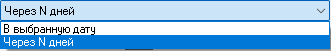 style="width:3.44792in;height:0.53125in" />
>
> а) «**Через N дней**» - Оплата будет списана через выбранное число
> дней после подключения услуги (допускаются дробные значения).
>
> б) «**В выбранную дату**» - Позволяет выбрать точную дату и время для
> списания оплаты.
>
>  style="width:4.73958in;height:2.36458in" />

-   «**Частичная оплата**» - Позволяет абоненту заплатить не полную
    стоимость, если услуга была подключена не весь расчётный период.

-   «**Перерасчёт при досрочном отключении**» - Если действие услуги
    было прервано досрочно, абоненту на счёт вернётся сумма
    пропорционально неизрасходованному времени.

-   «**Снимать оплату если клиент остановлен**» - Даже если абонент
    остановлен и не может пользоваться услугой, оплата за неё всё равно
    будет списываться со счёта.

-   «**Отключение с абонентской платой**» - Клиент сможет отключить
    услугу не раньше, чем наступит время списание оплаты.

-   «**Льготный период N списаний**» - Количество списаний оплаты,
    которые пропустит абонент после подключения услуги.

-   «**Клиент может отключить услугу через N дней**» - Минимальное число
    дней после которого абонент сможет отключить услугу.

-   «**Авто отключение после N списаний**» - Количество списаний оплаты,
    после которого абонентская плата будет автоматически отключена.

-   «**Стоимость услуги зависит от трафика**» - Позволяет изменить
    стоимость услуги в зависимости от трафика, посчитанного по списку
    сетей. Настройки опции выглядят так:

>  style="width:4.96875in;height:1.82292in" />
>
> Где «**Порог трафика**» - Кратно этому значению будет увеличиваться
> стоимость услуги.
>
> «**Шаг стоимости**» - Сумма, на которую будет изменяться стоимость
> услуги с превышением трафика на каждый шаг.
>
> «**Мин. стоимость**» - Минимальная стоимость услуги, меньше которой
> значение не может опуститься (если в зависимости от трафика
> предусмотрено уменьшение стоимости).
>
> «**Макс. стоимость**» - Максимальная стоимость услуги, больше которой
> значение не может подняться.
>
> «**Трафик**» - Алгоритм подсчёта трафика (Входящий, Исходящий, или
> Входящий + Исходящий).
>
> «**Поле трафика**» - Дополнительное поле, которое считает трафик.

-   «**Клиент может подключить услугу один раз**» - Для каждого абонента
    услуга доступна к подключению только 1 раз.

-   «**Клиент может отключить услугу**» - Чекбокс действует при
    отключенной опцией «**Клиент может подключить и откл. услугу**». В
    таком случае абонент сможет отключить, подключенную администратором
    услугу.

-   «**Отключать при остановке клиента**» - При остановке абонента из-за
    нехватки денег, услуга будет отключена (в противном случае услуга
    будет временно приостановлена).

-   «**Отключать при нехватке средств**» - При недостатке средств для
    продления услуги, она будет отключена (в противном случае услуга
    будет временно приостановлена).

-   «**Блокировать вместе с клиентом**» - При остановке абонента из-за
    нехватки денег, услуга тоже будет приостановлена, даже если была
    проплачена на большее время.

-   «**Ставить IP абонента на интерфейс роутера**» - В роутерах MikroTik
    адрес IP абонента будет установлен на интерфейс роутера, который в
    профиле абонента выбран как локальный интерфейс.

-   «**При отключении запись в фин. статистике**» - При отключении
    услуги оставлять запись в логе финансов.

-   «**Создавать адресный лист в MikroTik**» - В роутерах MikroTik, на
    которых присутствуют абоненты, подключившие услугу, будет создан
    адресный лист с именем: MikroBill\_LinkedServices\_Имя\_услуги.

-   «**SMS при остановке услуги**» - Отправлять сообщение абоненту по
    заданному шаблону через мессенджеры или SMS при остановке услуги.

-   «**Тарифы и группы, которые могут подключить**» - Выбор тарифов и
    групп, абоненты из которых могут самостоятельно подключить услугу.

-   «**Отключить услуги при запуске**» - Выбор услуг, которые будут
    автоматически отключены при подключении данной услуги.

-   «**Выбрать MikroTik**» - позволяет автоматически добавлять на
    выбранные роутеры абонентов, которым подключена данная услуга.

-   «**Корневая услуга**» - Позволяет выбрать перечень услуг, не
    подключив предварительно которые, нельзя будет подключить данную
    услугу.

-   «**Выдавать из пула новый IP**» - Позволяет при подключении услуги
    выдавать IP из одного пула, а при отключении из другого.

>  style="width:4.73958in;height:1.46875in" />

-   «**Выполнять скрипт**» - Здесь вы можете выбрать скрипты, которые
    активируются в момент активации и деактивации услуги.

>  style="width:4.875in;height:1.57292in" />

-   «**Управлять оборудованием Telnet / SSH**» - Здесь вы можете выбрать
    подключение и вписать собственные команды, которые необходимо
    отправить на оборудование при подключении и отключении услуги.

>  style="width:4.89652in;height:2.80247in" />
>
> **Добровольная блокировка**
>
> Услуга позволяет абоненту приостановить списание оплаты и действие
> услуг на определённый период.
>
>  style="width:4.84375in;height:5.34375in" />

-   «**Название (техническое)**» - эту строку видят только
    администраторы

-   «**Название для абонентов**» - эту строку увидит абонент в личном
    кабинете. Допускается выбор отдельного названия для каждой
    локализации. Для этого предназначена кнопка
    . После нажатия откроется
    меню:

>  style="width:2.82292in;height:1.96875in" />
>
> После выбора языка, можно вписать название.

-   «**Клиент может подключить и откл. услугу**» - если чекбокс отмечен,
    абонент может самостоятельно активировать услугу, иначе это сможет
    сделать только администратор.

-   «**Подключение**» - Цена подключения услуги.

-   «**Абон. плата**» - Плата за добровольную блокировку будет
    автоматически списываться в момент наступления абонентской платы по
    тарифу.

-   «**Период действия. Максимум**» - Максимальный срок действия, после
    которого услуга будет автоматически отключена.

-   «**Период действия. Минимум**» - Минимальный срок действия, раньше
    которого абонент не сможет отключить услугу.

-   «**Услуга запускается сразу**» - Услуга активируется сразу, после
    запуска её абонентом.

-   «**Клиент может выбрать дату начала**» - Абоненту будет предложено
    выбрать дату начала добровольной блокировки.

-   «**Старт с окончанием расчётного периода**» - Услуга запустится в
    момент следующей абонентской платы по тарифу.

-   «**Лимит запусков в год**» - Ограничивает количество запусков
    добровольной блокировки абонентом за последние 365 дней.

-   «**Можно включить, если клиент заблокирован**» - Абонент может
    активировать услугу, если он уже остановлен из-за нехватки средств.

-   «**Выдавать из пула новый IP**» - Позволяет при подключении услуги
    выдавать IP из одного пула, а при отключении из другого.

>  style="width:4.73958in;height:1.46875in" />

-   «**Выполнять скрипт**» - Здесь вы можете выбрать скрипты, которые
    активируются в момент активации и деактивации услуги.

>  style="width:4.875in;height:1.57292in" />

-   «**Управлять оборудованием Telnet / SSH**» - Здесь вы можете выбрать
    подключение и вписать собственные команды, которые необходимо
    отправить на оборудование при подключении и отключении услуги.

>  style="width:4.89652in;height:2.80247in" />
>
> **SMS-информирование**
>
> Если услуга подключена, абонент будет получать информационные рассылки
> через SMS или мессенджеры о необходимости пополнить счёт, о активации
> услуг и другие.
>
>  style="width:4.875in;height:6.16667in" />

-   «**Название (техническое)**» - эту строку видят только
    администраторы

-   «**Название для абонентов**» - эту строку увидит абонент в личном
    кабинете. Допускается выбор отдельного названия для каждой
    локализации. Для этого предназначена кнопка
    . После нажатия откроется
    меню:

>  style="width:2.82292in;height:1.96875in" />
>
> После выбора языка, можно вписать название.

-   «**Клиент может подключить и откл. услугу**» - если чекбокс отмечен,
    абонент может самостоятельно активировать услугу, иначе это сможет
    сделать только администратор.

-   «**Комментарий**» - Описание услуги, которое увидит абонент в
    WEB-кабинете. Так же, как и название, комментарий зависит от
    выбранного языка.

-   «**Подключение**» - Цена подключения услуги.

-   «**Отключение**» - Стоимость отключения услуги.

-   «**Абон. плата**» - Плата за добровольную блокировку будет
    автоматически списываться в момент наступления абонентской платы по
    тарифу.

-   «**Мессенджеры**» - Абонентская плата, если абонент подключил
    рассылку в мессенджеры вместо классических SMS.

-   «**Тип оплаты**» - Выбирает алгоритм расчёта оплаты. Доступны
    варианты:

1.  «**Предоплата**» – Оплата будет сниматься в момент подключения
    услуги за предстоящий период работы.

2.  «**Постоплата**» - Оплата будет сниматься в момент окончания
    действия услуги за отработанный период.

-   «**Списание**» - Алгоритм списания оплаты.

>  style="width:3.45833in;height:1.19792in" />
>
> 1\. «**Ежедневно»** - Оплата будет списываться каждый день.
>
> 2\. «**Разделить поровну на месяц**» - Стоимость тарифа будет
> разделена на количество дней в текущем месяце и списана равными
> долями.
>
> 3\. «**Списывать N-ого числа месяца**» - Оплата будет сниматься раз в
> месяц, заданного числа.
>
>  style="width:1.85417in;height:0.3125in" />
>
> 4\. «**Помесячно от даты создания**» - Оплата будет сниматься раз в
> месяц того же числа, в которое был создан абонент.
>
> PS: При необходимости вы можете изменить дату создания абонента, для
> этого выделите абонента, откройте контекстное меню и проследуйте
> «**Дополнительно**» -&gt; «**Сбросить**» -&gt; «**Изменить дату
> создания абонента**».
>
> 5\. «**Помесячно от даты абонентской платы**» - Оплата будет сниматься
> раз в месяц того же числа, в которое было предыдущее списание. При
> выборе этого и предыдущего пунктов появляется дополнительный
> выпадающий список, выбирающий длину периода.
>
>  style="width:1.76042in;height:0.59375in" />
>
> «**От даты до даты**» - Оплата будет сниматься раз в месяц того же
> числа, в которое было предыдущее списание.
>
> «**Произвольно**» - Вы сможете выбрать продолжительность расчётного
> периода в днях.
>
>  style="width:4.22917in;height:1.09375in" />
>
> Таким образом, например, можно создать услуги, оплата в которых
> списывается раз в неделю, раз в полгода, или даже раз в час.
>
> 6\. «**С абонентской платой тарифа**» - Оплата будет списываться
> одновременно с тарифом, на котором находится абонент.

-   «**Частичная оплата**» - Позволяет абоненту заплатить не полную
    стоимость, если услуга была подключена не весь расчётный период.

-   «**Перерасчёт при досрочном отключении**» - Если действие услуги
    было прервано досрочно, абоненту на счёт вернётся сумма
    пропорционально неизрасходованному времени.

-   «**Снимать оплату если клиент остановлен**» - Даже если абонент
    остановлен и не может пользоваться услугой, оплата за неё всё равно
    будет списываться со счёта.

-   «**Клиент может отключить услугу**» - Чекбокс действует при
    отключенной опцией «**Клиент может подключить и откл. услугу**». В
    таком случае абонент сможет отключить, подключенную администратором
    услугу.

-   «**Отключать при нехватке средств**» - При недостатке средств для
    продления услуги, она будет отключена (в противном случае услуга
    будет временно приостановлена).

-   «**Создавать адресный лист в MikroTik**» - В роутерах MikroTik, на
    которых присутствуют абоненты, подключившие услугу, будет создан
    адресный лист с именем: MikroBill\_LinkedServices\_Имя\_услуги.

-   «**Тарифы и группы, которые могут подключить**» - Выбор тарифов и
    групп, абоненты из которых могут самостоятельно подключить услугу.

> **Email-информирование**
>
> Если услуга подключена, абонент будет получать информационные рассылки
> на email о необходимости пополнить счёт, о активации услуг и другие.
>
>  style="width:4.82292in;height:5.8125in" />

-   «**Название (техническое)**» - эту строку видят только
    администраторы

-   «**Название для абонентов**» - эту строку увидит абонент в личном
    кабинете. Допускается выбор отдельного названия для каждой
    локализации. Для этого предназначена кнопка
    . После нажатия откроется
    меню:

>  style="width:2.82292in;height:1.96875in" />
>
> После выбора языка, можно вписать название.

-   «**Клиент может подключить и откл. услугу**» - если чекбокс отмечен,
    абонент может самостоятельно активировать услугу, иначе это сможет
    сделать только администратор.

-   «**Комментарий**» - Описание услуги, которое увидит абонент в
    WEB-кабинете. Так же, как и название, комментарий зависит от
    выбранного языка.

-   «**Подключение**» - Цена подключения услуги.

-   «**Отключение**» - Стоимость отключения услуги.

-   «**Абон. плата**» - Плата за добровольную блокировку будет
    автоматически списываться в момент наступления абонентской платы по
    тарифу.

-   «**Тип оплаты**» - Выбирает алгоритм расчёта оплаты. Доступны
    варианты:

1.  «**Предоплата**» – Оплата будет сниматься в момент подключения
    услуги за предстоящий период работы.

2.  «**Постоплата**» - Оплата будет сниматься в момент окончания
    действия услуги за отработанный период.

-   «**Списание**» - Алгоритм списания оплаты.

>  style="width:3.45833in;height:1.19792in" />
>
> 1\. «**Ежедневно»** - Оплата будет списываться каждый день.
>
> 2\. «**Разделить поровну на месяц**» - Стоимость тарифа будет
> разделена на количество дней в текущем месяце и списана равными
> долями.
>
> 3\. «**Списывать N-ого числа месяца**» - Оплата будет сниматься раз в
> месяц, заданного числа.
>
>  style="width:1.85417in;height:0.3125in" />
>
> 4\. «**Помесячно от даты создания**» - Оплата будет сниматься раз в
> месяц того же числа, в которое был создан абонент.
>
> PS: При необходимости вы можете изменить дату создания абонента, для
> этого выделите абонента, откройте контекстное меню и проследуйте
> «**Дополнительно**» -&gt; «**Сбросить**» -&gt; «**Изменить дату
> создания абонента**».
>
> 5\. «**Помесячно от даты абонентской платы**» - Оплата будет сниматься
> раз в месяц того же числа, в которое было предыдущее списание. При
> выборе этого и предыдущего пунктов появляется дополнительный
> выпадающий список, выбирающий длину периода.
>
>  style="width:1.76042in;height:0.59375in" />
>
> «**От даты до даты**» - Оплата будет сниматься раз в месяц того же
> числа, в которое было предыдущее списание.
>
> «**Произвольно**» - Вы сможете выбрать продолжительность расчётного
> периода в днях.
>
>  style="width:4.22917in;height:1.09375in" />
>
> Таким образом, например, можно создать услуги, оплата в которых
> списывается раз в неделю, раз в полгода, или даже раз в час.
>
> 6\. «**С абонентской платой тарифа**» - Оплата будет списываться
> одновременно с тарифом, на котором находится абонент.

-   «**Частичная оплата**» - Позволяет абоненту заплатить не полную
    стоимость, если услуга была подключена не весь расчётный период.

-   «**Перерасчёт при досрочном отключении**» - Если действие услуги
    было прервано досрочно, абоненту на счёт вернётся сумма
    пропорционально неизрасходованному времени.

-   «**Снимать оплату если клиент остановлен**» - Даже если абонент
    остановлен и не может пользоваться услугой, оплата за неё всё равно
    будет списываться со счёта.

-   «**Клиент может отключить услугу**» - Чекбокс действует при
    отключенной опцией «**Клиент может подключить и откл. услугу**». В
    таком случае абонент сможет отключить, подключенную администратором
    услугу.

-   «**Отключать при нехватке средств**» - При недостатке средств для
    продления услуги, она будет отключена (в противном случае услуга
    будет временно приостановлена).

-   «**Создавать адресный лист в MikroTik**» - В роутерах MikroTik, на
    которых присутствуют абоненты, подключившие услугу, будет создан
    адресный лист с именем: MikroBill\_LinkedServices\_Имя\_услуги.

-   «**Настройка Email**» - Открывает окно, где можно ввести реквизиты
    подключения к почтовому серверу.

-   «**Тарифы и группы**» - Выбор тарифов и групп, абоненты из которых
    могут самостоятельно подключить услугу.

> **Фильтрация рекламы**
>
> Услуга активирует блокировку рекламы для абонента по IP адресам или
> через DNS.
>
>  style="width:4.85417in;height:6.15625in" />

-   **Название (техническое)**» - эту строку видят только администраторы

-   «**Название для абонентов**» - эту строку увидит абонент в личном
    кабинете. Допускается выбор отдельного названия для каждой
    локализации. Для этого предназначена кнопка
    . После нажатия откроется
    меню:

>  style="width:2.82292in;height:1.96875in" />
>
> После выбора языка, можно вписать название.

-   «**Клиент может подключить и откл. услугу**» - если чекбокс отмечен,
    абонент может самостоятельно активировать услугу, иначе это сможет
    сделать только администратор.

-   «**Комментарий**» - Описание услуги, которое увидит абонент в
    WEB-кабинете. Так же, как и название, комментарий зависит от
    выбранного языка.

-   «**Подключение**» - Цена подключения услуги.

-   «**Отключение**» - Стоимость отключения услуги.

-   «**Абон. плата**» - Плата за добровольную блокировку будет
    автоматически списываться в момент наступления абонентской платы по
    тарифу.

-   «**Тип оплаты**» - Выбирает алгоритм расчёта оплаты. Доступны
    варианты:

1.  «**Предоплата**» – Оплата будет сниматься в момент подключения
    услуги за предстоящий период работы.

2.  «**Постоплата**» - Оплата будет сниматься в момент окончания
    действия услуги за отработанный период.

-   «**Списание**» - Алгоритм списания оплаты.

>  style="width:3.45833in;height:1.19792in" />
>
> 1\. «**Ежедневно»** - Оплата будет списываться каждый день.
>
> 2\. «**Разделить поровну на месяц**» - Стоимость тарифа будет
> разделена на количество дней в текущем месяце и списана равными
> долями.
>
> 3\. «**Списывать N-ого числа месяца**» - Оплата будет сниматься раз в
> месяц, заданного числа.
>
>  style="width:1.85417in;height:0.3125in" />
>
> 4\. «**Помесячно от даты создания**» - Оплата будет сниматься раз в
> месяц того же числа, в которое был создан абонент.
>
> PS: При необходимости вы можете изменить дату создания абонента, для
> этого выделите абонента, откройте контекстное меню и проследуйте
> «**Дополнительно**» -&gt; «**Сбросить**» -&gt; «**Изменить дату
> создания абонента**».
>
> 5\. «**Помесячно от даты абонентской платы**» - Оплата будет сниматься
> раз в месяц того же числа, в которое было предыдущее списание. При
> выборе этого и предыдущего пунктов появляется дополнительный
> выпадающий список, выбирающий длину периода.
>
>  style="width:1.76042in;height:0.59375in" />
>
> «**От даты до даты**» - Оплата будет сниматься раз в месяц того же
> числа, в которое было предыдущее списание.
>
> «**Произвольно**» - Вы сможете выбрать продолжительность расчётного
> периода в днях.
>
>  style="width:4.22917in;height:1.09375in" />
>
> Таким образом, например, можно создать услуги, оплата в которых
> списывается раз в неделю, раз в полгода, или даже раз в час.
>
> 6\. «**С абонентской платой тарифа**» - Оплата будет списываться
> одновременно с тарифом, на котором находится абонент.

-   «**Частичная оплата**» - Позволяет абоненту заплатить не полную
    стоимость, если услуга была подключена не весь расчётный период.

-   «**Перерасчёт при досрочном отключении**» - Если действие услуги
    было прервано досрочно, абоненту на счёт вернётся сумма
    пропорционально неизрасходованному времени.

-   «**Снимать оплату если клиент остановлен**» - Даже если абонент
    остановлен и не может пользоваться услугой, оплата за неё всё равно
    будет списываться со счёта.

-   «**Клиент может отключить услугу**» - Чекбокс действует при
    отключенной опцией «**Клиент может подключить и откл. услугу**». В
    таком случае абонент сможет отключить, подключенную администратором
    услугу.

-   «**Отключать при нехватке средств**» - При недостатке средств для
    продления услуги, она будет отключена (в противном случае услуга
    будет временно приостановлена).

-   «**SMS при остановке услуги**» - Отправлять сообщение абоненту по
    заданному шаблону через мессенджеры или SMS при остановке услуги.

-   «**Тарифы и группы, которые могут подключить**» - Выбор тарифов и
    групп, абоненты из которых могут самостоятельно подключить услугу.

-   «**Глобальные настройки блокировки рекламы**» - Открывает окно
    настроек [блокировки рекламы](#Блокировка_рекламы).

> **Временный доступ**
>
> Позволяет абоненту на короткое время получить доступ в интернет,
> например, для пополнения баланса.
>
> 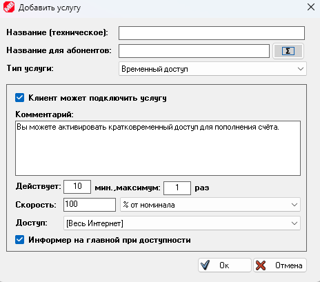 style="width:4.83333in;height:4.26042in" />

-   «**Название (техническое)**» - эту строку видят только
    администраторы

-   «**Название для абонентов**» - эту строку увидит абонент в личном
    кабинете. Допускается выбор отдельного названия для каждой
    локализации. Для этого предназначена кнопка
    . После нажатия откроется
    меню:

>  style="width:2.82292in;height:1.96875in" />
>
> После выбора языка, можно вписать название.

-   «**Комментарий**» - Описание услуги, которое увидит абонент в
    WEB-кабинете. Так же, как и название, комментарий зависит от
    выбранного языка.

-   «**Клиент может подключить услугу**» - если чекбокс отмечен, абонент
    может самостоятельно активировать услугу, иначе это сможет сделать
    только администратор.

-   «**Действует**» - Длительность временного доступа в днях. Так же,
    здесь можно выбрать максимальное количество запусков услуги в рамках
    одного расчётного периода.

-   «**Скорость**» - Устанавливает, какой должна быть скорость абонента
    в период действия услуги временного доступа. Доступны следующие
    опции:

>  style="width:2.75in;height:0.52083in" />

-   «**Доступ**» - Позволяет выбрать доступ либо ко всему Интернету,
    либо к определённому [списку сетей](#Списки_сетей).

-   «**Информер на главной при доступности**» - Включает отображение
    плашки-информера вверху главной страницы абонентского WEB кабинета,
    когда услуга доступна для подключения.

>  style="width:5.60417in;height:1.92708in" />

# Управление абонентами

> Кликнув по любому абоненту, вы откроете контекстное меню.
>
>  style="width:2.20846in;height:2.35904in" />
>  style="width:2.88996in;height:6.81001in" />
>
> Разберём доступные пункты подробно.

-   «**Пополнить баланс**» - Тут вы можете пополнить баланс абонента как
    деньгами, так и днями, отправить сообщение о пополнении по SMS или в
    мессенджер, а также распечатать квитанцию об оплате (Для печати
    квитанции о пополнении необходимо сделать копию файла шаблона
    files\receipt\_template.htm в файл files\receipt.htm и изменить его
    под свои нужды).

> Чекбокс «**Обнулить баланс и пополнить**», сбрасывает баланс абонента
> в 0 перед начислением суммы.
>
> Чекбокс «**Запустить абонента с 1 числа**» смещает дату запуска
> абонента на начало следующего расчётного периода (опция доступна
> только если абонент в настоящий момент отключен).

Так же, при необходимости кассир может зачислить платёж не от своего
имени, а от имени какой-то платёжной системы, это может быть нужно,
например, чтобы фискализировать платёж. Для этого в поле комментария
необходимо ввести строку вида: «PluginID = номер\_платёжной\_системы».
Например, строка «PluginID = 61» соответствует платежу через Альфабанк.
Номера всех платёжных систем вы можете посмотреть
[здесь](#Пополнения_moneys) в столбце **actionsubid**.

Если нужно добавить комментарий к платежу, то нужно он пишется так:
«PluginID = 61 = Комментарий». Что бы описанное выше изменение источника
платежа работало, у кассира должно быть разрешение на редактирование
финансов.

-   «**Редактировать**» и «**Создать абонента**»

>  style="width:5.96643in;height:4.07854in" />
>
> Попасть в окно редактирования вы можете из контекстного меню абонента,
> либо нажав клавишу **ПРОБЕЛ**. В окно создания абонента также можно
> попасть из контекстного меню, либо нажав клавишу **INSERT**. Если в
> момент перехода в окно создания абонента в списке выделен другой
> абонент, то сразу будет предложено создать абонента на этом же
> [тарифе](#тарифы) и в этой же [группе](#группы).
>
> На форме редактирования абонента можно указать данные абонента. Кнопки
> с пиктограммой  style="width:0.26042in;height:0.22917in" /> обновляют данные в поле,
> напротив которого они стоят, кнопки с пиктограммой
>  style="width:0.26042in;height:0.22917in" /> открывают дополнительное
> окно настроек. Об каждой кнопе более подробно будет ниже.

-   Галочка «**Это внешний IP**» отключает общие NAT правила для этого
    абонента.

-   Кнопка  напротив поля IP выдаст
    абоненту новый адрес и пула, который выбран в свойствах
    [тарифа](#тарифы) или [группы](#группы).

-   Кнопка  напротив поля MAC
    попытается получить новый MAC-адрес для выбранного IP.

-   Кнопка  откроет сетку адресов.
    Вы увидите занятые и свободные адреса, сможете выбрать подходящий
    адрес для абонента.

>  style="width:5.56411in;height:4.39775in" />

-   «**Caller ID**» - идентификатор вызывающего абонента. Если указанный
    CallerID не совпадает фактическим у абонента, он не сможет поднять
    соединение. Для PPPoE в качестве CallerID выступает MAC-адрес, для
    PPTP – IP-адрес.

-   Выпадающий список «**Авторизация**» позволяет выбрать тип
    авторизации из следующих доступных: IP + MAC, HotSpot, PPP Any,
    Async, L2TP, OVPN, PPPoE, PPTP, SSTP.

-   Выпадающий список «**Приоритет**» устанавливает приоритет трафика
    абонента. 8 – минимальный, 1 – максимальный.

-   Кнопка  напротив полей
    «**Имя**», «**Логин**» и «**Пароль**» сгенерирует новые реквизиты.
    Параметры генерации реквизитов [выбираются
    тут](#Создание_Абонентов).

-   Кнопка  напротив поля «**Дата
    1**» вставляет в текстовое поле текущую дату. Само поле «**Дата 1**»
    устанавливает для абонента дату начала работы. Дата начала работы не
    зависит от баланса. Если текущая дата не находится в диапазоне между
    «**Дата 1**» и «**Дата 2**», то абонент будет остановлен.

-   Кнопка  напротив поля «**Дата
    2**» вставляет в текстовое поле текущую дату. Само поле «**Дата 2**»
    устанавливает для абонента дату начала работы.

-   Кнопки  напротив полей «**Дата
    1**» и «**Дата 2**» прибавляют время к уже вписанной дате. Кнопки
    являются многофункциональными. Клик левой клавишей мыши - добавляет
    месяц, клик правой клавишей мыши - добавляет час, клик средней
    клавишей мыши (колёсиком) - добавляет день.

-   Кнопки  напротив полей «**Огр.
    Вх.**» и «**Огр. Исх.**» включают суточные и месячные лимиты по
    трафику для абонента. Настройки лимитов трафика по части функционала
    полностью идентичны таковым в настройках [тарифа](#тарифы).

-   «**Бурст**» - кратковременное превышение установленных лимитов
    скорости. Выбирается время действия ускорения в секундах и размер
    превышения базовой скорости в процентах.

-   «**Тариф**» - выбирает [тарифный](#тарифы) план абоненту. Если
    кликнуть по ссылке с именем тарифа правой клавишей мыши, сразу
    откроется окно с редактированием этого тарифа. Кнопка
     напротив имени тарифа
    откроет окно со списком тарифов, где их можно редактировать и менять
    их порядок.

-   «**Группа**» - выбирает [группу](#группы) абонента. Если кликнуть по
    ссылке с именем группы правой клавишей мыши, сразу откроется окно с
    редактированием этой группы. Кнопка
     напротив имени группы
    откроет окно со списком групп, где их можно редактировать и менять
    их порядок.

> Настройки группы всегда имеют больший приоритет, чем настройки тарифа,
> например, если в группе и тарифе выбраны разные локальные интерфейсы
> для абонента, то будет использоваться тот, что выбран в группе.

-   «**Групповой счёт**» - выбор общего счёта для абонентов. Подробнее о
    работе групповых счетов в разделе «[**Групповые
    счета**](#Групповые_счета)».

-   «**Интерфейс Local**» - выбирает локальный интерфейс абонента. Опция
    используется, если выбрана авторизация IP+MAC. Выбранный MAC адрес
    прописывается в ARP лист на роутере для данного интерфейса.

-   «**Интерфейс WAN**» - Позволяет выбрать внешний интерфейс, через
    который абонент будет выходить в Интернет. Опция работает только в
    том случае, если в свойствах подключения к роутеру включена
    [балансировка нагрузки](#WAN_интерфейсы_и_балансировка_нагрузки) и
    выбраны WAN интерфейсы.

> Раздел «**Персональные данные**».
>
> Здесь доступны следующие вкладки:

-   Вкладка «**Анкета физ.лица**»

>  style="width:6.02498in;height:3.57253in" />
>
> Остановимся не некоторых моментах.
>
> Кнопка  style="width:1.1875in;height:0.27083in" /> позволяет прикрепить любые
> файлы к профилю абонента, например, скан договора с подписями.
>
> Кнопка  style="width:0.26042in;height:0.22917in" /> напротив поля
> «**Договор**» подставляет следующий свободный номер договора.
>
> Кнопка  style="width:0.28125in;height:0.23958in" /> напротив поля «**Адрес
> подключения**» откроет браузер и покажет дом абонента на картах
> Яндекса. Для работы опции необходим ключ [Яндекс.Карт](#Yandex_Карта).
>
> «**Адрес подключения**» выбирается из справочника, подробнее о
> наполнении справочника и загрузке готовой базы адресов читайте в
> разделе «**Справочник адресов**».
>
> Кнопка  style="width:0.29167in;height:0.26042in" /> напротив полей «**Паспорт
> выдан**» и «**Прописка**» позволяет загрузить сканы документов.
>
> Поля «**Примечание 1-4**» - устанавливают комментарий об абоненте,
> который видят только кассиры. Вы можете использовать эти поля для
> хранения любой информации.
>
> Поля «**Информация 1-2**» - позволяют показать любую информацию в WEB
> кабинете абонента. Вы можете использовать в этих полях HTML теги.
> Плашка с информацией будет вверху главной страницы абонентского
> кабинета.
>
>  style="width:6.39691in;height:1.98681in" />

-   Вкладка «**Анкета юр.лица**»

> Здесь собраны данные об абоненте, если он является юридическим лицом.
>
> Базовая ставка налога задаётся в разделе «**Финансы**» &gt; «[**Валюта
> и абонентская плата**](#Валюта_и_абонентская_плата)». Так же мы хотим
> напомнить, что вы можете изменить название стандартных полей, нажав в
> настройках кнопку «**Интерфейс MikroREMOTE**» и перейдя на вкладку
> «[**Поля в профиле абонента**](#Поля_в_профиле_абонента)».

-   Вкладка «**Склад**»

>  style="width:5.98067in;height:1.20197in" />
>
> Здесь вы можете привязать оборудование со склада к абоненту. Подробнее
> о том, как создать типы оборудования и заводить их на склад, читайте в
> разделе «[**Склад**](#склад)». При клике на поле появляется выбор
> доступного оборудования.
>
> Кнопка  style="width:0.26042in;height:0.25in" /> скроет в списке все пункты,
> где оборудование не выбрано.
>
> Кнопка  style="width:0.27083in;height:0.26042in" /> (доступна только
> администраторам) откроет настройку дополнительных полей абонента, в
> которых можно хранить позицию со склада. Настройка полей происходит
> сразу для всех абонентов.
>
> 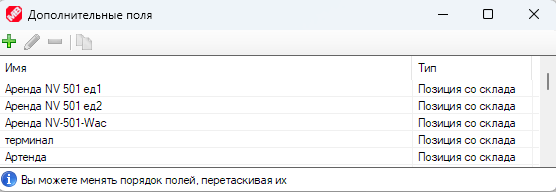 style="width:5.34865in;height:1.84702in" />
>
> Окно создания дополнительного поля выглядит следующим образом:
>
>  style="width:3.19623in;height:2.57382in" />
>
> Здесь вы можете вписать название поля и выбрать какой тип оборудования
> со склада будет принимать это поле. Ниже есть чекбокс «**Абонентская
> плата**». Если его установить, то одновременно с выбором оборудования
> в поле, абоненту автоматически будет подключена [услуга](#услуги). Это
> позволит списывать абонентскую плату за оборудование, или выполнять
> скрипт. Подробнее о том, как работают услуги и как создавать
> оборудование на складе читайте в разделах «**Услуги**» и «**Склад**».

-   «**Тикеты**» - на этой вкладке вы можете видеть все тикеты,
    связанные с абонентом. Можете создать, завершить, или удалить тикет.

> Так же в MikroBILL существует специальное окно, отображающее все
> тикеты абонентов и множество сопутствующих настроек. Подробнее об этом
> читайте в разделе «[**Тикеты**](#тикеты)».

-   «**Финансы**» - Тут отображаются все проводки по счёту абонента за
    последнее время.

>  style="width:6.0008in;height:1.6315in" />
>
> Кнопка  style="width:0.19792in;height:0.23958in" /> откроет окно полной
> финансовой статистики. Более подробно об этом в разделе «[**Движение
> средств**](#движение-средств)».
>
> Кнопка  style="width:0.25in;height:0.22917in" /> откроет окно запланированных
> пополнений и списаний по абоненту. Более подробно об этом в разделе
> «**Запланированные пополнения и списания**».

-   Вкладка «**Услуги**» - на этой вкладке можно отметить галочками
    [услуги](#услуги), которые должны быть подключены абоненту, или
    снять галочки, если услуги нужно отключить. Более подробно о
    настройке услуг читайте в разделе «**Услуги**».

>  style="width:5.96724in;height:1.68585in" />

-   Вкладка «**Скорость**» - на этой вкладке можно настроить изменение
    ограничений скорости в зависимости от времени суток. Настройки по
    части функционала полностью идентичны таковым в настройках
    [тарифов](#тарифы).

> Раздел
> «**Дополнительные поля**».
>
> Здесь вы можете добавить любое количество полей для хранения данных.
> Нажав кнопку  style="width:0.27083in;height:0.26042in" /> вы можете создать,
> удалить, или переименовать существующие дополнительные поля. Настройка
> полей происходит сразу для всех абонентов. Доступны поля следующих
> типов:

-   «**Строка**»

>  style="width:3.21753in;height:1.54691in" />
>
> Позволяет хранить текстовые данные. Чекбокс «**Уникальные данные**»
> активирует проверку вводимых данных, и если у другого абонента в этом
> же поле введена такая же строка, текст будет выделен красным цветом.

-   «**Число**» - позволяет хранить любые числовые данные. Поле не имеет
    дополнительных настроек.

-   «**Дата**» - позволяет хранить дату. Поле не имеет дополнительных
    настроек.

-   «**Флаг**» - позволяет хранить бит информации. Это поле
    переключатель Да/нет. Поле не имеет дополнительных настроек.

-   «**Список**» - позволяет выбирать данные из выпадающего списка.

>  style="width:3.26385in;height:2.10873in" />

-   «**GPS объект**» - позволяет рисовать и оставлять отметки поверх
    карты. Для работы карты необходим API ключ [Yandex](#Yandex_Карта).

> Доступно 5 типов GRS объектов:

1.  «**Координаты**» - Позволяет разместить пиктограмму на карте.
    Позволяет выбрать иконку.

2.  «**Флажок**» - добавляет булавку на карту.

3.  «**Ломаная**» - Позволяет нарисовать ломанную линию, состоящую из
    любого количества точек. Доступен выбор цвета линии.

4.  «**Область**» - Позволяет нарисовать замкнутую фигуру, состоящую из
    любого количества точек. Доступен выбор цвета контура и цвета
    заливки.

5.  «**Окружность**» - позволяет нарисовать окружность. Доступен выбор
    цвета контура и цвета заливки.

> Примеры рисования по карте на изображениях ниже.

-   «**IP**» - Позволяет хранить IP адрес для оборудования. Если в
    настройках поля выбрать пул, то можно по нажатию кнопки
     выдавать адрес из
    заданного пула.

>  style="width:3.28832in;height:1.54161in" />

-   «**MAC**» - Позволяет хранить MAC адрес для оборудования. Если у
    абонента присутствует поле типа «**IP**», то нажатие на кнопку
     попробует получить
    соответствующий MAC.

-   «**Файл**» - позволит хранить любой файл.

-   «**Трафик**» - поле-счётчик, в настройках содержит выбор списка
    сетей, с которого будет считаться трафик абонента. Опция активна
    только в случае, когда трафик считается через NetFlow. Более
    подробно о списках сетей читайте в разделе «**Списки сетей**».

-   «**Скорость**» - поле-счётчик, в настройках содержит выбор списка
    сетей, с которого будет считаться скорость абонента. Опция активна
    только в случае, когда трафик считается через NetFlow. Более
    подробно о списках сетей читайте в разделе «**Списки сетей**».

-   «**Список мастеров**» - позволяет выбрать Мастера. Это не порождает
    какого-либо последующего эффекта, только отметка для внутреннего
    пользования.

> Продолжаем обозревать пункты контекстного меню абонентов. Напоминаем,
> что оно выглядит вот так:
>
>  style="width:2.20846in;height:2.35904in" />
>
> Для пунктов «[**Начисления**](#движение-средств)»,
> «[**Тикеты**](#тикеты)» и «[**Склад**](#склад)» мы создали
> персональные разделы, переходите по ссылкам. Оставшиеся пункты ниже.

-   «**График скорости**» - Рисует потребление трафика абонентом в
    реальном времени, или за выбранный период (необходимо включить
    [сохранение в БД скоростей пользователей](#Логгирование)).

>  style="width:5.77083in;height:4.80208in"
> alt="https://mikro-bill.com/images/screenshots/speed.png" />

-   «**Сетевая активность**» - Показывает список текущих соединений,
    суточный трафик абонентов, либо детальную статистику NetFlow, если
    такая пишется. Включить запись NetFlow статистики можно в [свойствах
    подключения к роутеру](#Роутеры_и_настройки). Так же вы можете
    включить запись статистики в отдельную базу, для этого нажмите
    кнопку «**Параметры записи NetFlow в БД**» в [окне настроек
    подключения к базе](#MySQL_и_WEB).

> Данные можно экспортировать в Excel или в текстовый файл. Для этого
> используются кнопки на верхней панели, или контекстное меню.
>
> На вкладке «**Сетевая статистика**» по кнопке с изображением
>  style="width:0.27083in;height:0.26042in" /> откроется дополнительная
> панель поиска по NetFlow статистике.

> Здесь можно выбрать записи по IP, порту, протоколу, размеру и хосту
> (обратите внимание, что хост определяется исходя из IP и если к адресу
> привязано несколько доменов, может работать некорректно).

> Так же есть кнопка  style="width:0.27083in;height:0.25in" />, позволяющая выбрать или
> исключить записи по списку.

Кнопка  позволяет вывести топ
качальщиков.

Также тут можно посмотреть самые посещаемые IP и сколько к каждому
адресу было обращений.

Кнопка  выведет лог изменений IP по
выбранному абоненту.

Кнопка  покажет лог выхода абонентов
в онлайн.

Если у вас отключено автоматическое распознавание, вы можете выделить
нужные строки и в контекстном меню выбрать «**Распознать хост**» или
перейти на страницу с информацией о хосте – «**WhoIs**».

А на вкладке «**Быстрый отчёт по трафику**» можно посмотреть посуточное
потребление трафика. Так же доступны графики потребления по абонентам и
по дням.

Продолжаем исследовать контекстное меню абонента. Настало время
провалиться глубже, в подменю «**Дополнительно**».

-   «**Выбор подключенных услуг**» - Откроет окно со списком
    [услуг](#услуги).

>  style="width:6.04167in;height:6.39583in" />
>
> В этом же окне администраторы могут отредактировать услуги, по этому
> поводу будут дополнительные разъяснения в разделе
> «[**Услуги**](#услуги)».
>
> Кнопка  style="width:0.29167in;height:0.3125in" /> включает сортировку по
> выбранному столбцу. Если сортировка не включена, услуги отображаются в
> той последовательности, в которой они будут представлены в абонентском
> WEB-кабинете (не все услуги видны абонентам, в свойствах услуги есть
> выбор, какие [тарифы](#тарифы) и [группы](#группы) видят
> [услугу](#услуги)). Вы можете менять порядок услуг перетаскиванием.
>
> В контекстном меню подключенной услуги доступны следующие опции:
>
>  style="width:3.55208in;height:1.57292in" />
>
> «**Персональная абонентская плата**» - Задаёт для абонента особую
> тарификацию.
>
>  style="width:5.23958in;height:2.04167in" />
>
> «**Изменить дату последней абонентской платы**» - Поменяет в системе
> отметку о крайнем списании оплаты за [услугу](#услуги). Исходя из этих
> данных будет пересчитана дата следующей оплаты. Например, если услуга
> имеет тарификацию «**От даты до даты**» (т.е. списалось 1 числа –
> следующее списание того же числа) и поменяем дату на 5 число, и оплата
> будет списываться у абонента 5 числа. Так же вы можете дату сдвинуть
> на нужное число месяцев назад, инициировав таким образом списание
> оплаты за период от выбранной даты до текущего времени.
>
> «**Запланированное отключение**» - Выбор даты автоматического
> отключения услуги.
>
>  style="width:2.85456in;height:3.27129in" />

#  Движение средств

> В окно финансовой статистики можно попасть из контекстного меню в
> главном окне, либо нажав на кнопку
>  style="width:0.34375in;height:0.27083in" /> на верхней панели. В
> навигации при большом количестве открытых окон вам поможет список – вы
> можете нажать на стрелочку справа от иконки финансовой статистики и
> отроется список с всеми открытыми окнами:
>
>  style="width:1.47059in;height:0.69608in" />
>
> Окно финанов выглядит следующим образом:

> «**Дата 1**» и «**Дата 2**» устанавливают временной промежуток, в
> котором будет показана финансовая статистика. Вы можете выбрать даты,
> вписав их вручную, либо выбрав в календаре, нажав
>  style="width:0.26042in;height:0.26042in" /> , либо выбрать из заранее
> приготовленных диапазонов.
>
>  style="width:1.74158in;height:1.50236in" />
>
> Кнопки  style="width:0.45833in;height:0.23958in" /> экспортируют выбранные
> строчки отчёта либо в Excel, либо в текстовый файл.
>
> Кнопка  style="width:0.25in;height:0.22917in" /> откроет окно запланированных
> пополнений и списаний по абонентам, для которых вы строит отчёт. Более
> подробно об этом в разделе «**Запланированные пополнения и
> списания**».
>
> Кнопка  style="width:0.23958in;height:0.27083in" /> откроет финансовый отчёт с
> графиками. Подробнее об этом в разделе «**Отчёты**».
>
> Вы можете искать информацию в открытой финансовой статистике. Для
> этого введите искомую часть фразы в поле поиска и нажмите Enter. Чтобы
> перейти к следующему совпадению нажмите F3.
>
> Для того, чтоб добавить абонента или гурпповой счёт в окно движения
> финансов, просто перетащите его из главного окна MikroREMOTE в окно
> движения средств. Для того, чтобы исключить абонента, выделите его в
> списке и, либо в контекстном меню кликните по «**Исключить из
> отчёта**», либо возьмите его мышкой и вытяните за пределы списка.
>
> Чекбоксы «**Все абоненты**» и «**Все групповые счета**» отключат
> список выбранных абонентов, с ними будут показаны все финансовые
> данные, подпадающие под критерии фильтров, расположенных ниже.
>
> В фильтрах по кнопке «**Операции**» вы можете фильтровать данные и
> оставить в отчёте только абонентскую плату по [тарифу](#тарифы), или
> только списание за [услуги](#услуги), можете показать запланированные
> кассиром финансовые операции, или показать поступления, пришедшие на
> счёт абонента определённым способом, например, через Сбербанк.
>
> По кнопке «**Кассиры**» вы можете выбрать только действия, совершённые
> с балансом абонентов определёнными кассирами.
>
> По кнопке «**Тарифы и группы**» вы можете выбрать абонентов для отчёта
> только из указанных [тарифов](#тарифы) и [групп](#группы).
>
> Все фильтры имеют логику «ИЛИ», т.е. совпадение по любому фильтру
> приведёт к попаданию записи в отчёт.
>
> Техническая информация о таблице БД, в которой хранятся финансы
> доступна [здесь](#Структура_таблицы_moneys).

# Тикеты

> В окно тикетов можно попасть из контекстного меню в главном окне, либо
> нажав на кнопку  style="width:0.33333in;height:0.23958in" /> на верхней панели. В
> навигации при большом количестве открытых окон с тикетами вам поможет
> список – вы можете нажать на стрелочку справа от иконки тикетов и
> отроется список с всеми открытыми окнами:
>
>  style="width:2.97883in;height:0.71297in" />
>
> Окно с тикетами имеет следующий вид.
>
>  style="width:6.26806in;height:1.00139in" />
>
> «**Дата 1**» и «**Дата 2**» устанавливают временной промежуток, в
> котором будет показана финансовая статистика. Вы можете выбрать даты,
> вписав их вручную, либо выбрав в календаре, нажав
>  style="width:0.26042in;height:0.26042in" /> , либо выбрать из заранее
> приготовленных диапазонов.
>
>  style="width:1.78169in;height:1.65581in" />
>
> «**Фильтр**» позволяет включать в списке только открытые, закрытые,
> либо просроченные заявки.
>
> «**Клиенты**», позволяет выбрать абонентов, список чьих тикотов вы
> увидите. В противном случае будут показаны тикеты по всем абонентам.
>
> Чтобы создать новый тикет, кликните на кнопку с пиктограммой
>  style="width:0.26042in;height:0.22917in" />. Окно добавления тикета
> имеет следующий вид.
>
>  style="width:3.35071in;height:7.05207in" />
>
> В первую очередь здесь можно выбрать абонента, но это не является
> обязательным, т.к. для некоторых типов тикетов, например, для
> подключения нового пользователя, абонент может быть ещё не создан.
>
> Далее следует поле «**Адрес**». При нажатии на кнопку
>  style="width:0.26042in;height:0.22917in" /> будет подставлен текущий
> адрес абонента (если он выбран). Кнопка
>  style="width:0.28125in;height:0.25in" /> открывает настройки адреса.
> Здесь вы можете сократить его, оставив только последнее несколько
> октетов. Это может быть полезным, если мастера получают информацию о
> тикетах через SMS, и слишком длинные сообщения могут провоцировать
> излишние финансовые потери.
>
>  style="width:3.40932in;height:1.2638in" />
>
> В выпадающем списке «**Тип**» вы можете выбрать тип заявки из
> предложенных стандартных, которые включают: «**Ремонт**»,
> «**Подключение**», «**Прочее**».  class="anchor">Вы можете добавить свой тип, нажав на кнопку
>  style="width:0.26042in;height:0.22917in" />.
>
>  style="width:2.88009in;height:1.6649in" />
>
> Для нового типа тикетов можно вписать название, сделать тикеты этого
> типа по молчанию видимыми, или невидимыми для абонентов и выбрать
> через сколько дней тикет будет просрочен.
>
> В поле «**Мастер**» можно назначить ответственного за решение тикета.
> Кнопка  style="width:0.26042in;height:0.22917in" /> откроет окно со списком
> мастеров, где вы сможете осуществить их администрирование. Более
> подробно об этом в разделе «[**Мастера**](#Мастера)».
>
> Чекбокс «**Абонент может видеть тикет**» включает отображение данного
> тикета в WEB-кабинете абонента.
>
> Чекбокс «**Запланированное завершение**» выбирает дату, после которой
> тикет будет считаться просроченным. Если дата завершения не выбрана,
> тикет перейдёт в список просроченных по прошествии количества дней,
> указанных в [типе тикета](#Типы_Тикетов).
>
> Чекбокс «**SMS мастеру с текстом заявки**» инициирует отправку
> сообщения мастеру после создания тикета. Кнопка
>  style="width:0.28125in;height:0.25in" /> откроет окно выбора данных,
> доступных для отправки. Информация о структуре SMS [доступна
> здесь](#Оповещение_Мастера_Об_Открытом_Тикете).
>
> Чекбокс «**Email мастеру с текстом заявки**» инициирует отправку
> сообщения мастеру на электронную почту после создания тикета.
>
> В текстовом поле «**Описание заявки**» текст заявки, который может
> видеть абонент, или сам его написал, если создал эту заявку через
> WEB-кабинет.
>
> В текстовом поле «**Для мастера**» текст для внутреннего пользования,
> его видят только мастера и администратора.
>
> Кнопка «**Документы**» позволяет прикрепить любой документ к тикету,
> например, скриншот. Там же располагаются документы, прикреплённые к
> тикету самим абонентом.
>
>  style="width:4.73002in;height:4.47795in" />
>
> Отредактировать тикет можно перейдя в его редактирование из
> контекстного меню, а так же дважды кликнув по тикету мышкой, либо
> нажав **Enter** или **Space**. Форма редактирования тикета имеет
> следующий вид.
>
>  style="width:3.38429in;height:6.49519in" />
>
> Здесь вы можете дополнить текст заявки, либо изменить её параметры.
> Кнопка  style="width:0.26042in;height:0.25in" /> позволяет отправить сообщение
> абоненту. Более подробно об этом читайте в разделах «[**Сообщения
> абонентам**](#Отправка_Сообщений_Абонентам)» и
> «[**SMS-карты**](#SMS_Карты)».
>
> Закрытие тикета доступно по кнопке «**Закрыть тикет**». Форма закрытия
> тикета имеет следующий вид.
>
> 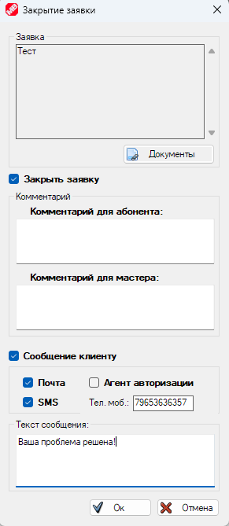 style="width:2.76356in;height:6.35334in" />
>
> Здесь можно завершить заявку, а также отправить сообщения абоненту
> посредством SMS, Email, либо в [агента
> аторизации](#Кнопка_Агент_Авторизации).
>
> **Мастера, исполняющие
> заявки.**
>
> Список мастеров вы можете увидеть, нажав кнопку «**Мастера**».
>
>  style="width:3.16918in;height:1.50318in" />
>
> Кнопка  style="width:0.26042in;height:0.23958in" /> откроет настройки
>  class="anchor">оповещения мастера об открытом тикете.
>
>  style="width:3.47391in;height:4.51191in" />
>
> Окно редактирования и создания мастера выглядит следующим образом.
>
>  style="width:4.27621in;height:3.2106in" />
>
> Чекбокс «**Создать аккаунт клиента**» создаст аккаунт абонента с тем
> же логином и паролем. Мастер, находясь на заявке, сможет подключаться
> к сети как абонент и проверять доступность интернет.
>
> Обратите внимание, что абоненты, созданные для мастеров, по умолчанию
> не отображаются в общем списке абонентов. Вам необходимо в окне
> фильтров выбрать пункт «**Мастера**», чтобы они появились в списке.
>
>  style="width:3.17642in;height:2.65224in" />
>
> Чекбокс «**Создать аккаунт кассира**» создаст учётку кассира для
> мастера. Он сможет помимо работы с тикетами управлять абонентами, а
> также администрирование (в зависимости от привилегий, выданных в окне
> [кассиров](#Кнопка_Кассиры_и_Мастера)).

# Карты оплаты

> В этом окне вы можете администрировать карты оплаты. Карты бывают двух
> типов: пополняющие баланс и создающие клиента. Пополняющие баланс
> карты, в свою очередь, тоже бывают двух типов: пополняют баланс
> деньгами, либо днями. Вот так выглядит окно карт.
>
>  style="width:6.07941in;height:1.85157in" />
>
> Давайте посмотрим, как выглядит окно создания карт.
>
>  style="width:6.11339in;height:3.75164in" />
>
> Здесь вы можете выбрать основные параметры новых карт оплаты – их
> количество, номинал, валюту карты: деньги, дни, или создание абонента.
> Так же можно выбрать длину логина и пароля и символы из которых они
> будут состоять. Здесь же есть привязка к [тарифу](#тарифы) и
> [группе](#группы). Если она выбрана, то воспользоваться картой сможет
> абонент только с указанного тарифа и группы. «**Нумерация с**»
> обозначает стартовый серийный номер, с которого начнут создаваться
> карты. Поле «**Серия**» позволяет разбивать карты по сериям.
>
> Кнопка  style="width:0.26042in;height:0.23958in" /> откроет настройки карт
> оплаты.
>
>  style="width:5.8654in;height:3.87554in" />
>
> Здесь вы можете выбрать фоновый рисунок карты оплаты и её размеры в
> пикселях. Кнопка  style="width:0.26042in;height:0.22917in" /> подгонит размер карточки
> под размеры загруженного рисунка. При нажатии на кнопку «**Изменить
> расположение текста**» откроется дизайнер карт. Здесь можно
> переместить любую надпись, а если кликнуть по ней правой клавишей
> мыши, то в контекстно меню можно выбрать текст, размер шрифта и его
> название, либо вообще можно скрыть эту надпись при печати.
>
> Кнопка «**Параметры создания абонентов картой**» отправляют нас в [это
> окно](#Регистрация_картой).
>
> Если вам необходимо распечатать карты с вашим дизайном, просто
> выберите их в основном списке и в контекстном меню выберите
> «**Распечатать**». Если же вам нужно выгрузит данные карт, например,
> для типографии, можно в контекстном меню выбрать «**Передать в
> Excel**» или «**Передать в TXT**» для экспорта.
>
> Окно «**Пункты продажи и серии**», открывающееся по кнопке
>  style="width:0.22917in;height:0.22917in" />, позволяет вести учёт карт
> и распределять их по пунктам сбыта.
>
> Здесь можно создать пункты продажи и посмотреть, в каком пункте
> сколько карт находится и какого они номинала. По кнопке «**Фильтр**»
> вы сможете выбрать серию карт, которая должна отображаться.
>
>  style="width:6.03563in;height:1.55656in" />
>
> На вкладке «**Серии**» отображаются все серии карт, оставшиеся
> номиналы не активированных карт и общий остаток.
>
>  style="width:5.79167in;height:1.30208in" />
>
> Для того чтобы переместить карту оплаты в пункт продаж, выделите
> необходимые карты в списке и в контекстном меню выберите «**Выбрать
> пункт продажи**».
>
>  style="width:2.20833in;height:2.07292in" />
>  style="width:2.95833in;height:1.11458in" />
>
> При необходимости вы можете быстро деактивировать всю серию карт из
> контекстного меню.  style="width:5.55208in;height:1.75in" />
>
> Техническая информация о таблицах БД, в которых хранятся карты оплаты
> достпна [здесь](#карты-оплаты).

# Склад

> Техническая информация о таблицах БД склада доступна
> [здесь](#Структура_таблицы_stock).
>
> Внешний вид главного окна склада.
>
>  style="width:6.96338in;height:2.50683in" />
>
> Здесь представлены все позиции, находящие на складе. Вы можете
> отфильтровать список, вписав запрос в строку поиска, либо
> воспользовавшись кнопкой фильтров.
>
>  style="width:2in;height:4.38542in" />
>
> Фильтровать можно по свободным позициям, израсходованным, позициям в
> работе (частично израсходованным) и зарезервированным.
>
> Предусмотрены дополнительные опции в работе склада. Для этого нажмите
> кнопку на панели сверху.
>
>  style="width:1.83333in;height:0.80208in" />
>
> Для импорта доступны 3 опции:

-   **Импорт из текстового файла**.

> Тут вам необходимо выбрать какой тип объектов будем импортировать и
> отметить набор полей, который присутствует в файле и их порядок (можно
> изменять перетаскиванием). Также нужно выбрать разделитель данных и
> кодировку.
>
>  style="width:3.93805in;height:5.54244in" />

-   **Импорт из таблицы Excel**.

> Здесь все опции аналогичны импорту из текстового файла, за исключением
> необходимости выбора разделителя данные. Тип импортируемого объекта и
> порядок полей выбирать нужно.
>
>  style="width:3.93805in;height:5.03195in" />

-   **Импорт из XML файла**.

> Импорт и экспорт из XML файла, созданного MikroBILL, является самым
> простым способом переноса данных склада. Вам достаточно просто выбрать
> файл из списка, импорт или экспорт будут завершены автоматически.
>
>  style="width:3.95833in;height:1.55208in" />
>
> Пункт настроек склада открывает следующее окно:
>
>  style="width:4.80208in;height:2.19792in" />
>
> Включив опцию «**Мастера видят только закреплённое за ними
> оборудование**», вы запретите [мастерам](#Мастера) закреплять за
> абонентами оборудование, которое не принадлежит текущему мастеру.
>
> Для того чтобы задать принадлежность оборудования конкретному мастеру,
> отредактируйте тип оборудования и добавьте поле с типом «[**Список
> мастеров**](#Дополнительные_поля)». Более подробно про типы
> оборудования на складе можно прочитать в разделе «**Добавление позиций
> на склад**».
>
> **Добавление позиций на склад.**
>
> Для того, чтобы добавить позицию на склад, необходимо определиться с
> её типом. Типы можно создать, нажав на кнопку с изображением
>  style="width:0.27083in;height:0.26042in" />.
>
>  style="width:3.78125in;height:3.33333in" />
>
> Для описания каждого типа складируемых объектов можно выбрать любое
> количество полей. Типы полей идентичны [дополнительным
> полям](#Дополнительные_поля) для абонентов. Порядок уже добавленных
> полей вы можете менять перетаскиванием.
>
> Помимо полей для каждого типа можно выбрать свою иконку, название
> единицы изменения, а так же назначить тип «**исчисляемым**» или
> «**неисчисляемым**».

-   **Исчисляемый** – Позиция на складе является целой и неделимой,
    например - роутер (нельзя продать 0.3 шт.). Так же каждая позиция
    неделимого типа в списке отображается отдельно.

-   **Неисчисляемый** – Позволяет отпускать товар дробными частями и
    хранить большое количество одной строкой, например – бухта кабеля.

> На снимке ниже окно редактирования типа.
>
>  style="width:4.6875in;height:4.14583in" />
>
> А на следующем снимке мы находимся в окне редктирования позиции на
> складе, которая имеет тот же тип, в данном случае он называется
> «DIR-615», где присутствуют созданные для этого типа поля.
>
>  style="width:4.70833in;height:3.45833in" />
>
> Тепеь рассмотрим, как привязать оборудование к конкретному абоненту.
> Для этого в профиле абонента необходимо создать дополнитеное поле с
> типом объекта со склада.
>
>  style="width:6.63105in;height:1.31137in" />
>
> Кнопка  style="width:0.26042in;height:0.25in" /> скроет в списке все пункты,
> где оборудование не выбрано.
>
> Настроить список дополнительных полей в профиле абонента вы можете
> нажав на кнопку  style="width:0.28125in;height:0.26042in" /> (доступна только
> администраторам). Выбранное в этом окне поле добавится сразу всем
> абонентам.
>
>  style="width:5.34865in;height:1.84702in" />
>
> Окно создания дополнительного поля выглядит следующим образом:
>
>  style="width:3.51042in;height:2.80208in" />
>
> Здесь вы можете вписать название поля и выбрать какой тип оборудования
> со склада будет принимать это поле. Ниже есть чекбокс «**Абонентская
> плата**». Если его установить, то одновременно с выбором оборудования
> в поле, абоненту автоматически будет подключена [услуга](#услуги). Это
> позволит списывать абонентскую плату за оборудование, или выполнять
> скрипт.
>
> Теперь кликнув по столбцу «**Значение**» напротив нужного поля, мы
> получим возможность выбрать свободную позицию со склада.
>
>  style="width:4.125in;height:1.38542in" />
>
> Для неисчисляемых типов после выбора позиции будет предложено выбрать
> количество.
>
>  style="width:3.0625in;height:1.19792in" />
>
> После этого в профиле абонента вы увидите заголовок выбранной позиции.
>
>  style="width:6.03125in;height:0.26042in" />
>
> А в основном окне склада напротив позиции в столбце «Привязан к»
> появится имя абонента, которому мы выдали позицию со склада.
>
> Открепить позицию от абонента можно, выбрав поле, и нажав клавишу
> Delete.
>
>  style="width:4.22917in;height:0.46875in" />
>
> Если мы откроим окно редактирования позиции, то, в строке привязки
> тоже увидим имя абонента.
>
>  style="width:4.75in;height:1.6875in" />
>
> Вы можете открепить позицию от абонента, нажав на
>  style="width:0.20833in;height:0.23958in" />, а если кликните на имени
> абонента, то откроется меню.
>
>  style="width:1.875in;height:0.875in" />
>
> Из которого вы можете оперативно начать редактирование абонента,
> пополнить его баланс, либо перейти в основное окно MikroREMOTE и
> выделить этого абонента.
>
> В этом же окне можно отпрвить часть товара в резерв.
>
> WEB версия схожа по функционалу с MikroREMOTE.

Здесь тоже можно осуществлять поиск по ключевым словам, сортировать
данные по столбцам и применять фильтры.

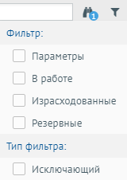

Чтобы начать редактирование позиции, выделите строку и нажмите кнопку
.

Вы можете кликнуть по имени абонента, чтобы перейти на страницу
редактирования. Внизу страницы редактирования абонента будет блок для
привязки позиций со склада к абоненту.

При клике на количество, откроется окно выбора позиции.

# Структура таблиц БД MySQL

Ниже представлено описание некоторых важных таблиц БД.

-   **[moneys](#Структура_таблицы_moneys)** – Содержит в себе лог
    финансовых операций.

-   **[tickets](#Структура_таблицы_tickets)** – Заявки на ремонт и
    обслуживание.

-   [**cards**](#Структура_таблицы_cards) – Карты оплаты.

-   **[topponyms](#Структура_таблицы_toponyms)** – Библиотека адресов.

-   **[stock](#Структура_таблицы_stock)** – Основная таблица модуля
    **«[склад](#_Склад)»**, в ней перечислены все позиции.

-   **[fields](#Структура_таблицы_fields)** – Дополнительные поля для
    абонентов и поля, описывающие позиции на складе.

-   [**stock\_types**](#Структура_таблицы_stock_types) – Типы позиций на
    складе.

-   **[objects](#Структура_таблицы_objects)** - Произвольные файлы,
    которые загружаются в профиль абонентов, для объектов
    [склада](#_Склад) или для [тикетов](#тикеты).

Дополнительные таблицы БД:

-   [**users\_list**](#Структура_таблицы_users_list) – Содержит в себе
    данные об абонентах. Информация зашифрованна и не предусматривает
    прямого изменения администратором. Для автоматизации управления
    абонентами используйте [API](#api).

-   **[system\_objects](#Структура_таблицы_system_objects)** – Содержит
    данные о [тарифах](#тарифы), [группах](#группы), [услугах](#услуги)
    и т.д., читается биллингом только в момент запуска, вносить
    изменения в таблицу не рекомендуется, для автоматизации управления
    тарифами, группами и услугами используйте [API](#api).

-   [**search\_tags**](#Структура_таблицы_search_tags) – Содержит
    информацию об абонентах, таблица формируется автоматически на основе
    ключевых слов для поиска абонентов, изменение в ней не приведёт к
    изменению данных в MikroBILL, для управления абонентами используйте
    [API](#api).

-   [**news**](#Структура_таблицы_news) – Список новостей.

-   [**operations\_\***](#Структура_таблицы_operations_) - Вместо
    символа «звёздочка» назване платёжной системы. Хранит данные о
    транзакциях, пришедших через платёжную систему.

-   [**actionslog2**](#Структура_таблицы_actionslog2) – Логи активностей
    кассиров и администраторов.

-   [**trafofday**](#Структура_таблицы_trafofday) – Наработанный
    абонентам трафик за сутки. Отчёт по суточному трафику можно увидеть
    в окне сетевой активности.

-   [**trafstat**](#Структура_таблицы_trafstat) – Данные о трафике
    абонетнов. Записывается 1 раз в минуту, по этим данным строятся
    графики скорости.

-   [**users\_ip**](#Структура_таблицы_users_ip) – Логи изменения IP
    адресов у абонентов.

-   [**users\_caller\_id**](#Структура_таблицы_users_caller_id) – Логи
    изменения Caller ID адресов у абонентов.

-   [**onoffline**](#Структура_таблицы_onoffline) – Логи выхода абонента
    в онлайн.

-   [**who\_was\_active**](#Структура_таблицы_who_was_active) – В
    таблицу попадают абоненты, кто имел трафик за сутки. Таблица
    используется для построения отчётов.

-   [**who\_was\_enabled**](#Структура_таблицы_who_was_enabled) – В
    таблицу попадают абоненты, кто был выключен за сутки. Таблица
    используется для построения отчётов.

Структура
таблицы **«moneys»**:

CREATE TABLE \`**moneys**\` (

> \`**user\_name**\` bigint NOT NULL,
>
> \`**moneytime**\` bigint UNSIGNED NOT NULL DEFAULT 0,
>
> \`**cash**\` decimal(18, 2) NOT NULL,
>
> \`**cash\_name**\` tinytext CHARACTER SET utf8 COLLATE
> utf8\_general\_ci NOT NULL,
>
> \`**value1**\` mediumtext CHARACTER SET utf8 COLLATE utf8\_general\_ci
> NOT NULL,
>
> \`**actball**\` decimal(18, 2) NOT NULL,
>
> \`**client\_login**\` tinytext CHARACTER SET utf8 COLLATE
> utf8\_general\_ci NOT NULL,
>
> \`**uid**\` bigint UNSIGNED NOT NULL AUTO\_INCREMENT,
>
> \`**actionid**\` int NOT NULL DEFAULT 0,
>
> \`**actionsubid**\` tinytext CHARACTER SET utf8 COLLATE
> utf8\_general\_ci NOT NULL,
>
> \`**corrected**\` int NOT NULL DEFAULT 0,
>
> \`**basevalue**\` decimal(18, 2) NOT NULL,
>
> \`**actionsubsubid**\` tinytext CHARACTER SET utf8 COLLATE
> utf8\_general\_ci NOT,
>
> \`**moneytype**\` int NOT NULL DEFAULT,
>
> PRIMARY KEY (\`**uid**\`) USING BTREE,
>
> INDEX \`ind1\`(\`**user\_name**\`) USING BTREE

) CHARACTER SET = utf8 COLLATE = utf8\_general\_ci;

Описание полей таблицы **«moneys»**:

-   **user\_name** - ID абонента, идентичен полям **shortguid** из
    таблиц таблиц **stat,** **search\_tags** и **users\_list**. Так же,
    тут может быть ID [группового счёта](#Групповые_счета), если он
    подключен абоненту.

-   **moneytime** - Время финансовой операции в миллисекундах от даты
    начала эпохи UNIX.

-   **cash** - Сумма пополнения или списания.

-   **cash\_name** - Название валюты.

-   **value1** - Комментарий к операции.

-   **actball** - Баланс абонента сразу после совершения операции.

-   **client\_login** - ID абонента, идентичен полям **shortguid** из
    таблиц **stat** и **search\_tags**. Используется для идентификации
    абонента, если выбран [групповой счёт](#Групповые_счета).

-   **uid** - Уникальный порядковый номер финансовой операции.

-   **actionid** - Тип операции. Расшифровку см. в таблице ниже.

-   **actionsubid** - Подтип операции. Расшифровку см. в таблице ниже.

-   **corrected** - Была ли сумма операции изменена кассиром.

-   **basevalue** - Изначальная сумма финансовой операции (до
    корректировки).

-   **actionsubsubid** - Дополнительные данные.

-   **moneytype** - Тип валюты (0 - деньги, 1 - дни).

Типы финансовых операций (поля «**actionid**» и «**actionsubid**»):

**Пополнения**

<table>
<colgroup>
<col style="width: 11%" />
<col style="width: 88%" />
</colgroup>
<thead>
<tr class="header">
<th><strong>actionid</strong></th>
<th><strong>Описание</strong></th>
</tr>
</thead>
<tbody>
<tr class="odd">
<td><strong>0</strong></td>
<td>Пополнено из MikroBILL (устарело, относится к MikroBILL v.1)</td>
</tr>
<tr class="even">
<td><strong>1</strong></td>
<td>Пополнено кассиром (в «<strong>actionsubid»</strong> помещается ID
кассира)</td>
</tr>
<tr class="odd">
<td><strong>2</strong></td>
<td>Пополнено картой оплаты (в «<strong>actionsubid»</strong> помещается
номер карточки)</td>
</tr>
<tr class="even">
<td><strong>3</strong></td>
<td>
<strong>Пополнено онлайн, либо подключение сервиса</strong>

В «<strong>actionsubid»</strong> ID платёжной системы:
<strong>0</strong> - LiqPay, <strong>1</strong> - Payeer,
<strong>2</strong> - Compay, <strong>3</strong> - Onpay,
<strong>4</strong> - qiwi, <strong>5</strong> - PayPlug,
<strong>6</strong> - ЮMoney (Yandex.Money), <strong>7</strong> -
Krasplat, <strong>8</strong> - NonStop, <strong>9</strong> - Ctypay,
<strong>10</strong> - Citypay.su, <strong>11</strong> - easypay.ua,
<strong>12</strong> - city-pay.com.ua, <strong>13</strong> -
tel-cell.am, <strong>14</strong> - Privat24, <strong>15</strong> - Mail,
<strong>16</strong> - RoboKassa, <strong>17</strong> - SMS,
<strong>18</strong> - Smotreshka, <strong>19</strong> - OSMP QIWI,
<strong>20</strong> - Tinkoff, <strong>21</strong> - HayPost,
<strong>22</strong> - OSMP, <strong>23</strong> - EasyPay.am,
<strong>24</strong> - КАССервис, <strong>25</strong> - Omega.TV,
<strong>26</strong> - TV24h, <strong>27</strong> - TrinitY,
<strong>28</strong> – ЮKassa (Yandex.Касса), <strong>29</strong> –
Сбербанк интернет эквайринг, <strong>30</strong> - Kaspi,
<strong>31</strong> - VivaWallet, <strong>32</strong> - ckassa.ru,
<strong>33</strong> - gosbank.su, <strong>34</strong> - Prosto.TV,
<strong>35</strong> - Megogo, <strong>36</strong> - ОСМП Сбербанк,
<strong>37</strong> - Касса24, <strong>38</strong> - Prodamus.ru,
<strong>39</strong> - GlobalMoney, <strong>40</strong> - Business.ru,
<strong>41</strong> - зарезервировано, <strong>42</strong> - IPTVPORTAL,
<strong>43</strong> - LugaPay, <strong>44</strong> - Sweet.tv,
<strong>45</strong> - mobidram.mts.am, <strong>46</strong> - click.uz,
<strong>47</strong> - iPay.ua, <strong>48</strong> - 2click.money,
<strong>49</strong> - sistema, <strong>50</strong> - InitPRO.ru,
<strong>51</strong> - PayMe, <strong>52</strong> - Zajzev,
<strong>53</strong> - Wink, <strong>54</strong> - payhub.com.ua,
<strong>55</strong> - PayBerry, <strong>56</strong> - Gorod74,
<strong>57</strong> – Modulbank, <strong>58</strong> – КИТ онлайн
(зарезервировано), <strong>59</strong> – РНКБ, <strong>60</strong> -
Промсвязьбанк, <strong>61</strong> - Альфабанк, <strong>62</strong> –
iDRAM, <strong>63</strong> – PayAnyWay, <strong>64</strong> – PayKeeper,
<strong>65</strong> – TVIPmedia, <strong>66</strong> – donate.stream,
<strong>67</strong> – Paynet.uz, <strong>68</strong> – КИТ инвест
Терминал-ФА, <strong>69</strong> – Tvime, <strong>70</strong> -
mydatapi.aade.gr (налоговая Греции), <strong>71</strong> - Dushanbe City
Bank, <strong>72</strong> – selfwork.ru, <strong>73</strong> - AlifBank,
<strong>74</strong> - Payvand, <strong>75</strong> – EskhataBank,
<strong>76</strong> – Moovi, <strong>77</strong> - CryptoCloud,
<strong>78</strong> – Microimpuls/Smarty
</td>
</tr>
<tr class="odd">
<td><strong>4</strong></td>
<td>Стартовый баланс (в «<strong>actionsubid»</strong> помещается ID
тарифа)</td>
</tr>
<tr class="even">
<td><strong>5</strong></td>
<td>Денежный перевод (в «<strong>actionsubid»</strong> помещается ID
переводящего)</td>
</tr>
<tr class="odd">
<td><strong>6</strong></td>
<td>Пополнение скриптом (в «<strong>actionsubid»</strong> помещается ID
скрипта)</td>
</tr>
<tr class="even">
<td><strong>7</strong></td>
<td>Бонус (в «<strong>actionsubid»</strong> порог срабатывания
бонуса)</td>
</tr>
<tr class="odd">
<td><strong>8</strong></td>
<td>Обещанный платёж (в «<strong>actionsubid»</strong> помещается ID
обещанного платежа)</td>
</tr>
<tr class="even">
<td><strong>9</strong></td>
<td>Добавленная кассиром задним числом финансовая операция</td>
</tr>
<tr class="odd">
<td><strong>99</strong></td>
<td>Неизвестное пополнение</td>
</tr>
</tbody>
</table>

**Списания**

<table>
<colgroup>
<col style="width: 11%" />
<col style="width: 88%" />
</colgroup>
<thead>
<tr class="header">
<th><strong>actionid</strong></th>
<th><strong>Описание</strong></th>
</tr>
</thead>
<tbody>
<tr class="odd">
<td><strong>10</strong></td>
<td>Списана абонентская плата (в «<strong>actionsubid»</strong>
помещается ID тарифа)</td>
</tr>
<tr class="even">
<td><strong>11</strong></td>
<td>Списана плата за аренду порта (в «<strong>actionsubid»</strong>
помещается ID тарифа)</td>
</tr>
<tr class="odd">
<td><strong>12</strong></td>
<td>Списана абонентская плата за услугу (в
«<strong>actionsubid»</strong> помещается ID услуги)</td>
</tr>
<tr class="even">
<td><strong>13</strong></td>
<td>Плата за изменение тарифа (в «<strong>actionsubsubid»</strong>
помещается ID прежнего тарифа)</td>
</tr>
<tr class="odd">
<td><strong>14</strong></td>
<td>Плата за использование турбо-кнопки (в
«<strong>actionsubid»</strong> помещается ID услуги)</td>
</tr>
<tr class="even">
<td><strong>15</strong></td>
<td>Плата за использование обещанного платежа (в
«<strong>actionsubid»</strong> помещается ID услуги)</td>
</tr>
<tr class="odd">
<td><strong>16</strong></td>
<td>Обещанный платёж закончен (в «<strong>actionsubid»</strong>
помещается ID услуги)</td>
</tr>
<tr class="even">
<td><strong>17</strong></td>
<td>Денежный перевод (в «<strong>actionsubid»</strong> помещается ID
абонента)</td>
</tr>
<tr class="odd">
<td><strong>18</strong></td>
<td>Плата за добровольную блокировку (в «<strong>actionsubid»</strong>
помещается ID услуги)</td>
</tr>
<tr class="even">
<td><strong>19</strong></td>
<td>Оплата за трафик (в «<strong>actionsubid»</strong> помещается ID
тарифа)</td>
</tr>
<tr class="odd">
<td><strong>50</strong></td>
<td>Оплата за SMS сообщение</td>
</tr>
<tr class="even">
<td><strong>98</strong></td>
<td>Неизвестное списание</td>
</tr>
</tbody>
</table>

**Другие операции**

<table>
<colgroup>
<col style="width: 11%" />
<col style="width: 88%" />
</colgroup>
<thead>
<tr class="header">
<th><strong>actionid</strong></th>
<th><strong>Описание</strong></th>
</tr>
</thead>
<tbody>
<tr class="odd">
<td><strong>20</strong></td>
<td>Корректировка баланса кассиром.</td>
</tr>
<tr class="even">
<td><strong>21</strong></td>
<td>Обнуление баланса перед пополнением</td>
</tr>
<tr class="odd">
<td><strong>22</strong></td>
<td>Отмена обещанного платежа</td>
</tr>
<tr class="even">
<td><strong>23</strong></td>
<td>Перерасчёт при изменении тарифа (в «<strong>actionsubid»</strong>
помещается ID тарифа)</td>
</tr>
<tr class="odd">
<td><strong>24</strong></td>
<td>Включение или отключение абонента</td>
</tr>
<tr class="even">
<td><strong>25</strong></td>
<td>Запланированные по времени финансовые операции</td>
</tr>
<tr class="odd">
<td><strong>97</strong></td>
<td>Изменения кредитного лимита</td>
</tr>
</tbody>
</table>

Структура
таблицы **«tickets»**:

CREATE TABLE \`**tickets**\` (

\`**id**\` int UNSIGNED NOT NULL AUTO\_INCREMENT,

\`**user\_name**\` bigint NOT NULL,

\`**tickettime**\` timestamp NOT NULL DEFAULT '2000-01-01 00:00:00',

\`**tickettext**\` text CHARACTER SET utf8 COLLATE utf8\_general\_ci NOT
NULL,

\`**ticketstatus**\` tinyint(1) NOT NULL DEFAULT,

\`**tickettype**\` int NOT NULL,

\`**ticketcomment**\` text CHARACTER SET utf8 COLLATE utf8\_general\_ci
NOT NULL,

\`**ticketmaster**\` bigint NOT NULL DEFAULT 0,

\`**ticketreaded**\` tinyint(1) NOT NULL DEFAULT 0,

\`**user\_login**\` tinytext CHARACTER SET utf8 COLLATE
utf8\_general\_ci NOT NULL,

\`**ticketcreator**\` text CHARACTER SET utf8 COLLATE utf8\_general\_ci
NOT NULL,

\`**ticketcomment2**\` text CHARACTER SET utf8 COLLATE utf8\_general\_ci
NOT NULL,

\`**closedate**\` timestamp NOT NULL DEFAULT '2000-01-01 00:00:00',

\`**working\_address**\` text CHARACTER SET utf8 COLLATE
utf8\_general\_ci NOT NULL,

\`**filename**\` mediumtext CHARACTER SET utf8 COLLATE utf8\_general\_ci
NOT NULL,

\`**alerttime**\` timestamp NOT NULL DEFAULT '2000-01-01 00:00:00',

\`**use\_alert\_time**\` tinyint(1) NOT NULL DEFAULT 0,

\`**visible**\` tinyint(1) UNSIGNED NOT NULL DEFAULT 1,

\`**closed\_by**\` bigint NOT NULL DEFAULT -1,

PRIMARY KEY (\`**id**\`) USING BTREE,

INDEX \`ind\`(\`**user\_name**\`) USING BTREE

) CHARACTER SET = utf8 COLLATE = utf8\_general\_ci;

Описание полей таблицы **«tickets»**:

-   **id** - Уникальный идентификатор тикета.

-   **user\_name** - ID абонента, для которого создан тикет. Идентичен
    полям shortguid из таблиц таблиц **stat,** **search\_tags** и
    **users\_list**.

-   **tickettime** - Время создания тикета в UNIXTIME.

-   **tickettext** - Текст тикета. Его видит и мастер и абонент.

-   **ticketstatus** - Состояние тикета (0 - активен, 1 - завершён).

-   **tickettype** - ID типа тикетов (присутствуют в файле config.php,
    переменная $TicketsTypes).

-   **ticketcomment** - Комментарий к тикету (видят абоненты и мастера).

-   **ticketmaster** - ID мастера, ответственного за выполнение

-   **ticketreaded** - Тикет просмотрен оператором (0 - не просмотрен,
    1 - просмотрен).

-   **user\_login** - Логин абонента, для которого создан тикет.
    Идентичен полям user\_name и login из таблиц stat и search\_tags.

-   **ticketcreator** - ID кассира, создавшего тикет. Иднетичен полю
    guid таблицы cashiers

-   **ticketcomment2** - Комментарий к тикету (видят только мастера).

-   **closedate** - Планируемая дата завершения тикета.

-   **working\_address** - Адрес, на котором проводятся работы.

-   **filename** - ID файлов, прикреплённых к тикету. Идентичны полю id
    таблицы objects.

-   **alerttime** - После этой даты тикет будет считаться просроченным.

-   **use\_alert\_time** - Может ли тикет статьь просроченным (0 - Нет,
    1 - Да).

-   **visible** - Видит ли абонент этот тиикет в своём WEB кабинете (0 -
    Нет, 1 - Да)

Структура
таблицы **«cards»**:

CREATE TABLE \`**cards**\` (

\`**cardlogin**\` text CHARACTER SET utf8 COLLATE utf8\_bin NOT NULL,

\`**cardpassword**\` text CHARACTER SET utf8 COLLATE utf8\_bin NOT NULL,

\`**cardpar**\` float(18, 2) NOT NULL,

\`**activatedate**\` datetime(0) NOT NULL DEFAULT '0001-01-01 00:00:00',

\`**createdate**\` datetime(0) NOT NULL,

\`**moneytype**\` text CHARACTER SET utf8 COLLATE utf8\_general\_ci NOT
NULL,

\`**activator**\` text CHARACTER SET utf8 COLLATE utf8\_general\_ci NOT
NULL,

\`**params**\` mediumtext CHARACTER SET utf8 COLLATE utf8\_general\_ci
NOT NULL,

\`**cardno**\` bigint NOT NULL,

\`**cardpar2**\` float(18, 2) NOT NULL,

\`**isenabled**\` int NOT NULL,

\`**selling\_point**\` bigint NOT NULL DEFAULT 0,

\`**series**\` bigint NOT NULL DEFAULT 0,

\`**group**\` bigint NOT NULL DEFAULT 0,

UNIQUE INDEX \`**cardlogin**\`(\`**cardlogin**\`(255)) USING BTREE,

) CHARACTER SET = utf8 COLLATE = utf8\_general\_ci;

Описание полей таблицы **«cards»**:

-   **cardlogin** - Логин карты.

-   **cardpassword** - Пароль карты.

-   **cardpar** – Остаток.

-   **activatedate** - Дата активации.

-   **createdate** - Дата создания.

-   **moneytype** - Тип карты (0 - Пополниение деньгами, 1 - Пополнение
    днями, 2 - Создание нового абонента).

-   **activator** - Логин абонента, активировавшего карту. Идентичен
    полям user\_name и login из таблиц stat и search\_tags.

-   **params** - ID тарифа, абоненты которого могут активировать карту.
    (Идентичен полю id таблицы system\_objects).

-   **cardno** - Порядковый номер карты.

-   **cardpar2** – Номинал.

-   **isenabled** - Карта активна и доступна для активации (0 - Нет, 1 -
    Да).

-   **selling\_point** - ID точки продажи, где должна быть реализована
    карточка.

-   **series** - Серия выпуска карт.

-   **group** - ID [группы](#группы) или [тарифа](#тарифы), абоненты
    которой могут активировать карту (Идентичен полю id таблицы
    system\_objects).

Структура
таблицы **«toponyms»**:

CREATE TABLE \`**toponyms**\` (

\`**id**\` int UNSIGNED NOT NULL AUTO\_INCREMENT,

\`**name**\` tinytext CHARACTER SET utf8 COLLATE utf8\_general\_ci NOT
NULL,

\`**type**\` smallint NULL DEFAULT NULL,

\`**parent**\` int UNSIGNED NOT NULL,

PRIMARY KEY (\`**id**\`) USING BTREE

) CHARACTER SET = utf8 COLLATE = utf8\_general\_ci;

Описание полей таблицы **«toponyms»**:

-   **id** – Порядковый номер записи.

-   **name** – Название топонима.

-   **type** – Тип (0 - Страна, 1 - Область, 2 - Город, 3 - Район
    города, 4 - Улица, 5 - Дом, 6 - Квартира).

-   **parent** - ID родительской записи (0 - нет родителя, корневая
    запись).

Структура
таблицы **«stock»**:

CREATE TABLE \`**stock**\` (

\`**id**\` bigint UNSIGNED NOT NULL AUTO\_INCREMENT,

\`**parent**\` bigint UNSIGNED NOT NULL,

\`**creator**\` bigint UNSIGNED NOT NULL,

\`**data**\` varchar(8192) CHARACTER SET utf8 COLLATE utf8\_general\_ci
NOT NULL,

\`**create\_date**\` int UNSIGNED NOT NULL,

\`**linked\_to**\` mediumtext CHARACTER SET utf8 COLLATE
utf8\_general\_ci NOT NULL,

\`**balance**\` float(20, 5) NOT NULL,

\`**base\_balance**\` float(20, 5) NOT NULL,

\`**reserved**\` float(20, 5) NOT NULL DEFAULT 0,

PRIMARY KEY (\`id\`) USING BTREE

) CHARACTER SET = utf8 COLLATE = utf8\_general\_ci;

Описание полей таблицы **«stock»**:

-   **id** – Порядковый номер записи.

-   **parent** – ID типа позиции. Идентичен полю id таблицы
    stock\_types.

-   **creator** – ID кассира, добавившего позицию на склад. Идентичен
    полю guid таблицы cashiers.

-   **data** – Описание позиции на сладке в формате JSON - {"Ключ" :
    "Значение"}. Ключ идентичен полю id из таблицы fields.

-   **create\_date** – Дата добавление позиции на склад в формате
    UNIXTIME.

-   **linked\_to** - Днные о привязке позиции к абоненту. Данные
    разделены символом | - вертикалная черта. Позиции: 1 – (в данный
    момент всегда 0) привязка к абоненту. 2 – ID абонента. Идентичен
    полям shortguid из таблиц таблиц **stat,** **search\_tags** и
    **users\_list**. 3 – ID поля в профиле абонента, идентичен полю id
    из таблицы fields. 4 – Количество (для неисчисляемых типов).

-   **balance** - Количество товара в позиции (Для неисчисляемых типов,
    для исчисляемых – всегда 1).

-   **base\_balance** – Изначальное количество товара в позиции.

-   **reserved** – Количество зарезервированного.

Структура
таблицы **«fields»**:

CREATE TABLE \`**fields**\` (

\`**id**\` bigint UNSIGNED NOT NULL,

\`**field\_name**\` tinytext CHARACTER SET utf8 COLLATE
utf8\_general\_ci NOT NULL,

\`**field\_type**\` smallint UNSIGNED NOT NULL,

\`**data\_array**\` text CHARACTER SET utf8 COLLATE utf8\_general\_ci
NOT NULL,

\`**main**\` tinyint NOT NULL,

\`**pos**\` int NOT NULL,

PRIMARY KEY (\`**id**\`) USING BTREE

) CHARACTER SET = utf8 COLLATE = utf8\_general\_ci;

Описание полей таблицы **«fields»**:

-   **id** – Порядковый номер записи.

-   **field\_name** – Название поля.

-   **field\_type** – Тип (0 – Текст, 1 - Число, 2 - Дата, 3 - Флаг, 4 -
    Списко, 5 – GPS объект, 6 – IP адрес, 7 – MAC адрес, 8 – Файл, 9 –
    Позиция со склада, 10 – Счётчик скорости, 11 – Счётчик трафика, 12 -
    Мастер).

-   **data\_array** – Дополнительные параметры.

-   **main** – Если 1 – дополнительное поле для абонентов, 0 – относится
    к описанию объектов склада.

-   **pos** – Порядковый номер.

Структура таблицы **«stock\_types»**:

CREATE TABLE \` **stock\_types** \` (

\`**id**\` bigint UNSIGNED NOT NULL,

\`**name**\` tinytext CHARACTER SET utf8 COLLATE utf8\_general\_ci NOT
NULL,

\`**comment**\` tinytext CHARACTER SET utf8 COLLATE utf8\_general\_ci
NOT NULL,

\`**fields**\` text CHARACTER SET utf8 COLLATE utf8\_general\_ci NOT
NULL,

\`**pos**\` int NOT NULL,

\`**countable**\` tinyint(1) NOT NULL,

\`**measure**\` tinytext CHARACTER SET utf8 COLLATE utf8\_general\_ci
NOT NULL,

\`**icon**\` longblob NOT NULL,

PRIMARY KEY (\`**id**\`) USING BTREE

) CHARACTER SET = utf8 COLLATE = utf8\_general\_ci;

Описание
полей таблицы **«stock\_types»**:

-   **id** – Порядковый номер записи.

-   **name** – Название типа складской позиции.

-   **comment** – Комментарий.

-   **fields** – Список полей, описывающих складскую позицию. Данные
    являются конкатинацией полей id из таблицы fields, разделённых
    символом «,» - запятая.

-   **pos** – Порядковый номер.

-   **countable** – 0 – Исчисляемый тип, 1 – Неисчисляемый.

-   **measure** - Название единицы измерения.

-   **icon** – Иконка ассоциированная с данным типом складской позиции.

Структура
таблицы **«objects»**:

CREATE TABLE \`**objects**\` (

\`**id**\` int UNSIGNED NOT NULL AUTO\_INCREMENT,

\`**object\_name**\` tinytext CHARACTER SET utf8 COLLATE
utf8\_general\_ci NOT NULL,

\`**object\_data**\` longblob NOT NULL,

\`**file\_size**\` bigint NOT NULL DEFAULT -1,

\`**for\_client**\` tinyint(1) NOT NULL DEFAULT 0,

PRIMARY KEY (\`**id**\`) USING BTREE

) CHARACTER SET = utf8 COLLATE = utf8\_general\_ci;

Описание полей таблицы **«objects»**:

-   **id** – Порядковый номер записи.

-   **object\_name** – Имя файла.

-   **object\_data** – Двоичные данные файла.

-   **file\_size** – Размер файла в байтах.

-   **for\_client** – Файл для абонента (0 или 1).

Информация в поле **object\_data** зашифрована по алгоритму
RijndaelManaged, ключ в файле config.php (расположен в корне
WEB-сервера) в переменной $CRYPTO\_KEY\_1, а вектор инициализации из БД
MikroBILL из таблицы \`workparams\`, параметр CRYPTO\_KEY\_2.

Структура
таблицы **«users\_list»**:

CREATE TABLE \`**users\_list**\` (

\`**shortguid**\` bigint NOT NULL DEFAULT 0,

\`**user\_type**\` smallint NOT NULL DEFAULT 1,

\`**autorize**\` mediumtext CHARACTER SET utf8 COLLATE utf8\_general\_ci
NULL,

\`**billing**\` mediumtext CHARACTER SET utf8 COLLATE utf8\_general\_ci
NULL,

\`**day\_traf\_limits**\` mediumtext CHARACTER SET utf8 COLLATE
utf8\_general\_ci NULL,

\`**month\_traf\_limits**\` mediumtext CHARACTER SET utf8 COLLATE
utf8\_general\_ci NULL,

\`**personal\_info**\` mediumtext CHARACTER SET utf8 COLLATE
utf8\_general\_ci NULL,

\`**time\_billing\_data**\` mediumtext CHARACTER SET utf8 COLLATE
utf8\_general\_ci NULL,

PRIMARY KEY (\`**shortguid**\`) USING BTREE

) CHARACTER SET = utf8 COLLATE = utf8\_general\_ci;

Описание полей таблицы **«users\_list»**:

-   **shortguid** – Уникальный ID абонента. Соотносится с полями
    **shortguid** из таблиц **stat,** **search\_tags**.

-   **user\_type** – Тип абонента (0 – Удалённый, 1 - Обычный).

-   **autorize** – Параметры авторизации абонента. Зашифрованы.

-   **billing** – Параметры тарификации абонента. Зашифрованы.

-   **day\_traf\_limits** – Суточные ограничения по трафику.
    Зашифрованы.

-   **month\_traf\_limits** – Месячные ограничения по трафику.
    Зашифрованы.

-   **personal\_info** – Персональные данные абонента. Зашифрованы.

-   **time\_billing\_data** – Данные о изменении ограничений скорости в
    зависимости от времени суток. Зашифрованы.

Структура таблицы **«system\_objects»**:

CREATE TABLE \`**objects**\` (

\`**id**\` bigint UNSIGNED NOT NULL,

\`**object\_name**\` tinytext CHARACTER SET utf8 COLLATE
utf8\_general\_ci NOT NULL,

\`**object\_type**\` smallint NOT NULL,

\`**object\_data**\` mediumtext CHARACTER SET utf8 COLLATE
utf8\_general\_ci NOT NULL,

\`**quick\_info**\` mediumtext CHARACTER SET utf8 COLLATE
utf8\_general\_ci NOT NULL,

PRIMARY KEY (\`**id**\`) USING BTREE

) CHARACTER SET = utf8 COLLATE = utf8\_general\_ci;

Описание полей таблицы **«system\_objects»**:

-   **id** – Порядковый номер объекта.

-   **object\_name** – Название объекта.

-   **object\_type** – Тип объекта. Расшифровку см. в таблице ниже.

-   **object\_data** – Описание объекта в формате JSON.

-   **planetext** – Начальный фрагмент новости, очищенный от
    форматирования. Максимум 255 символов. Используется для
    предпросмотра новости.

-   **quick\_info** – Зарезервировано. В настоящий момент не
    используется.

Типы объектов (поле «**object\_type**»).

<table>
<colgroup>
<col style="width: 15%" />
<col style="width: 84%" />
</colgroup>
<thead>
<tr class="header">
<th><strong>object_type</strong></th>
<th><strong>Описание</strong></th>
</tr>
</thead>
<tbody>
<tr class="odd">
<td><strong>0</strong></td>
<td><a href="#тарифы">Тариф</a></td>
</tr>
<tr class="even">
<td><strong>1</strong></td>
<td><a href="#Группы">Группа</a></td>
</tr>
<tr class="odd">
<td><strong>2</strong></td>
<td><a href="#Роутеры_и_настройки">Роутер</a></td>
</tr>
<tr class="even">
<td><strong>3</strong></td>
<td><a href="#услуги">Услуга</a></td>
</tr>
</tbody>
</table>

Структура таблицы **«search\_tags»**:

Обратите внимание! Таблица формируется автоматически на основе ключевых
слов для поиска абонентов, изменение в ней не приведёт к изменению
данных в MikroBILL, для управления абонентами используйте [API](#api).

CREATE TABLE \`**search\_tags**\` (

\`**shortguid**\` bigint NOT NULL,

\`**client**\` mediumtext CHARACTER SET utf8 COLLATE utf8\_general\_ci
NOT NULL,

\`**login**\` mediumtext CHARACTER SET utf8 COLLATE utf8\_general\_ci
NOT NULL,

\`**fio**\` mediumtext CHARACTER SET utf8 COLLATE utf8\_general\_ci NOT
NULL,

\`**email**\` mediumtext CHARACTER SET utf8 COLLATE utf8\_general\_ci
NOT NULL,

\`**tel**\` mediumtext CHARACTER SET utf8 COLLATE utf8\_general\_ci NOT
NULL,

\`**tariff**\` mediumtext CHARACTER SET utf8 COLLATE utf8\_general\_ci
NOT NULL,

\`**group**\` mediumtext CHARACTER SET utf8 COLLATE utf8\_general\_ci
NOT NULL,

\`**ip**\` mediumtext CHARACTER SET utf8 COLLATE utf8\_general\_ci NOT
NULL,

\`**mac**\` mediumtext CHARACTER SET utf8 COLLATE utf8\_general\_ci NOT
NULL,

\`**contract**\` mediumtext CHARACTER SET utf8 COLLATE utf8\_general\_ci
NOT NULL,

\`**address**\` mediumtext CHARACTER SET utf8 COLLATE utf8\_general\_ci
NOT NULL,

\`**address2**\` mediumtext CHARACTER SET utf8 COLLATE utf8\_general\_ci
NOT NULL,

\`**comment**\` mediumtext CHARACTER SET utf8 COLLATE utf8\_general\_ci
NOT NULL,

\`**comment2**\` mediumtext CHARACTER SET utf8 COLLATE utf8\_general\_ci
NOT NULL,

\`**comment3**\` mediumtext CHARACTER SET utf8 COLLATE utf8\_general\_ci
NOT NULL,

\`**comment4**\` mediumtext CHARACTER SET utf8 COLLATE utf8\_general\_ci
NOT NULL,

\`**company**\` mediumtext CHARACTER SET utf8 COLLATE utf8\_general\_ci
NOT NULL,

\`**principal**\` mediumtext CHARACTER SET utf8 COLLATE
utf8\_general\_ci NOT NULL,

\`**legal\_address**\` mediumtext CHARACTER SET utf8 COLLATE
utf8\_general\_ci NOT NULL,

\`**mailing\_address**\` mediumtext CHARACTER SET utf8 COLLATE
utf8\_general\_ci NOT NULL,

\`**billing\_address**\` mediumtext CHARACTER SET utf8 COLLATE
utf8\_general\_ci NOT NULL,

\`**ls**\` mediumtext CHARACTER SET utf8 COLLATE utf8\_general\_ci NOT
NULL,

\`**rs**\` mediumtext CHARACTER SET utf8 COLLATE utf8\_general\_ci NOT
NULL,

\`**inn**\` mediumtext CHARACTER SET utf8 COLLATE utf8\_general\_ci NOT
NULL,

\`**state**\` tinyint(1) UNSIGNED NOT NULL,

\`**online**\` tinyint(1) UNSIGNED NOT NULL,

\`**traffic\_day\_rx**\` float(25, 2) NOT NULL,

\`**traffic\_day\_tx**\` float(25, 2) NOT NULL,

\`**traffic\_month\_rx**\` float(25, 2) NOT NULL,

\`**traffic\_month\_tx**\` float(25, 2) NOT NULL,

\`**traffic\_rx\` float**(25, 2) NOT NULL,

\`**traffic\_tx\` float**(25, 2) NOT NULL,

\`**date1**\` int UNSIGNED NOT NULL,

\`**date2**\` int UNSIGNED NOT NULL,

\`**speed\_rx**\` int NOT NULL,

\`**speed\_tx**\` int NOT NULL,

\`**limits\_rx**\` float(20, 2) NOT NULL,

\`**limits\_tx**\` float(20, 2) NOT NULL,

\`**activity\_time**\` int UNSIGNED NOT NULL,

\`**replanish\_time**\` int UNSIGNED NOT NULL,

\`**creation\_time**\` int UNSIGNED NOT NULL,

\`**personal\_fee**\` float(20, 2) NOT NULL,

\`**personal\_credit**\` float(20, 2) NOT NULL,

\`**days\_to\_stop**\` mediumint UNSIGNED NOT NULL,

\`**block\_reason**\` smallint NOT NULL,

\`**on\_promise\_payment**\` tinyint(1) UNSIGNED NOT NULL,

\`**pesonal\_credit\_algorithm**\` tinyint(1) UNSIGNED NOT NULL,

\`**pesonal\_fee\_algorithm**\` tinyint(1) UNSIGNED NOT NULL,

\`**tarif\_guid**\` bigint NOT NULL,

\`**group\_guid**\` bigint NOT NULL,

\`**balance**\` float(20, 2) NOT NULL,

\`**days\_to\_stop2**\` int NOT NULL,

\`**money\_account\_guid**\` bigint NOT NULL,

\`**money\_account\_name**\` tinytext CHARACTER SET utf8 COLLATE
utf8\_general\_ci NOT NULL,

\`**recommended\_pay**\` float(20, 2) NOT NULL,

\`**hometel**\` mediumtext CHARACTER SET utf8 COLLATE utf8\_general\_ci
NOT NULL,

\`**personal\_fee\_day**\` tinyint NOT NULL,

\`**stoped\_date**\` int UNSIGNED NULL,

\`**next\_tariff**\` mediumtext CHARACTER SET utf8 COLLATE
utf8\_general\_ci NULL,

\`**sms\_to\_messengers**\` tinyint NOT NULL DEFAULT 0,

\`**services**\` mediumtext CHARACTER SET utf8 COLLATE utf8\_general\_ci
NOT,

\`**services\_to\_enable**\` mediumtext CHARACTER SET utf8 COLLATE
utf8\_general\_ci NOT NULL,

\`**services\_to\_disable**\` mediumtext CHARACTER SET utf8 COLLATE
utf8\_general\_ci NOT NULL,

PRIMARY KEY (\`**shortguid**\`) USING BTREE

) CHARACTER SET = utf8 COLLATE = utf8\_general\_ci;

Описание полей таблицы **«seach\_tags»**:

-   **shortguid** – Уникальный идентификатор абонента.

-   **client** – Имя абонента (не путать с ФИО).

-   **login** – Логин.

-   **fio** – ФИО.

-   **email** – Электронная почта.

-   **tel** – Мобильный телефон.

-   **tariff** – Имя [тарифа](#тарифы), на котором находится абонент.

-   **group** – Имя [группы](#группы), в которой находится абонент.

-   **ip** – IP-адрес.

-   **mac** – MAC-адрес.

-   **contract** – Номер договора.

-   **address** – Адрес установки оборудования.

-   **address2** – Адрес прописки.

-   **comment** – Примичание к абонетну №1.

-   **comment2** – Примичание к абонетну №2.

-   **comment3** – Примичание к абонетну №3.

-   **comment4** – Примичание к абонетну №4.

-   **company** – Название организации.

-   **principal** – Директор.

-   **legal\_address** – Юридический адрес.

-   **mailing\_address** – Адрес для корреспонденции.

-   **billing\_address** – Адрес для счетов.

-   **ls** – Банковский счёт.

-   **rs** – Банковский расчётный счёт.

-   **inn** – ИНН.

-   **state** – Состояние (0 - Заблокирован, 1 - Работа разрешена).

-   **online** – Онлай (0 - Offline, 1 - Online).

-   **traffic\_day\_rx** – Входящий суточный трафик, MБ.

-   **traffic\_day\_tx** – Исходящий суточный трафик, MБ.

-   **traffic\_month\_rx** – Входящий месячный трафик, MБ.

-   **traffic\_month\_tx** – Исходящий месячный трафик, MБ.

-   **traffic\_rx** – Входящий трафик за всё время, MБ.

-   **traffic\_tx** – Исходящий трафик за всё время, MБ.

-   **date1** – Фиксированная дата начала работы.

-   **date2** – Фиксированная дата окончания работы.

-   **speed\_rx** – Текущая входящая скорость, Kбит.

-   **speed\_tx** – Текущая исходящая скорость, Kбит.

-   **limits\_rx** – Текущие ограничения входящей скорость, Kбит.

-   **limits\_tx** – Текущие ограничения исходящей скорость, Kбит.

-   **activity\_time** – Время последней сетевой активности в UNIXTIME.

-   **replanish\_time** – Время крайнего пополнения баланса в UNIXTIME.

-   **creation\_time** – Дата создания абонента в UNIXTIME.

-   **personal\_fee** – Размер персональной абонентской платы (если
    используется).

-   **personal\_credit** – Размер персонального кредита (если
    используется).

-   **days\_to\_stop** – Количество предполагаемых дней до остановки
    абонента.

-   **block\_reason** – Причина блокировки доступа абоненту. Расшифровку
    см. в таблице ниже.

-   **on\_promise\_payment** – Активирован обещанный платёж (0 - Нет,
    1 - Да).

-   **pesonal\_credit\_algorithm** – Алгоритм персонального кредита (0 -
    Не используется персональный кредит, 1 - Процент от тарифного
    кредита, 2 - Фиксированное значение, 3 - Скидка).

-   **pesonal\_fee\_algorithm** – Алгоритм персонального кредита (0 - Не
    используется персональный кредит, 1 - Процент от тарифного кредита,
    2 - Фиксированное значение, 3 - Скидка).

-   **tarif\_guid** – Уникальный идентификатор [тарифа](#тарифы),
    сопоставляется с id из таблицы
    [**system\_objects**](#Структура_таблицы_system_objects) при
    **object\_type** = 0.

-   **group\_guid** – Уникальный идентификатор [группы](#группы),
    сопоставляется с id из таблицы
    [**system\_objects**](#Структура_таблицы_system_objects) при
    **object\_type** = 1.

-   **balance** – Баланс.

-   **days\_to\_stop2** – Предпологаемая дата остановки в UNIXTIME.

-   **money\_account\_guid** – Уникальный идентификатор [группового
    счёта](#Групповые_счета), сопоставляется с **id** из таблицы
    **money\_accounts**.

-   **money\_account\_name** – Название [группового
    счёта](#Групповые_счета).

-   **recommended\_pay** – Рекомендуемая сумма оплаты.

-   **hometel** – Домашний телефон.

-   **personal\_fee\_day** – Персональный день оплаты.

Помимо основных полей, после **personal\_fee\_day** могут следовать
дополнительные поля, список которых берётся из таблицы
**[fields](#Структура_таблицы_fields)** (выгружаются только основные
поля: **main = 1**). Имя поля формируется следующим образом:
**field\_\*** где вместо \* указывается имя дополнительного поля.

Причина блокировки доступа абоненту (поле «**block\_reason**»).

<table>
<colgroup>
<col style="width: 17%" />
<col style="width: 82%" />
</colgroup>
<thead>
<tr class="header">
<th><strong>block_reason</strong></th>
<th><strong>Описание</strong></th>
</tr>
</thead>
<tbody>
<tr class="odd">
<td><strong>-1</strong></td>
<td>Не заблокирован</td>
</tr>
<tr class="even">
<td><strong>0</strong></td>
<td>Остановлен по балансу</td>
</tr>
<tr class="odd">
<td><strong>1</strong></td>
<td>Нет денег на текущую абонентскую плату (предоплата)</td>
</tr>
<tr class="even">
<td><strong>2</strong></td>
<td>Остановлен по датам</td>
</tr>
<tr class="odd">
<td><strong>3</strong></td>
<td>Остановлен администратором</td>
</tr>
<tr class="even">
<td><strong>4</strong></td>
<td>На блокирующем тарифе</td>
</tr>
<tr class="odd">
<td><strong>5</strong></td>
<td>Включена добровольная блокировка,</td>
</tr>
<tr class="even">
<td><strong>6</strong></td>
<td>В архиве</td>
</tr>
<tr class="odd">
<td><strong>7</strong></td>
<td>Нет денег на текущую абонентскую плату (предоплата) и отрицательный
баланс</td>
</tr>
<tr class="even">
<td><strong>8</strong></td>
<td>Не подключен агент авторизации</td>
</tr>
<tr class="odd">
<td><strong>9</strong></td>
<td>Не принята публичная оферта</td>
</tr>
<tr class="even">
<td><strong>10</strong></td>
<td>После блокировки необходима оплата за месяц вперёд.</td>
</tr>
</tbody>
</table>

Структура
таблицы **«news»**:

CREATE TABLE \`**objects**\` (

\`**id**\` int NOT NULL AUTO\_INCREMENT,

\`**actiondate**\` datetime(0) NOT NULL DEFAULT '2010-01-01 00:00:00',

\`**newsheader**\` text CHARACTER SET utf8 COLLATE utf8\_general\_ci NOT
NULL,

\`**newstext**\` longtext CHARACTER SET utf8 COLLATE utf8\_general\_ci
NOT NULL,

\`**planetext**\` text CHARACTER SET utf8 COLLATE utf8\_general\_ci NOT
NULL,

\`**filename**\` tinytext CHARACTER SET utf8 COLLATE utf8\_general\_ci
NOT NULL,

\`**isvisible**\` tinyint NOT NULL DEFAULT 1,

\`**linkedobjects**\` mediumtext CHARACTER SET utf8 COLLATE
utf8\_general\_ci NOT NULL,

\`**views**\` int UNSIGNED NOT NULL DEFAULT 0,

PRIMARY KEY (\`**id**\`) USING BTREE) CHARACTER SET = utf8 COLLATE =
utf8\_general\_ci;

Описание полей таблицы **«news»**:

-   **id** – Порядковый номер новости.

-   **actiondate** – Время создания новости.

-   **newsheader** – Заголовок новости.

-   **newstext** – Зарезервировано. В настоящий момент не используется.

-   **planetext** – Начальный фрагмент новости, очищенный от
    форматирования. Максимум 255 символов. Используется для
    предпросмотра новости.

-   **filename** – Имя файла без пути, из которого будет подгружаться
    новость при просмотре абонентом. Файлы новостей хранятся по пути
    /news/ относительно корня WEB.

-   **Isvisible** – 1 – абоненты видят новость, 0 – абоненты не видят
    новость.

-   **linkedobjects** – ID [тарифов](#тарифы), [групп](#группы) или
    [услуг](#услуги), абоненты с которых будут видеть эту новость. ID
    разделены символами «||» - две вертикальные черты.

-   **views** – счётчик просмотра новости.

Структура
таблиц **«operations\_\*»**:

Почти все таблицы, регистрирующие онлайн поступления денег выглядят
следедующим образом:

CREATE TABLE \`**operations\_\***\` (

\`id\` int NOT NULL AUTO\_INCREMENT,

\`contract\` varchar(100) CHARACTER SET utf8 COLLATE utf8\_general\_ci
NULL DEFAULT NULL,

\`sum\` float(15, 2) NULL DEFAULT NULL,

\`operation\_id\` varchar(45) CHARACTER SET utf8 COLLATE
utf8\_general\_ci NULL DEFAULT NULL,

\`date\` datetime(0) NULL DEFAULT NULL,

PRIMARY KEY (\`id\`) USING BTREE

) CHARACTER SET = utf8 COLLATE = utf8\_general\_ci;

Описание полей таблицы **«news»**:

-   **id** – Порядковый номер операции.

-   **contract** – Уникальный ID абонента. Соотносится с полями
    **shortguid** из таблиц **stat,** **search\_tags** и
    **users\_list**.

-   **sum** – Размер пополнения.

-   **operation\_id** – Уникальный идентификатор операции на стороне
    платёжной системы.

-   **date** – Время операции.

Структура
таблицы **«actionslog2»**:

CREATE TABLE \` **actionslog2** \` (

\`**id**\` int UNSIGNED NOT NULL AUTO\_INCREMENT,

\`**timeval**\` int NOT NULL,

\`**action**\` tinyint UNSIGNED NOT NULL,

\`**initiator\_type**\` tinyint NOT NULL,

\`**initiator\` bigint** UNSIGNED NOT NULL,

\`**target**\` bigint NOT NULL,

\`**object**\` bigint NOT NULL,

\`**comment**\` text CHARACTER SET utf8 COLLATE utf8\_general\_ci NOT
NULL,

\`**comment2**\` text CHARACTER SET utf8 COLLATE utf8\_general\_ci NOT
NULL,

\`**comment3**\` text CHARACTER SET utf8 COLLATE utf8\_general\_ci NOT
NULL,

PRIMARY KEY (\`**id**\`) USING BTREE

) CHARACTER SET = utf8 COLLATE = utf8\_general\_ci;

Описание полей таблицы **«actionslog2»**:

-   **id** – Порядковый номер записи.

-   **timeval** – Время операции в UNIXTIME

-   **action** – Тип действия. Расшифровку см. в таблице ниже.

-   **initiator\_type** – Тип объекта, совершившего действие.
    Расшифровку см. в таблице ниже.

-   **initiator** – ID совершившего действие.

-   **target** – ID объекта, над которым совершалось действие.

-   **object** – ID связанного объекта.

-   **comment** – Комментарий №1

-   **comment2** – Комментарий №2

-   **comment3** – Комментарий №3

Тип объекта, совершившего действие (поле «**initiator\_type**»).

<table>
<colgroup>
<col style="width: 17%" />
<col style="width: 82%" />
</colgroup>
<thead>
<tr class="header">
<th><strong>initiator_type</strong></th>
<th><strong>Описание</strong></th>
</tr>
</thead>
<tbody>
<tr class="odd">
<td><strong>0</strong></td>
<td>Абонент</td>
</tr>
<tr class="even">
<td><strong>1</strong></td>
<td>Кассир</td>
</tr>
<tr class="odd">
<td><strong>2</strong></td>
<td>Скрипт</td>
</tr>
<tr class="even">
<td><strong>3</strong></td>
<td>Автоматическая операция</td>
</tr>
<tr class="odd">
<td><strong>4</strong></td>
<td>Кассир через API</td>
</tr>
<tr class="even">
<td><strong>5</strong></td>
<td>Карта создания абонента</td>
</tr>
</tbody>
</table>

Действие (поле «**action**»).

<table>
<colgroup>
<col style="width: 17%" />
<col style="width: 82%" />
</colgroup>
<thead>
<tr class="header">
<th><strong>initiator_type</strong></th>
<th><strong>Описание</strong></th>
</tr>
</thead>
<tbody>
<tr class="odd">
<td><ol type="1">
<li></li>
</ol></td>
<td>Обещанный платеж запущен</td>
</tr>
<tr class="even">
<td><ol start="2" type="1">
<li></li>
</ol></td>
<td>Обещанный платёж остановлен</td>
</tr>
<tr class="odd">
<td><ol start="3" type="1">
<li></li>
</ol></td>
<td>Ускорение запущено</td>
</tr>
<tr class="even">
<td><ol start="4" type="1">
<li></li>
</ol></td>
<td>Ускорение закончено</td>
</tr>
<tr class="odd">
<td><ol start="5" type="1">
<li></li>
</ol></td>
<td>Добровольная блокировка включена</td>
</tr>
<tr class="even">
<td><ol start="6" type="1">
<li></li>
</ol></td>
<td>Добровольная блокировка отключена</td>
</tr>
<tr class="odd">
<td><ol start="7" type="1">
<li></li>
</ol></td>
<td>Абонент включен или отключен администратором</td>
</tr>
<tr class="even">
<td><ol start="8" type="1">
<li></li>
</ol></td>
<td>Персональный статус добавлен</td>
</tr>
<tr class="odd">
<td><ol start="9" type="1">
<li></li>
</ol></td>
<td>Абонент разъединён</td>
</tr>
<tr class="even">
<td><ol start="10" type="1">
<li></li>
</ol></td>
<td>Абонент отредактирован</td>
</tr>
<tr class="odd">
<td><ol start="11" type="1">
<li></li>
</ol></td>
<td>Абонент добавлен</td>
</tr>
<tr class="even">
<td><ol start="12" type="1">
<li></li>
</ol></td>
<td>Абонент удалён окончательно</td>
</tr>
<tr class="odd">
<td><ol start="13" type="1">
<li></li>
</ol></td>
<td>Абонент перемещён в удалённые</td>
</tr>
<tr class="even">
<td><ol start="14" type="1">
<li></li>
</ol></td>
<td>Абонент восстановлен из удалённых</td>
</tr>
<tr class="odd">
<td><ol start="15" type="1">
<li></li>
</ol></td>
<td>Установлен новый баланс абоненту</td>
</tr>
<tr class="even">
<td><ol start="16" type="1">
<li></li>
</ol></td>
<td>Пересчитана финансовая информация по абоненту</td>
</tr>
<tr class="odd">
<td><ol start="17" type="1">
<li></li>
</ol></td>
<td>Пароль абонента обновлён</td>
</tr>
<tr class="even">
<td><ol start="18" type="1">
<li></li>
</ol></td>
<td>IP абонента обновлён</td>
</tr>
<tr class="odd">
<td><ol start="19" type="1">
<li></li>
</ol></td>
<td>Абонент перемещён в архив</td>
</tr>
<tr class="even">
<td><ol start="20" type="1">
<li></li>
</ol></td>
<td>Абонент возвращён с блокирующего тарифа</td>
</tr>
<tr class="odd">
<td><ol start="21" type="1">
<li></li>
</ol></td>
<td>Абонент возвращён из архива</td>
</tr>
<tr class="even">
<td><ol start="22" type="1">
<li></li>
</ol></td>
<td>Дневной трафик абонента сброшен</td>
</tr>
<tr class="odd">
<td><ol start="23" type="1">
<li></li>
</ol></td>
<td>Месячный трафик абонента сброшен</td>
</tr>
<tr class="even">
<td><ol start="24" type="1">
<li></li>
</ol></td>
<td>Общий трафик абонента сброшен</td>
</tr>
<tr class="odd">
<td><ol start="25" type="1">
<li></li>
</ol></td>
<td>Задано новое значение наработанного абонентом трафика</td>
</tr>
<tr class="even">
<td><ol start="26" type="1">
<li></li>
</ol></td>
<td>Сброшен CallerID абонента</td>
</tr>
<tr class="odd">
<td><ol start="27" type="1">
<li></li>
</ol></td>
<td>Сброшен интерфейс балансировки у абонента</td>
</tr>
<tr class="even">
<td><ol start="28" type="1">
<li></li>
</ol></td>
<td>Сброшена дата окончания тарифа у абонента</td>
</tr>
<tr class="odd">
<td><ol start="29" type="1">
<li></li>
</ol></td>
<td>Изменён логин абонента в системе «Смотрёшка»</td>
</tr>
<tr class="even">
<td><ol start="30" type="1">
<li></li>
</ol></td>
<td>Изменена дата предыдущей абонентской платы по тарифу</td>
</tr>
<tr class="odd">
<td><ol start="31" type="1">
<li></li>
</ol></td>
<td>Изменена дата предыдущей абонентской платы по услуге</td>
</tr>
<tr class="even">
<td><ol start="32" type="1">
<li></li>
</ol></td>
<td>Изменена дата последней активности абонента</td>
</tr>
<tr class="odd">
<td><ol start="33" type="1">
<li></li>
</ol></td>
<td>Включен или отключен автоматический обещанный платёж для
абонента</td>
</tr>
<tr class="even">
<td><ol start="34" type="1">
<li></li>
</ol></td>
<td>Персональный статус отредактирован</td>
</tr>
<tr class="odd">
<td><ol start="35" type="1">
<li></li>
</ol></td>
<td>Задан новый комментарий для абонента</td>
</tr>
<tr class="even">
<td><ol start="36" type="1">
<li></li>
</ol></td>
<td>Задано информационное поле в профиле абонента</td>
</tr>
<tr class="odd">
<td><ol start="37" type="1">
<li></li>
</ol></td>
<td>Персональный статус удалён</td>
</tr>
<tr class="even">
<td><ol start="38" type="1">
<li></li>
</ol></td>
<td>Изменён персональный статус абонента</td>
</tr>
<tr class="odd">
<td><ol start="39" type="1">
<li></li>
</ol></td>
<td>Установлена персональная гарантированная скорость для абонента</td>
</tr>
<tr class="even">
<td><ol start="40" type="1">
<li></li>
</ol></td>
<td>Установлена персональная абонентская плата</td>
</tr>
<tr class="odd">
<td><ol start="41" type="1">
<li></li>
</ol></td>
<td>Установлен персональный кредит</td>
</tr>
<tr class="even">
<td><ol start="42" type="1">
<li></li>
</ol></td>
<td>Выбран следующий тариф</td>
</tr>
<tr class="odd">
<td><ol start="43" type="1">
<li></li>
</ol></td>
<td>Добавлена запланированная финансовая операция</td>
</tr>
<tr class="even">
<td><ol start="44" type="1">
<li></li>
</ol></td>
<td>Отредактирована запланированная финансовая операция</td>
</tr>
<tr class="odd">
<td><ol start="45" type="1">
<li></li>
</ol></td>
<td>Удалена запланированная финансовая операция</td>
</tr>
<tr class="even">
<td><ol start="46" type="1">
<li></li>
</ol></td>
<td>Подключена или отключена услуга для абонента</td>
</tr>
<tr class="odd">
<td><ol start="47" type="1">
<li></li>
</ol></td>
<td>Зарезервировано</td>
</tr>
<tr class="even">
<td><ol start="48" type="1">
<li></li>
</ol></td>
<td>Тариф добавлен</td>
</tr>
<tr class="odd">
<td><ol start="49" type="1">
<li></li>
</ol></td>
<td>Тариф отредактирован</td>
</tr>
<tr class="even">
<td><ol start="50" type="1">
<li></li>
</ol></td>
<td>Тариф удалён</td>
</tr>
<tr class="odd">
<td><ol start="51" type="1">
<li></li>
</ol></td>
<td>Группа добавлена</td>
</tr>
<tr class="even">
<td><ol start="52" type="1">
<li></li>
</ol></td>
<td>Группа отредактирована</td>
</tr>
<tr class="odd">
<td><ol start="53" type="1">
<li></li>
</ol></td>
<td>Группа удалена</td>
</tr>
<tr class="even">
<td><ol start="54" type="1">
<li></li>
</ol></td>
<td>Услуга добавлена</td>
</tr>
<tr class="odd">
<td><ol start="55" type="1">
<li></li>
</ol></td>
<td>Услуга отредактирована</td>
</tr>
<tr class="even">
<td><ol start="56" type="1">
<li></li>
</ol></td>
<td>Услуга удалена</td>
</tr>
<tr class="odd">
<td><ol start="57" type="1">
<li></li>
</ol></td>
<td>Подключение по Telnet добавлено</td>
</tr>
<tr class="even">
<td><ol start="58" type="1">
<li></li>
</ol></td>
<td>Подключение по Telnet отредактировано</td>
</tr>
<tr class="odd">
<td><ol start="59" type="1">
<li></li>
</ol></td>
<td>Подключение по Telnet удалено</td>
</tr>
<tr class="even">
<td><ol start="60" type="1">
<li></li>
</ol></td>
<td>Правило фаервола добавлено</td>
</tr>
<tr class="odd">
<td><ol start="61" type="1">
<li></li>
</ol></td>
<td>Правило фаервола отредактировано</td>
</tr>
<tr class="even">
<td><ol start="62" type="1">
<li></li>
</ol></td>
<td>Правило фаервола удалено</td>
</tr>
<tr class="odd">
<td><ol start="63" type="1">
<li></li>
</ol></td>
<td>Список сетей добавлен</td>
</tr>
<tr class="even">
<td><ol start="64" type="1">
<li></li>
</ol></td>
<td>Список сетей отредактирован</td>
</tr>
<tr class="odd">
<td><ol start="65" type="1">
<li></li>
</ol></td>
<td>Список сетей удалён</td>
</tr>
<tr class="even">
<td><ol start="66" type="1">
<li></li>
</ol></td>
<td>SMS карта добавлена</td>
</tr>
<tr class="odd">
<td><ol start="67" type="1">
<li></li>
</ol></td>
<td>SMS карта отредактирована</td>
</tr>
<tr class="even">
<td><ol start="68" type="1">
<li></li>
</ol></td>
<td>SMS карта удалена</td>
</tr>
<tr class="odd">
<td><ol start="69" type="1">
<li></li>
</ol></td>
<td>Скрипт добавлен</td>
</tr>
<tr class="even">
<td><ol start="70" type="1">
<li></li>
</ol></td>
<td>Скрипт отредактирован</td>
</tr>
<tr class="odd">
<td><ol start="71" type="1">
<li></li>
</ol></td>
<td>Скрипт удалён</td>
</tr>
<tr class="even">
<td><ol start="72" type="1">
<li></li>
</ol></td>
<td>Скрипт включен или отключен</td>
</tr>
<tr class="odd">
<td><ol start="73" type="1">
<li></li>
</ol></td>
<td>Зарезервировано</td>
</tr>
<tr class="even">
<td><ol start="74" type="1">
<li></li>
</ol></td>
<td>Скрипт выполнен</td>
</tr>
<tr class="odd">
<td><ol start="75" type="1">
<li></li>
</ol></td>
<td>Сброшен счётчик выполнения скрипта</td>
</tr>
<tr class="even">
<td><ol start="76" type="1">
<li></li>
</ol></td>
<td>Триггер добавлен</td>
</tr>
<tr class="odd">
<td><ol start="77" type="1">
<li></li>
</ol></td>
<td>Триггер отредактирован</td>
</tr>
<tr class="even">
<td><ol start="78" type="1">
<li></li>
</ol></td>
<td>Триггер удалён</td>
</tr>
<tr class="odd">
<td><ol start="79" type="1">
<li></li>
</ol></td>
<td>Карта оплаты создана</td>
</tr>
<tr class="even">
<td><ol start="80" type="1">
<li></li>
</ol></td>
<td>Карта оплаты отредактирована</td>
</tr>
<tr class="odd">
<td><ol start="81" type="1">
<li></li>
</ol></td>
<td>Карта оплаты удалена</td>
</tr>
<tr class="even">
<td><ol start="82" type="1">
<li></li>
</ol></td>
<td>Карте оплаты назначена точка продажи</td>
</tr>
<tr class="odd">
<td><ol start="83" type="1">
<li></li>
</ol></td>
<td>Новость создана</td>
</tr>
<tr class="even">
<td><ol start="84" type="1">
<li></li>
</ol></td>
<td>Новость отредактирована</td>
</tr>
<tr class="odd">
<td><ol start="85" type="1">
<li></li>
</ol></td>
<td>Новость удалена</td>
</tr>
<tr class="even">
<td><ol start="86" type="1">
<li></li>
</ol></td>
<td>Подключение к роутеру создано</td>
</tr>
<tr class="odd">
<td><ol start="87" type="1">
<li></li>
</ol></td>
<td>Подключение к роутеру отредактировано</td>
</tr>
<tr class="even">
<td><ol start="88" type="1">
<li></li>
</ol></td>
<td>Подключение к роутеру удалено</td>
</tr>
<tr class="odd">
<td><ol start="89" type="1">
<li></li>
</ol></td>
<td>Параметры подключения к базе данных изменены</td>
</tr>
<tr class="even">
<td><ol start="90" type="1">
<li></li>
</ol></td>
<td>Пул IP адресов добавлен</td>
</tr>
<tr class="odd">
<td><ol start="91" type="1">
<li></li>
</ol></td>
<td>Пул IP адресов отредактирован</td>
</tr>
<tr class="even">
<td><ol start="92" type="1">
<li></li>
</ol></td>
<td>Пул IP адресов удалён</td>
</tr>
<tr class="odd">
<td><ol start="93" type="1">
<li></li>
</ol></td>
<td>Параметры создания абонента изменены</td>
</tr>
<tr class="even">
<td><ol start="94" type="1">
<li></li>
</ol></td>
<td>Платёжный бонус добавлен</td>
</tr>
<tr class="odd">
<td><ol start="95" type="1">
<li></li>
</ol></td>
<td>Платёжный бонус отредактирован</td>
</tr>
<tr class="even">
<td><ol start="96" type="1">
<li></li>
</ol></td>
<td>Платёжный бонус удалён</td>
</tr>
<tr class="odd">
<td><ol start="97" type="1">
<li></li>
</ol></td>
<td>Параметры финансов отредактированы</td>
</tr>
<tr class="even">
<td><ol start="98" type="1">
<li></li>
</ol></td>
<td>Параметры входа для абонентов изменены</td>
</tr>
<tr class="odd">
<td><ol start="99" type="1">
<li></li>
</ol></td>
<td>Список разрешённых действий для абонентов изменён</td>
</tr>
<tr class="even">
<td><ol start="100" type="1">
<li></li>
</ol></td>
<td>Использование WEB-кассы включено или отключено</td>
</tr>
<tr class="odd">
<td><ol start="101" type="1">
<li></li>
</ol></td>
<td>Кассир добавлен</td>
</tr>
<tr class="even">
<td><ol start="102" type="1">
<li></li>
</ol></td>
<td>Кассир отредактирован</td>
</tr>
<tr class="odd">
<td><ol start="103" type="1">
<li></li>
</ol></td>
<td>Кассир удалён</td>
</tr>
<tr class="even">
<td><ol start="104" type="1">
<li></li>
</ol></td>
<td>Параметры записи логов изменены</td>
</tr>
<tr class="odd">
<td><ol start="105" type="1">
<li></li>
</ol></td>
<td>Параметры записи логов действий изменены</td>
</tr>
<tr class="even">
<td><ol start="106" type="1">
<li></li>
</ol></td>
<td>Параметр новостей изменены</td>
</tr>
<tr class="odd">
<td><ol start="107" type="1">
<li></li>
</ol></td>
<td>Бонусный трафик абонента изменён</td>
</tr>
<tr class="even">
<td><ol start="108" type="1">
<li></li>
</ol></td>
<td>Использование платёжных бонусов включено или отключено</td>
</tr>
<tr class="odd">
<td><ol start="109" type="1">
<li></li>
</ol></td>
<td>Обновление MikroBILL запущено</td>
</tr>
<tr class="even">
<td><ol start="110" type="1">
<li></li>
</ol></td>
<td>Настройки блокировки рекламы изменены</td>
</tr>
<tr class="odd">
<td><ol start="111" type="1">
<li></li>
</ol></td>
<td>Дополнительное поле отредактировано</td>
</tr>
<tr class="even">
<td><ol start="112" type="1">
<li></li>
</ol></td>
<td>Дополнительное поле добавлено</td>
</tr>
<tr class="odd">
<td><ol start="113" type="1">
<li></li>
</ol></td>
<td>Дополнительное поле удалено</td>
</tr>
<tr class="even">
<td><ol start="114" type="1">
<li></li>
</ol></td>
<td>Быстрая команда отредактирована</td>
</tr>
<tr class="odd">
<td><ol start="115" type="1">
<li></li>
</ol></td>
<td>Быстрая команда добавлена</td>
</tr>
<tr class="even">
<td><ol start="116" type="1">
<li></li>
</ol></td>
<td>Быстрая команда удалена</td>
</tr>
<tr class="odd">
<td><ol start="117" type="1">
<li></li>
</ol></td>
<td>Быстрая команда запущена</td>
</tr>
<tr class="even">
<td><ol start="118" type="1">
<li></li>
</ol></td>
<td>Абонент заблокирована или запущен администратором</td>
</tr>
<tr class="odd">
<td><ol start="119" type="1">
<li></li>
</ol></td>
<td>Позиция на складе отредактирована</td>
</tr>
<tr class="even">
<td><ol start="120" type="1">
<li></li>
</ol></td>
<td>Позиция добавлена на склад</td>
</tr>
<tr class="odd">
<td><ol start="121" type="1">
<li></li>
</ol></td>
<td>Позиция удалена из склада</td>
</tr>
<tr class="even">
<td><ol start="122" type="1">
<li></li>
</ol></td>
<td>Финансовая скидка добавлена</td>
</tr>
<tr class="odd">
<td><ol start="123" type="1">
<li></li>
</ol></td>
<td>Финансовая скидка отредактирована</td>
</tr>
<tr class="even">
<td><ol start="124" type="1">
<li></li>
</ol></td>
<td>Финансовая скидка удалена</td>
</tr>
<tr class="odd">
<td><ol start="125" type="1">
<li></li>
</ol></td>
<td>Финансовая скидка включена или отключена</td>
</tr>
<tr class="even">
<td><ol start="126" type="1">
<li></li>
</ol></td>
<td>Добавлен сервер теста скорости</td>
</tr>
<tr class="odd">
<td><ol start="127" type="1">
<li></li>
</ol></td>
<td>Отредактирован сервер теста скорости</td>
</tr>
<tr class="even">
<td><ol start="128" type="1">
<li></li>
</ol></td>
<td>Удалён сервер теста скорости</td>
</tr>
<tr class="odd">
<td><ol start="129" type="1">
<li></li>
</ol></td>
<td>Зарезервировано</td>
</tr>
<tr class="even">
<td><ol start="130" type="1">
<li></li>
</ol></td>
<td>Использование внешних серверов для теста скорости включено или
отключено</td>
</tr>
<tr class="odd">
<td><ol start="131" type="1">
<li></li>
</ol></td>
<td>Абоненту активирован временный доступ для абонента</td>
</tr>
<tr class="even">
<td><ol start="132" type="1">
<li></li>
</ol></td>
<td>Закончил своё действие временный доступ для абонента</td>
</tr>
<tr class="odd">
<td><ol start="133" type="1">
<li></li>
</ol></td>
<td>Для абонента изменён статус публичной оферты</td>
</tr>
<tr class="even">
<td><ol start="134" type="1">
<li></li>
</ol></td>
<td>Параметры сервиса Chatra изменены</td>
</tr>
<tr class="odd">
<td><ol start="135" type="1">
<li></li>
</ol></td>
<td>Групповой счёт добавлен</td>
</tr>
<tr class="even">
<td><ol start="136" type="1">
<li></li>
</ol></td>
<td>Групповой счёт отредактирован</td>
</tr>
<tr class="odd">
<td><ol start="137" type="1">
<li></li>
</ol></td>
<td>Групповой счёт удалён</td>
</tr>
<tr class="even">
<td><ol start="138" type="1">
<li></li>
</ol></td>
<td>Платёж отредактирован</td>
</tr>
<tr class="odd">
<td><ol start="139" type="1">
<li></li>
</ol></td>
<td>Платёж удалён</td>
</tr>
<tr class="even">
<td><ol start="140" type="1">
<li></li>
</ol></td>
<td>Платёж вставлен задним числом</td>
</tr>
<tr class="odd">
<td><ol start="141" type="1">
<li></li>
</ol></td>
<td>Инициирована повторная рассылка SMS о скорой остановке</td>
</tr>
<tr class="even">
<td><ol start="142" type="1">
<li></li>
</ol></td>
<td>Сброшен счётчик запусков триггера</td>
</tr>
<tr class="odd">
<td><ol start="143" type="1">
<li></li>
</ol></td>
<td>Добавлено запланированное пополнение группового счёта</td>
</tr>
<tr class="even">
<td><ol start="144" type="1">
<li></li>
</ol></td>
<td>Отредактировано запланированное пополнение группового счёта</td>
</tr>
<tr class="odd">
<td><ol start="145" type="1">
<li></li>
</ol></td>
<td>Удалено запланированное пополнение группового счёта</td>
</tr>
</tbody>
</table>

Структура
таблицы **«trafofday»**:

CREATE TABLE \`**objects**\` (

\`**user\_name**\` bigint NOT NULL DEFAULT 0,

\`**day**\` int NOT NULL DEFAULT 0,

\`**traf\_in**\` float(18, 2) UNSIGNED NOT NULL DEFAULT 0,

\`**traf\_out**\` float(18, 2) UNSIGNED NOT NULL DEFAULT 0,

PRIMARY KEY (\`**user\_name**\`, \`**day**\`) USING BTREE

) CHARACTER SET = utf8 COLLATE = utf8\_general\_ci;

Описание полей таблицы **«trafofday»**:

-   **user\_name** – Уникальный ID абонента. Соотносится с полями
    **shortguid** из таблиц **stat,** **search\_tags** и
    **users\_list**.

-   **day** – Время в формате UNIXTIME.

-   **traf\_in** – Наработанный входящий трафик, Мбайт.

-   **traf\_out** – Наработанный исходящий трафик, Мбайт.

Структура
таблицы **«trafstat»**:

CREATE TABLE \`**trafstat**\` (

\`**user\_name**\` bigint NULL DEFAULT NULL,

\`**in\_traf**\` float(20, 2) NULL DEFAULT NULL,

\`**out\_traf**\` float(20, 2) NULL DEFAULT NULL,

\`**traftime**\` timestamp NOT NULL DEFAULT current\_timestamp ON UPDATE
CURRENT\_TIMESTAMP,

INDEX \`ind1\`(\`**user\_name**\`) USING BTREE,

INDEX \`ind2\`(\`**traftime**\`) USING BTREE

) CHARACTER SET = utf8 COLLATE = utf8\_general\_ci;

Описание полей таблицы **«trafstat»**:

-   **user\_name** – Уникальный ID абонента. Соотносится с полями
    **shortguid** из таблиц **stat,** **search\_tags** и
    **users\_list**.

-   **in\_traf** – Наработанный входящий трафик, Мбайт.

-   **out\_traf** – Наработанный исходящий трафик, Мбайт.

-   **traftime** – Время.

Структура
таблицы **«users\_ip»**:

CREATE TABLE \`**trafstat**\` (

\`**user\_id**\` bigint NOT NULL,

\`**actiondate**\` int NOT NULL,

\`**ip**\` int NOT NULL,

\`**pool**\` bigint NOT NULL

) CHARACTER SET = utf8 COLLATE = utf8\_general\_ci;

Описание полей таблицы **«users\_ip»**:

-   **user\_id** – Уникальный ID абонента. Соотносится с полями
    **shortguid** из таблиц **stat,** **search\_tags** и
    **users\_list**.

-   **actiondate** – Дата и время получения абонентом нового IP адреса в
    формате UNIXTIME.

-   **ip** – IP адрес в формате INTEGER.

-   **pool** – Уникальный идентификатор пула IP адресов.

Структура таблицы **«users\_caller\_id»**:

CREATE TABLE \`**users\_caller\_id**\` (

\`**user\_id**\` bigint NOT NULL,

\`**actiondate**\` int NOT NULL,

\`**acc\_index**\` tinyint UNSIGNED NOT NULL,

\`**caller\_id**\` tinytext CHARACTER SET utf8 COLLATE utf8\_general\_ci
NOT NULL

) CHARACTER SET = utf8 COLLATE = utf8\_general\_ci;

Описание полей таблицы **«users\_caller\_id»**:

-   **user\_id** – Уникальный ID абонента. Соотносится с полями
    **shortguid** из таблиц **stat,** **search\_tags** и
    **users\_list**.

-   **actiondate** – Дата и время получения абонентом нового IP адреса в
    формате UNIXTIME.

-   **acc\_index** – Порядковый номер аккаунта в профиле абонента.

-   **caller\_id** – Идентификатор вызывающей стороны.

Структура
таблицы **«onoffline»**:

CREATE TABLE \`**onoffline**\` (

\`**user\_name**\` bigint NULL DEFAULT NULL,

\`**actiontime**\` timestamp NOT NULL DEFAULT current\_timestamp ON
UPDATE CURRENT\_TIMESTAMP,

\`**value1**\` tinyint(1) NULL DEFAULT NULL,

\`**user\_login**\` text CHARACTER SET utf8 COLLATE utf8\_general\_ci
NULL,

\`**duration**\` int NOT NULL,

INDEX \`ind1\`(\`**user\_name**\`) USING BTREE

) CHARACTER SET = utf8 COLLATE = utf8\_general\_ci;

Описание полей таблицы **«onoffline»**:

-   **user\_id** – Уникальный ID абонента. Соотносится с полями
    **shortguid** из таблиц **stat,** **search\_tags** и
    **users\_list**.

-   **actiondate** – Дата и время выхода абонента в онлайн, или ухода из
    него в формате UNIXTIME.

-   **value1** – Абонент стал: 1 – Онлайн, 0 - Офлайн.

-   **user\_login** – Логин абонента. Соотносится с полями
    **user\_name** из таблицы **stat** и полем **login** из таблицы
    **search\_tags**.

-   **duration** – Продолжительность онлайна (если **value1** = 0) в
    секундах.

Структура таблицы **«who\_was\_active»**:

CREATE TABLE \`**who\_was\_active**\` (

\`**timeval**\` int UNSIGNED NOT NULL,

\`**shortguid**\` bigint NOT NULL,

PRIMARY KEY (\`**timeval**\`, \`**shortguid**\`) USING BTREE,

INDEX \`ind\`(\`**shortguid**\`) USING BTREE

) CHARACTER SET = utf8 COLLATE = utf8\_general\_ci;

Описание полей таблицы **«who\_was\_active»**:

-   **timeval** – Дата активности абонента в формате UNIXTIME.

-   **shortguid** – Уникальный ID абонента. Соотносится с полями
    **shortguid** из таблиц **stat,** **search\_tags** и
    **users\_list**.

Структура таблицы **«who\_was\_enabled»**:

CREATE TABLE \`**who\_was\_enabled**\` (

\`**timeval**\` int UNSIGNED NOT NULL,

\`**shortguid**\` bigint NOT NULL,

\`**state**\` tinyint(1) NOT NULL,

PRIMARY KEY (\`**timeval**\`, \`**shortguid**\`, \`**state**\`) USING
BTREE,

INDEX \`ind\`(\`**shortguid**\`) USING BTREE) CHARACTER SET = utf8
COLLATE = utf8\_general\_ci;

Описание полей таблицы **«who\_was\_enabled»**:

-   **timeval** – Дата активности абонента в формате UNIXTIME.

-   **shortguid** – Уникальный ID абонента. Соотносится с полями
    **shortguid** из таблиц **stat,** **search\_tags** и
    **users\_list**.

-   **state** – Состояние абонента (0 – Абонент был остановлен в эту
    дату, 1 – Абоненту доступ был разрешён в эту дату).

# API

**API для PHP**

Написанное ниже относится к версиям MikroBILL 2.0.6 и более новым. Для
создания расширений на PHP вам понадобится подключить файл apicore.php
(найти его можно в папке WEB документов апача в подпапке kassa).

Полное описание классов доступно
[здесь](https://mikro-bill.com/api_docs/).

Версия класса для Python
[здесь](https://mikro-bill.com/files/mikrobill-api.py).

**1. Пример подключения к серверу MikroBILL.**

//Импортируем библиотеку API

include 'apicore.php';

//Создаём новый экземпляр класса MikroBILL\_API

$Api = new MikroBILL\_API('IP\_или\_host', Port, 'Login', 'Password');

//Выполняем запрос API

$Api-&gt;Process('Команда API');

//Закрываем соединение

$Api-&gt;Close();

Вы можете скопировать файл apicore.php на другой WEB-сервер, где нет
кассы MikroBILL, тогда при создании экземпляра класса MikroBILL\_API
необходимо добавить ещё 2 аргумента:

//Создаём новый экземпляр класса MikroBILL\_API

$Api = new MikroBILL\_API('IP\_или\_host', Port, 'Login', 'Password',
$CRYPTO\_KEY\_1, $CRYPTO\_KEY\_2);

Переменную $CRYPTO\_KEY\_1 вы можете взять из файла config.php, который
расположен в корне WEB сервера MikroBILL, а переменную $CRYPTO\_KEY\_2
из БД MikroBILL из таблицы \`workparams\`.

Обратите внимание, что значения этих переменных являются уникальными и
при переустановке MikroBILL будут изменены!

**2. Формат команд.**

Команды вызываются по их пути. Разделителем пути является символ точки.
Путь соответсвует классам в их иерархии, описание классов доступно
здесь.

Как видим, команда получения или поиска абонентов находится
непосредственно в классе API, значит вызов будет выглядеть так:

$Api-&gt;Process('API.GetClients');

Результатом будет JSON вида:

{"return":\[...\], "code":0}

В поле return массив ID абонентов. Поле code = 0 показывает отсутствие
ошибок. Любое другое число сигнализирует о проблеме, тогда в return
будет описание.

Чтобы обратиться к свойству абонента, в пути команды необходимо указать
ID абонета:

// Получаем имя абонента

$Api-&gt;Process("API.Client.$ClientGUID.AutorizeInfo.Name");

Результат:

{"return":"UserName", "code":0}

Ещё пример. Установим новый IP абоненту. Для этого нужно вначале
получить все аккаунты абонента:

$Api-&gt;Process("API.Client.$ClientGUID.AutorizeInfo.Accounts");

Результатом будет массив GUID аккаунтов:

{"return":\[...\], "code":0}

Теперь обратимся к нужному аккаунту, чтобы получить свойство "IP".

$Api-&gt;Process("API.Client.$ClientGUID.AutorizeInfo.Accounts.$AccountGUID.IP");

Ответ:

{"return":"IP\_клиента", "code":0}

Для установки значения необходимо добавить второй аргумент в функцию
Process:

$Api-&gt;Process("API.Client.$ClientGUID.AutorizeInfo.Accounts.$AccountGUID.IP",
"192.168.10.25");

Если функция требует несколько входящих аргументов, то их нужно
передавать в виде массива.

Напоминаем, описание входных аргументов Вы можете найти в описании
классов [здесь](https://mikro-bill.com/api_docs/).

// Добавляем аккаунт абоненту

$Api-&gt;Process("API.Client.$ClientGUID.AutorizeInfo.Accounts.AddAccount",
\["120.10.53.234", "", "Login", "Password"\]);

Если операция прошла успешно, вы получит сообщение вида:

{"return":"OK", "code":0}

**3. Пакетные команды.**

Вы можете в одной команде запрашивать несколько значений (начиная с
версии MikroBILL 2.0.9), для этого во второй аргумент в функцию Process
необходимо передать массив.

В массиве необходимо перечислить аргументы так, чтобы начальный путь в
функции Process + имя элемента массива образовали законченный путь.

// Создаём массив и перечисляем аргументы.

$arr = array((string)$AccountGUID =&gt; array('IP', 'MAC');

// Выполняем команду

$Api-&gt;Process("API.Client.$ClientGUID.AutorizeInfo.Accounts", $arr);

// В данном случае будут вызваны 2 пути:

// API.Client.$ClientGUID.AutorizeInfo.Accounts.$AccountGUID.IP

// API.Client.$ClientGUID.AutorizeInfo.Accounts.$AccountGUID.MAC

Результатом будет JSON вида:

\[{"return":"1.1.1.1", "code":0,
"path":"API.Client.633824158637492.AutorizeInfo.Accounts.28236356495083.IP"},

{"return":"AA:AA:AA:AA:AA:AA", "code":0,
"path":"API.Client.633824158637492.AutorizeInfo.Accounts.28236356495083.MAC"}\]

Для того, чтобы установить несколько параметров одновременно, нужно в
массиве к каждому аргументу добавить ассоциированное значение.

// Создаём массив и перечисляем аргументы.

$arr = array((string)$AccountGUID =&gt; array('IP' =&gt;
'192.168.25.110', 'MAC' =&gt; 'aa:bb:cc:dd:ee:ff'));

// Выполняем команду

$Api-&gt;Process("API.Client.$ClientGUID.AutorizeInfo.Accounts", $arr);

Результатом будет JSON вида:

\[{"return":"OK", "code":0,
"path":"API.Client.633824158637492.AutorizeInfo.Accounts.28236356495083.IP"},

{"return":"OK", "code":0,
"path":"API.Client.633824158637492.AutorizeInfo.Accounts.28236356495083.MAC"}\]

Так же имеется возможность в одной команде читать параметры и
устанавливать.

// Создаём массив и перечисляем аргументы.

$arr = array((string)"$ClientGUID.BillingInfo.Money",
(string)"$ClientGUID2.AutorizeInfo.Accounts.$AccountGUID2" =&gt;
array('MAC' =&gt; 'aa:bb:cc:dd:ee:ff'));

// Выполняем команду

$Api-&gt;Process("API.Client", $arr);

Результатом будет JSON вида:

\[{"return":"100.01", "code":0,
"path":"API.Client.633824158637492.BillingInfo.Money"},

{"return":"OK", "code":0,
"path":"API.Client.9527563927532953.AutorizeInfo.Accounts.835354904534456.MAC"}\]

Вы можете использовать массивы с любой глубиной вложенности.

Например, здесь:

// Создаём массив и перечисляем аргументы.

$arr=array('IP' =&gt; '192.168.25.110');

// Выполняем команду

$Api-&gt;Process("API.Client.633824158637492.AutorizeInfo.Accounts.28236356495083",
$arr);

И здесь:

// Создаём массив и перечисляем аргументы.

$arr = array('AutorizeInfo' =&gt; array('Accounts' =&gt;
array('28236356495083' =&gt; array('IP' =&gt; '192.168.25.110'))));

// Выполняем команду

$Api-&gt;Process("API.Client.633824158637492", $arr);

В обоих случаях вызывается путь:

API.Client.633824158637492.AutorizeInfo.Accounts.28236356495083.IP

**API для .NET**

Для создания расширений вам понадобится подключаемый к .NET совместимым
языкам программирования MikroBILL\_API.exe (найти его можно в архиве с
MikroBILL в папке Scripts).

Полное описание классов доступно
[здесь](https://mikro-bill.com/api_docs/).

Пример использования с Visual Studio 2013 (разработка на Visual Basic).

1\. Создайте новый проект. Зайдите в его параметры.

2\. Перейдите на вкладку расширений, добавьте файл MikroBILL\_API.exe.

3\. В MikroBILL откройте настройки, перейдите на вкладку
"Администрирование", нажмите кнопку "Кассиры". Создайте кассира или
отредактируйте кассира, отметив пункт разрешено подключаться через
MikroBILL\_API.

Теперь вы можете пользоваться всеми возможностями MikroBILL API.

# Обновление MikroBILL

**Автоматическое обновление**

1.  В MikroREMOTE перейдите в настройки -&gt; "Администрирование" -&gt;
    "Логи, бэкапы, обновление" -&gt; "Обновления" -&gt; "Проверить". При
    наличии свежего обновления будет предложено его установить.

2.  После начала установки Вы получите сообщение.

3.  Подключитесь через несколько минут к серверу при помощи MikroREMOTE.
    Обновление завершено.

**Ручное обновление**

1.  Скачайте архив MikroBILL на серверную машину.

2.  Распакуйте содержимое архива в любую папку.

3.  Запустите MikroBILL.exe для Windows, или введя в терминале dotnet
    /путь\_куда\_распаковали\_архив/MikroBILL.dll для обновления под
    UNIX.

4.  MikroBILL автоматически обновит все файлы.

Мы всегда рекомендуем использовать ручное обновление, дабы
контролировать весь процесс и убедиться, что программа корерктно
обновлена.

# Сброс пароля администратора

> Для сброса пароля кассира выполните следующие действия:

1.  Остановите сервис MikroBILL

> Выполните в командной строке, запущенной от имени администратора:
>
> Для Windows:
>
> net stop MikroBILL
>
> Для UNIX:
>
> systemctl stop MikroBILL

1.  Удалите пароль.

> Перейдите по пути для Windows: %allusersprofile%\MikroBILL\\
>
> Или перейдите по пути для UNIX: /var/MikroBILL/
>
> Выше для Windows указан абсолютный путь. Попасть в папку можно,
> скопировав текст в любую адресную строку, например, в Проводник.
>
> Откройте файл MikroBILL.xml любым текстовым редактором, например,
> Notepad++. Найдите строки, начинающиеся с CashierItem - это и есть
> кассиры.
>
> Найдите необходимого кассира по логину (параметр - CashierLogin). В
> параметре CashierPass находится пароль. Он зашифрован. Расшифровать
> его Вы не сможете :) Но вы сможете его удалить. Сделайте чтобы пароль
> был равен пустой строке, вот так: CashierPass="" и сохраните файл.

1.  Запустите сервис MikroBILL

> Выполните в командной строке, запущенной от имени администратора:
>
> Для Windows:
>
> net start MikroBILL
>
> Для UNIX:
>
> systemctl start MikroBILL
>
> Теперь Вы можете подключиться к MikroBILL с пустым паролем.

# Перенос MikroBILL на другой сервер

Для переезда на новое оборудование.

1.  Дождитесь сообщения о переносе активации.

2.  Остановите MikroBILL на предыдущем ПК:

> Выполните в командной строке, запущенной от имени администратора:
>
> **Для Windows:**
>
> net stop MikroBILL
>
> sc delete MikroBILL
>
> net stop MySQL
>
> Если Вы не планируете больше на этом ПК использовать БД и Apache, то
> их можно удалить:
>
> sc delete MySQL
>
> net stop Apache2.2
>
> sc delete Apache2.2
>
> **Для UNIX:**
>
> systemctl stop MikroBILL
>
> systemctl disable MikroBILL
>
> systemctl stop mysqld

1.  Запустите MikroBILL на новом ПК. Установите Apache и MySQL и
    запомните новый пароль от БД.

> После введите в командную строку, запущенную от имени администратора:
>
> **Для Windows:**
>
> net stop MikroBILL
>
> net stop MySQL
>
> **Для UNIX:**
>
> systemctl stop MikroBILL
>
> systemctl stop mysqld

1.  Скопируйте прежнюю БД. Для этого перенесите папку:

> **Для Windows:**
>
> %programfiles%\MySQL\data\mikrobill\\
>
> **Для UNIX:**
>
> /var/lib/mysql/mikrobill/
>
> по такому же пути на новую систему.
>
> Выше указан абсолютный путь. Попасть в папку можно, скопировав текст в
> любую адресную строку, например, в Проводник.
>
> PS: Если имя БД у Вас отличается от 'mikrobill', то и путь будет
> другим.

1.  Скопируйте настройки MikroBILL. Для этого перенесите папку:

> **Для Windows:**
>
> %allusersprofile%\MikroBILL\\
>
> **Для UNIX:**
>
> /var/MikroBILL/
>
> по такому же пути на новую систему.
>
> Выше указан абсолютный путь. Попасть в папку можно, скопировав текст в
> любую адресную строку, например, в Проводник.
>
> Конфигурации под Windows и UNIX идентичны, вы можете мигрировать между
> системами, скопировав '%allusersprofile%\MikroBILL\\
> '/var/MikroBILL/'.

1.  Запустите сервисы MikroBILL, введя в командную строку, запущенную от
    имени администратора:

> **Для Windows:**
>
> net start MySQL
>
> net start MikroBILL
>
> **Для UNIX:**
>
> systemctl start MikroBILL
>
> systemctl start mysqld

1.  Всё готово. Можно подключаться к MikroBILL через MikroREMOTE.

> PS: Не забудьте в настройках ввести новый пароль от БД, который Вы
> запомнили в пункте 3.
>
> **СТРАНИЦА ЗАГОТОВКИ ДЛЯ ССЫЛОК!!!!!**
>
> Отправка
> сообщений абонентам
>
> SMS-карты
>
> Услуги
>
> Telnet и SSH
> подключения
>
> Скрипты и Триггеры
>
> Групповые счета
>
> Списки сетей
>
> Столбцы в главном окне MikroREMOTE

# Вы готовы приступить к работе?

> Надеемся, вам понравится работать с MikroBILL!
>
> С уважением,
>
> Команда разработчиков MikroBILL

# Подробнее

> Это еще не все. В MikroBILL есть намного больше новых функций и
> возможностей. Чтобы ознакомиться с ними вступайте в [нашу группу в
> Telegram](https://t.me/MikroBILL).
